# ASSIGNMENT 43 Report
## Cloud VM Bootstrap + Docker Deploy (Static Website on Port 80)

Learning to automate server setup with cloud-init and Docker is a game-changer for modern development. Instead of manually installing software every time you create a server, you write the instructions once, and your VM bootstraps itself automatically. This approach saves hours of repetitive work, eliminates human error, and mirrors how real production environments are deployed at scale.

### Objective

Provision a cloud VM (AWS or Azure), bootstrap it with User Data / Custom Data to install Docker automatically, dockerize the sample static site, and serve it on `http://<VM_IP>:80/`.

**App repo:** [https://github.com/eyolegoo/Azure-Static-Website](https://github.com/eyolegoo/Azure-Static-Website)


### What I Will Build:

1. Linux VM (Ubuntu 22.04 recommended) on AWS or Azure
2. Cloud-init (User Data / Custom Data) script that:
    - Installs Docker
    - Enables Docker service
    - Adds your user to the docker group
3. A Docker image for Azure-Static-Website (served by Nginx)
4. A running container mapped to port 80
5. Public access to the site at `http://<VM_IP>:80/`

---

### Step 1: Launch the VM

I set up a VM with the following:

* **Image:** Ubuntu 22.04 LTS
* **Size:** Standard_B1s/B2s
* **NSG:** inbound rules for 22/tcp (your IP) and 80/tcp (Any)
* **Paste the Custom Data (cloud-init) script (below) at create time**

```yaml
#cloud-config
package_update: true
package_upgrade: true
packages:
  - apt-transport-https
  - ca-certificates
  - curl
  - gnupg
  - lsb-release
  - docker.io # Docker is installed here

runcmd:
  # Docker is already installed by the 'packages' module,
  # but systemctl commands and user addition need 'runcmd'.
  - systemctl enable docker
  - systemctl start docker
  - usermod -aG docker ubuntu || true    # change user if different
  - echo "Docker installed successfully" >> /home/ubuntu/install.log
```

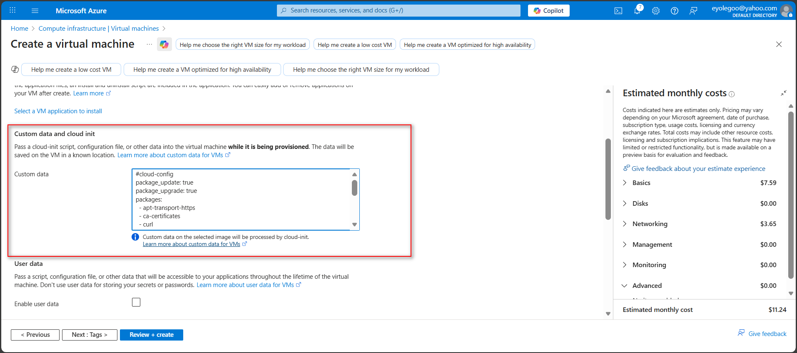
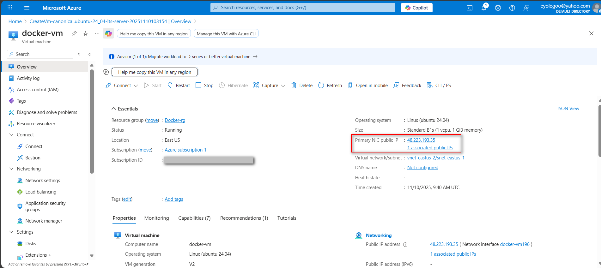
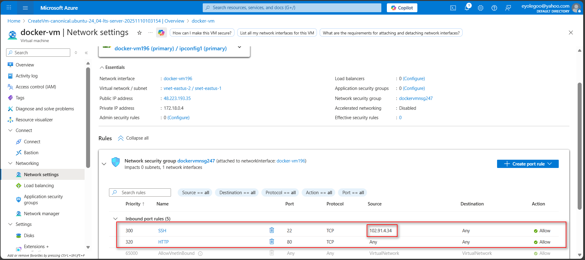


### Step 2: Get the App & Create a Dockerfile

I did some verification check first.

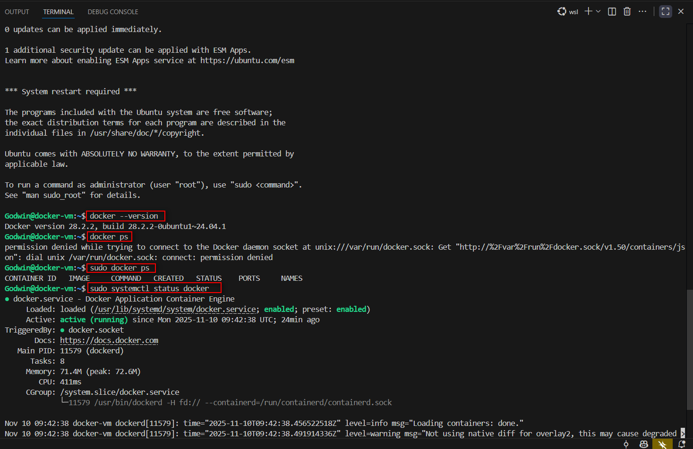
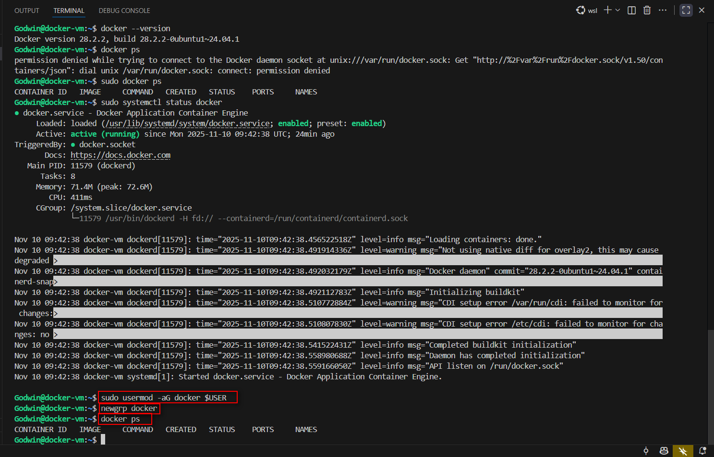


I cloned the app repository and navigated to the app folder.

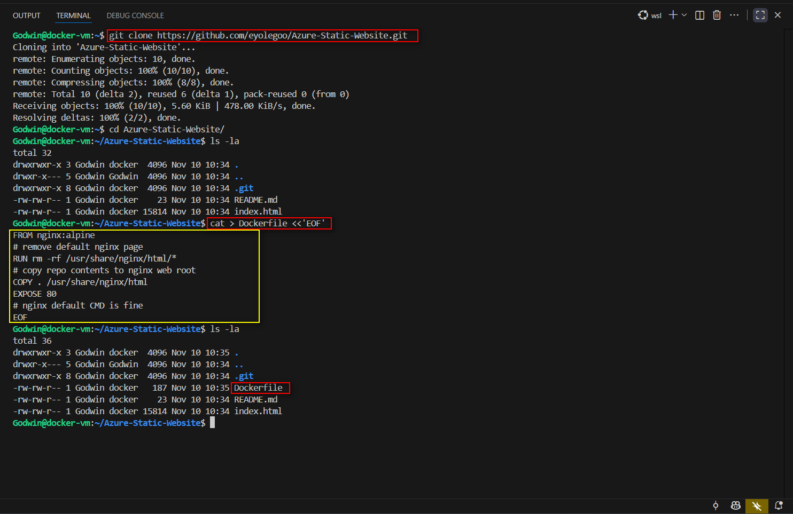

I created a Dockerfile that will serve static site via nginx using cat:

```Bash
cat > Dockerfile <<'EOF’
FROM nginx:alpine
# remove default nginx page
RUN rm -rf /usr/share/nginx/html/*
# copy repo contents to nginx web root
COPY . /usr/share/nginx/html
EXPOSE 80
# nginx default CMD is fine
EOF
```


### Step 3: Build and Run the Container

Using the below command, I built and ran the container:

```Bash
docker build -t static-site:latest

docker run -d --name static-site  -p 80:80 --restart unless-stopped static-site:latest
```

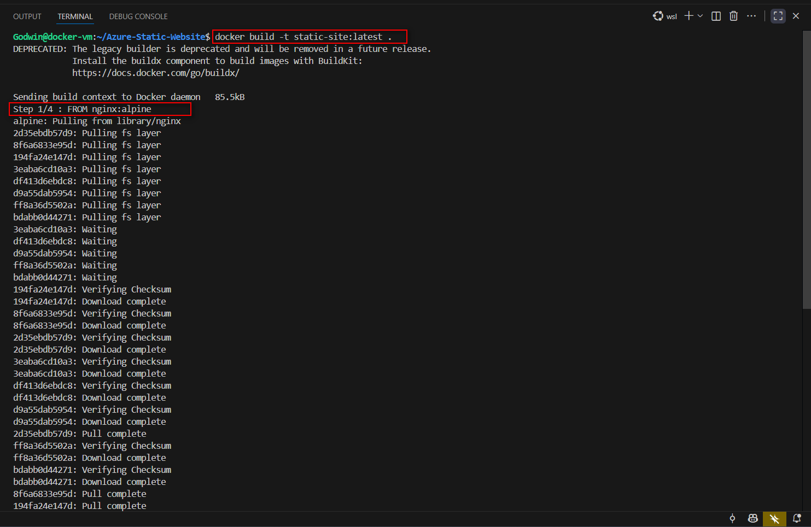


The container was successfully built and I also checked for running containers using `docker ps`.

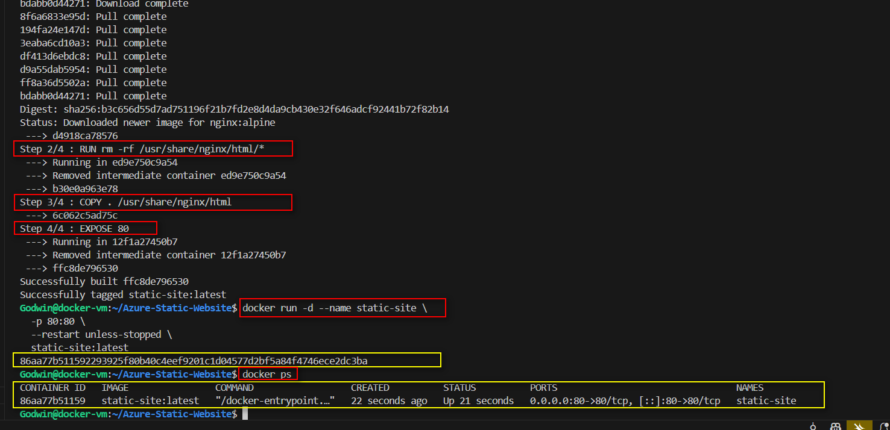


Testing the VM IP on a web browser:


User data file used:

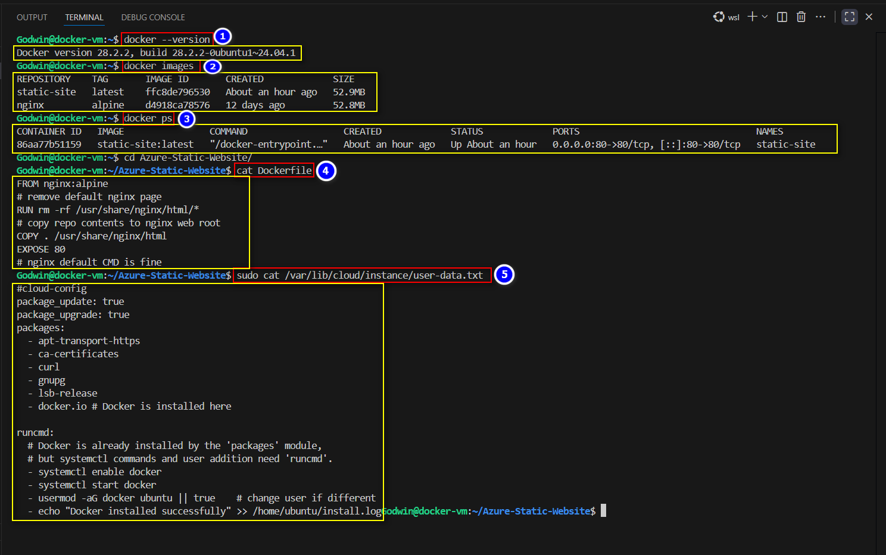


Verifying output log location:

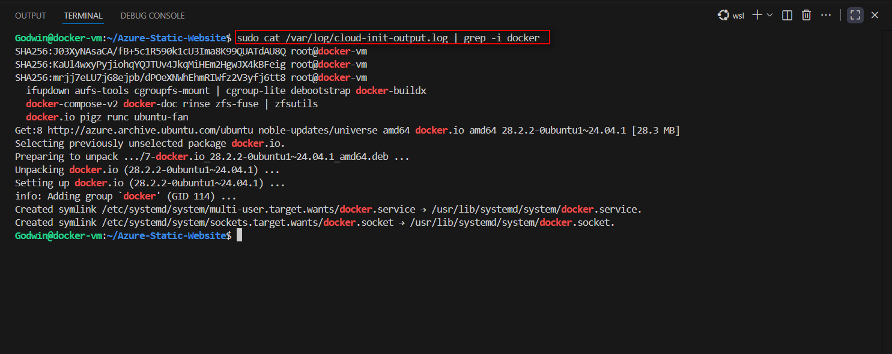


I logged in to docker hub so I can push the created image to the hub.

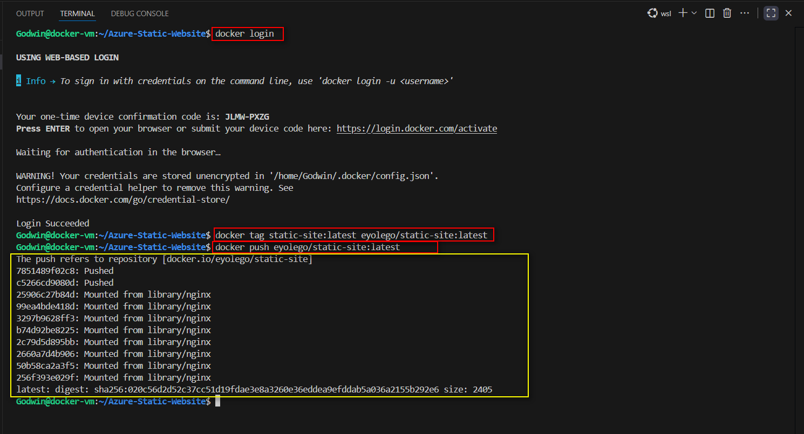
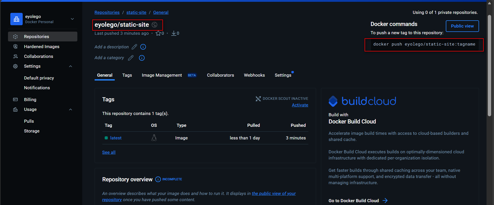


### Step 3.1: Reflection

Challenge: Docker kept asking for sudo permissions even after I added my user to the docker group. Turns out, group membership changes don't take effect until you log out and back in—a simple fix that caught me off guard!

Why Containers Win: Using Nginx in a container beats installing it directly on the server. You get a clean, isolated environment that works the same everywhere, plus you can tear it down and rebuild without leaving any mess on your host system.

Next-Level Thinking: For production, I'd add HTTPS with Let's Encrypt, throw in Nginx as a reverse proxy, set up health checks to monitor the container, and switch to docker-compose for smoother deployment management.