# ASSIGNMENT 48 Report

## Deploy the Book Review App with Docker Compose (MySQL + API + UI)

This assignment demonstrates deploying a full-stack Book Review application using Docker Compose, orchestrating three interconnected services: MySQL database, Node.js backend, and React frontend. By containerizing each component, we achieve consistent environments across development and production while simplifying deployment complexity. The implementation emphasizes critical practices like health-based startup sequencing, data persistence through volumes, and secure inter-service communication. This approach mirrors real-world microservices architecture, where applications are broken into manageable, scalable components that work together seamlessly—a fundamental skill for modern DevOps and cloud engineering roles.

**Objective:**

Package and run the Book Review Application (Frontend + Backend + MySQL) using one Docker Compose file with:
* Health-gated startup (depends_on with DB healthcheck)
* A named volume for MySQL persistence
* Correct CORS and service-to-service wiring
* Browser access to the app on your VM’s public IP

**What To Build:**
1. Three services in docker-compose.yml:
   * mysql: official image, persistent data volume, healthcheck
   * backend: builds from backend/ Dockerfile, reads DB env vars
   * frontend: builds from frontend/ Dockerfile, points to backend URL
2. One named volume: mysql_data


## Step 1: Prepare the project

1. Clone the book-review-app repo into a clean workspace/VM with Docker installed.
2. Ensure required inbound ports are open on your VM (frontend port and backend port you plan to expose; DB doesn’t need to be public).
3. Add a **.dockerignore** in both **frontend/** and **backend/** to keep images lean.

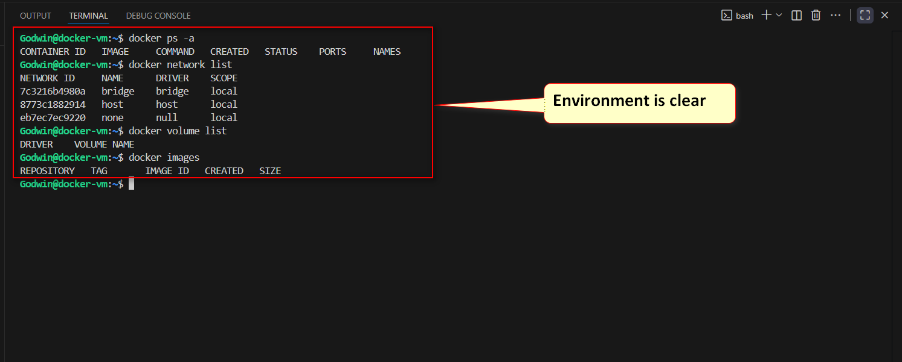
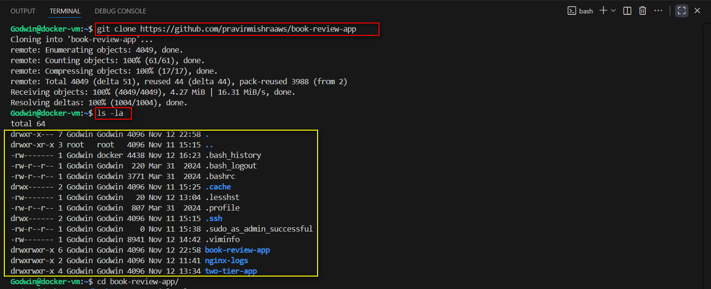


## Step 2: Prepare the Dockerfiles

**Frontend Dockerfile (inside frontend/):**
* Node base image,
* set working directory,
* copy package.json/lock files,
* install deps, copy source, expose frontend port (e.g., 3000), start app.

```Dockerfile
# Use Node.js LTS as base image
FROM node:18

# Set working directory
WORKDIR /app

# Copy package.json and package-lock.json
COPY package*.json ./

# Install dependencies
RUN npm install

# Copy the rest of the application files
COPY . .

# Expose the Next.js port
EXPOSE 3000

# Start Next.js in development mode
CMD ["npm", "run", "dev"]
```

**Backend Dockerfile (inside backend/):**
* Node base image,
* set working directory,
* copy package.json/lock files, install deps,
* copy source, expose backend port (e.g., 3001), start app.

```Dockerfile
# Use Node.js LTS as base image
FROM node:18

# Set working directory
WORKDIR /app

# Copy package.json and package-lock.json
COPY package*.json ./

# Install dependencies
RUN npm install

# Copy the rest of the application files
COPY . .

# Expose the port the backend runs on
EXPOSE 3001

# Start the backend server
CMD ["node", "src/server.js"]
```

**backend/.env**

```Bash
# Database Configuration 
DB_HOST=localhost
DB_NAME=book_review_db
DB_USER=root
DB_PASS=my-secret-pw
DB_DIALECT=mysql

# Application Port 
PORT=3001

# JWT Secret for Authentication
JWT_SECRET=mysecretkey

# Allowed Origins for CORS (comma-separated for multiple origins)
ALLOWED_ORIGINS=https://IP:port,http://localhost:3000
```

**docker-compose.yml file**

```YAML
version: '2.1'

services:
  mysql:
    image: mysql:8.0
    container_name: mysql_container
    restart: always
    healthcheck:
      test: ["CMD", "mysqladmin", "ping", "-h", "localhost"]
      interval: 10s
      timeout: 5s
      retries: 5
    environment:
      MYSQL_ROOT_PASSWORD: my-secret-pw
      MYSQL_DATABASE: book_review_db
      MYSQL_USER: pravin
      MYSQL_PASSWORD: Demo12@Test23
    ports:
      - "3306:3306"
    volumes:
      - mysql_data:/var/lib/mysql

  backend:
    build: ./backend
    container_name: backend_container
    restart: always
    depends_on:
      mysql:
        condition: service_healthy
    environment:
      PORT: 3001
      DB_HOST: mysql
      DB_NAME: book_review_db
      DB_USER: pravin
      DB_PASS: Demo12@Test23
      DB_DIALECT: mysql
      JWT_SECRET: mysecretkey
      ALLOWED_ORIGINS: http://<FRONTEND PUBLIC IP>:3000
    ports:
      - "3001:3001"

  frontend:
    build: ./frontend
    container_name: frontend_container
    restart: always
    depends_on:
      - backend
    environment:
      NEXT_PUBLIC_API_URL: http://<BACKEND PUBLIC IP>:3001
    ports:
      - "3000:3000"

volumes:
  mysql_data:
```


## Step 3: Bring up the Setup

1. Start the stack (detached is fine).
2. Watch logs briefly to confirm:
   * MySQL becomes healthy
   * Backend connects to DB (no “connection refused”)
   * Frontend starts without fatal errors

Build and start all services in the stack using ``docker-compose up -d –build``

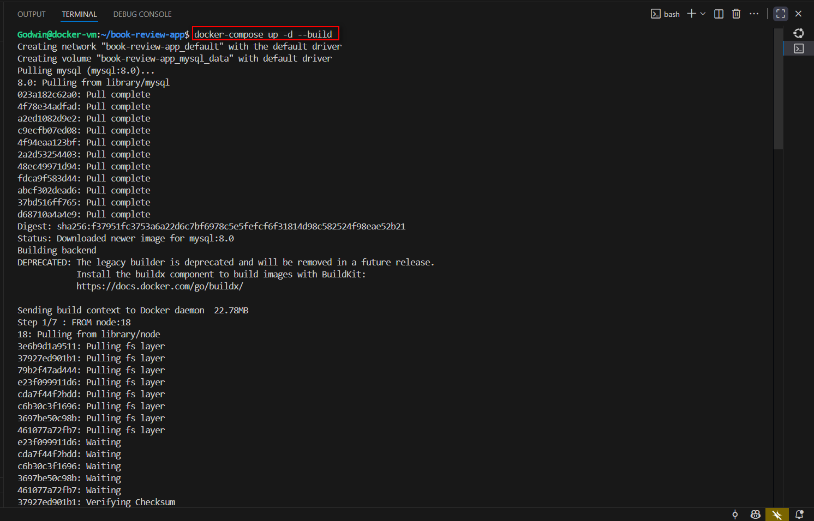
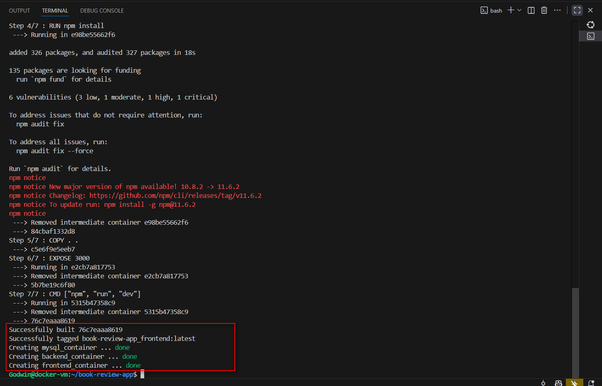


**Check the status**

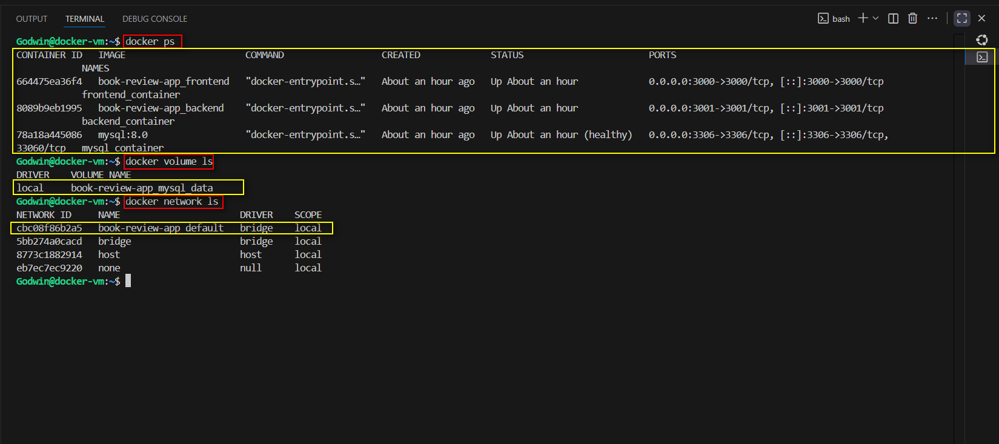

**Monitor Logs**

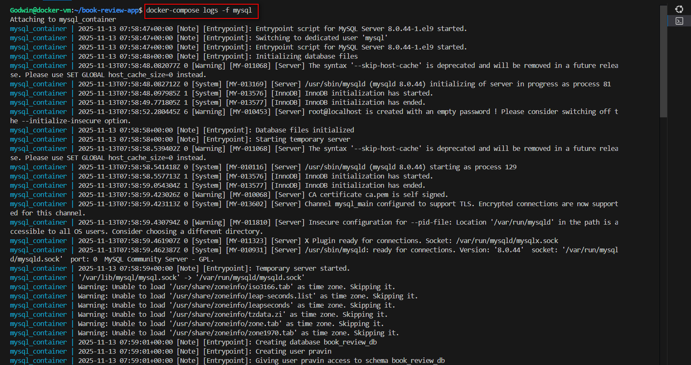
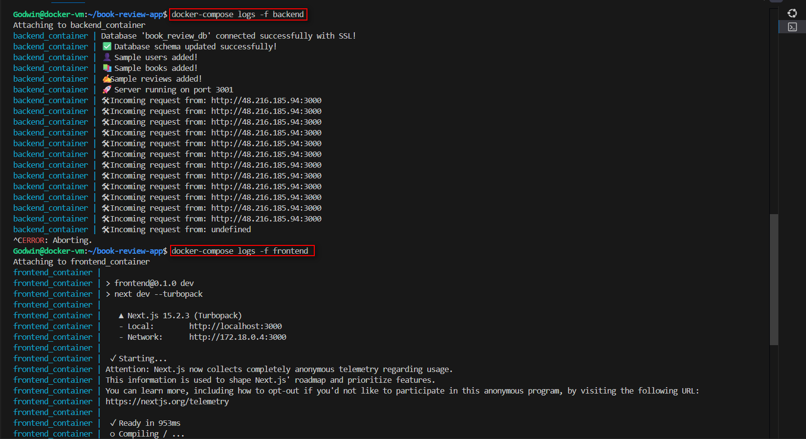


## Step 4: Test end-to-end

1. Open the frontend in your browser: http://<VM_PUBLIC_IP>:<frontend_port>/
2. Register a user, login, and create a review.
3. Verify entries persist in MySQL.

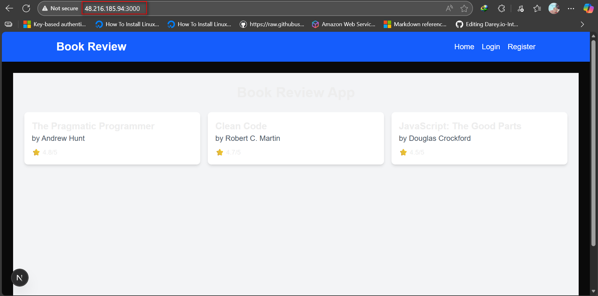
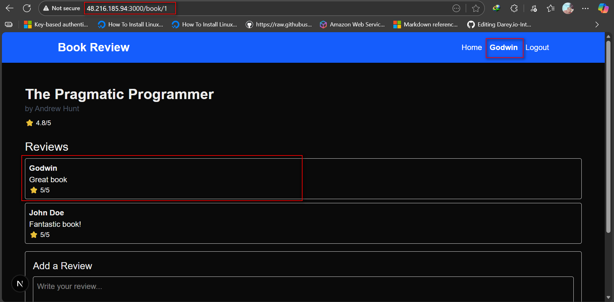


## Step 5: Prove persistence

1. Stop the stack without removing volumes.
2. Start it again.
3. Confirm your user/review data is still there (volume worked).

**Before stopping all containers, check the data in mysql**

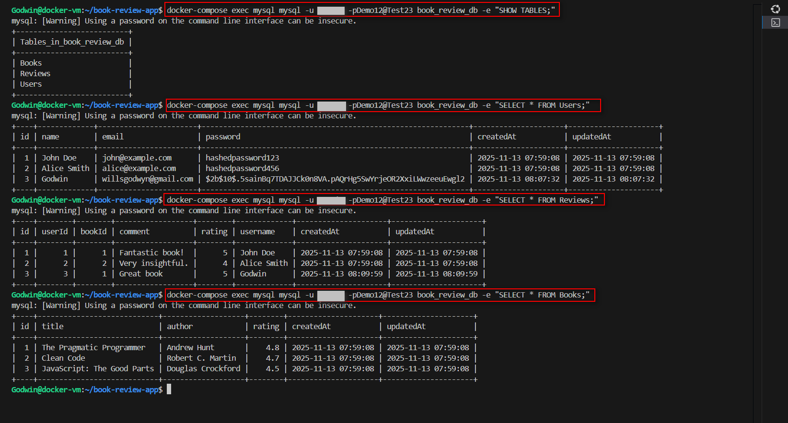
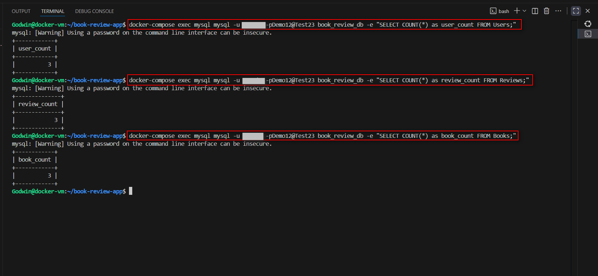


**Stop all containers**

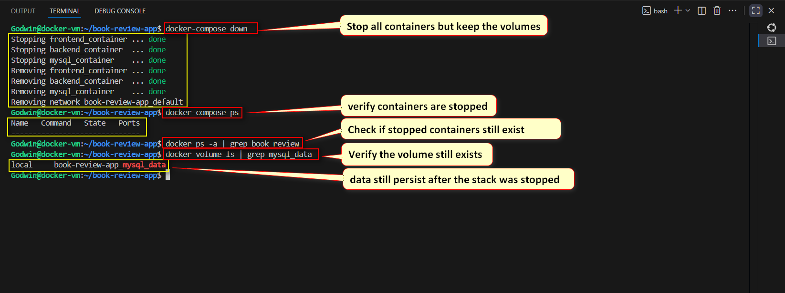

**Restart and Verify Persistence**

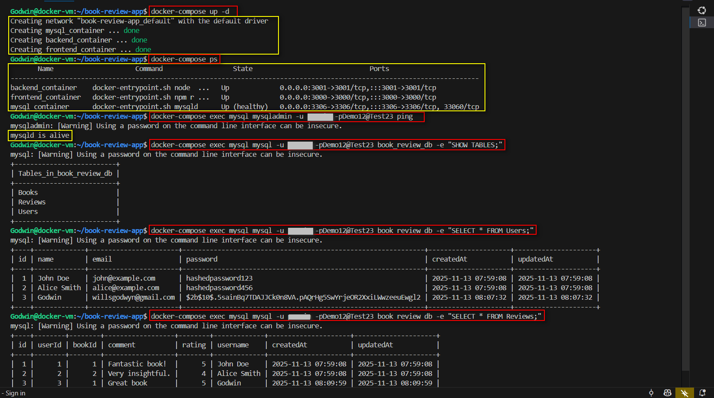
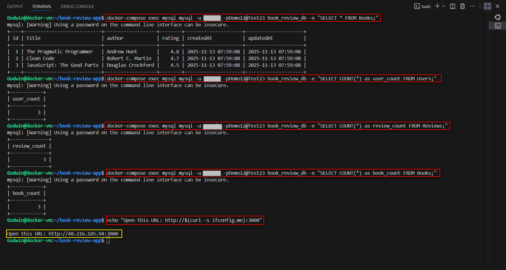


**After refreshing, the book review done on a book remains intact**

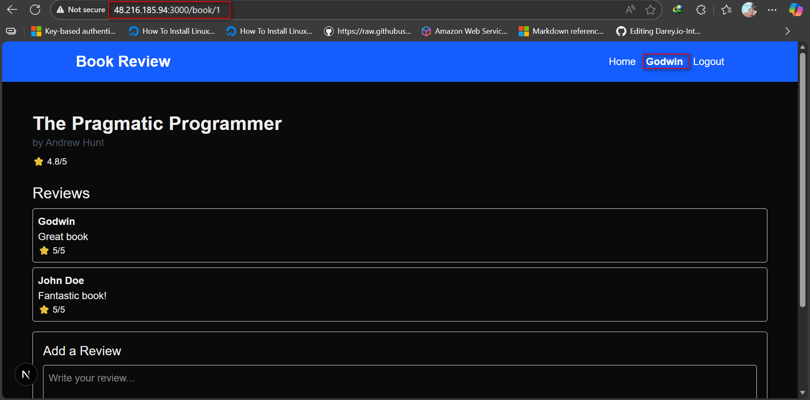


## Step 5.1: Teardown choices

1. Non-destructive down (keep mysql_data).
2. Full reset (remove volumes too) when you want a clean slate.

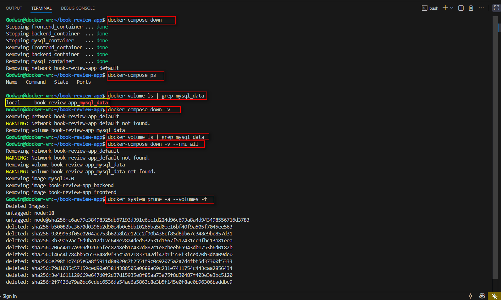


## Step 6: Concepts and Reflection

**CONCEPT:**

A) **Why depends_on Alone Is Insufficient Without a Healthcheck**
 Just starting MySQL doesn’t mean it’s ready. Without a healthcheck, the backend may try to connect too early and fail. Adding condition: service_healthy ensures Docker waits until MySQL is truly ready, preventing crashes and connection errors during startup.

B) **Why the Database Should Not Be Publicly Exposed**
 Opening MySQL to the internet invites attacks. It should only talk to the backend inside Docker’s private network. Avoid exposing port 3306 publicly, use secure credentials, and keep sensitive data out of your compose file to stay safe.

C) **How Service-Name DNS in Compose Simplifies Wiring vs IPs**
 Docker Compose lets containers talk using service names like mysql, not fragile IPs. This makes setups portable, scalable, and easier to manage—no need to track changing IPs or update configs manually. It’s smart, secure, and built for microservices.

**REFLECTION:**

The biggest time-saver was *service-name DNS* for dynamic, portable container communication, coupled with *healthchecks* for reliable startup ordering.

Before production, the focus is on security and resilience: implementing *Docker secrets* for sensitive data, enabling *TLS/SSL*, configuring network isolation for the database, and setting up *volume backups*.

For CI/CD, the plan involves *caching and multi-stage builds* for fast, small images, using *semantic versioning*, separating configurations for environments, and integrating *security scanning* to catch vulnerabilities early.
