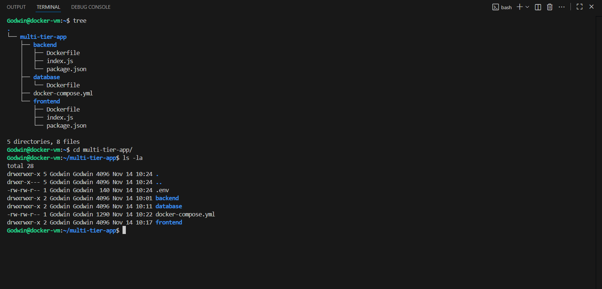
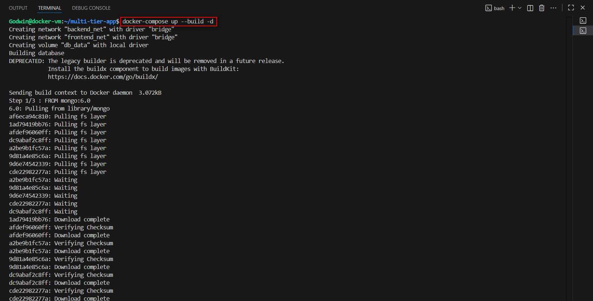
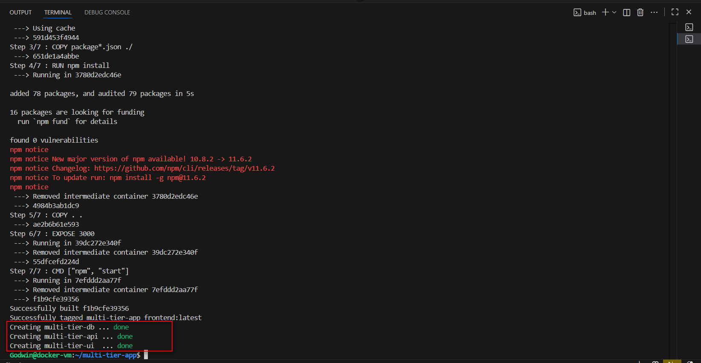
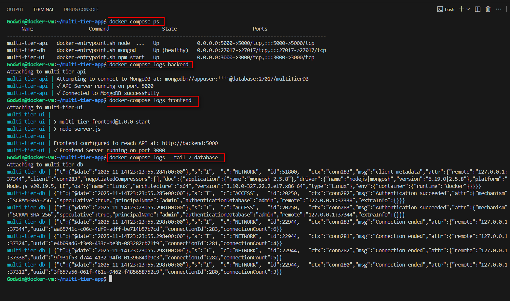
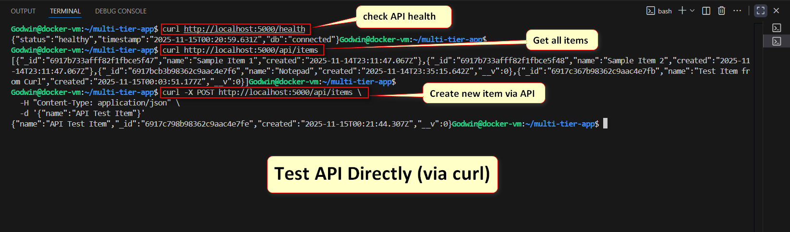
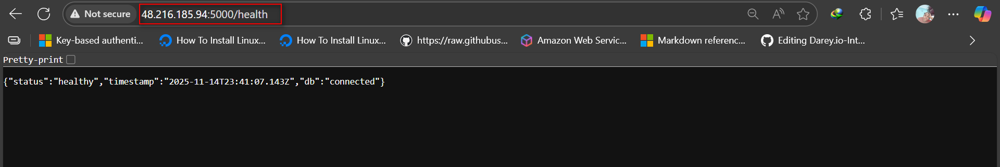
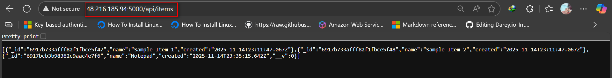
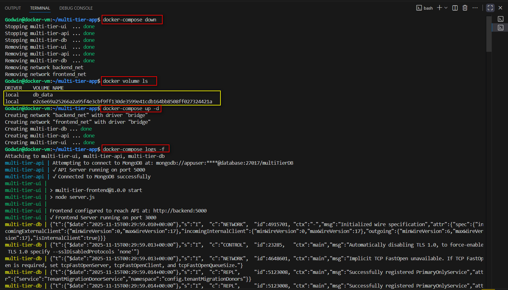
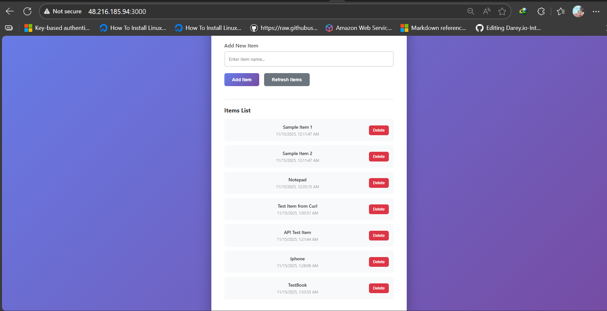

# ASSIGNMENT 47 Report: 

## Docker Compose — One Command, Three Tiers (DB + API + UI)

Docker Compose solves a real problem developers face daily: managing multiple services without chaos. Instead of running 30+ Docker commands manually, Compose brings everything together in one file. This assignment teaches how companies actually deploy applications—with proper database connectivity, network security, data persistence, and dependency management. You'll learn why network segmentation protects against breaches, why health checks prevent startup failures, and why volumes keep data safe across restarts. This is how Netflix, Uber, and most tech companies run their applications locally and in production. Master this, and you've got a skill worth thousands.

## Objective
Turn a manual, many-command setup into a single docker compose up workflow for a three-tier app with clear dependencies, isolated networks, and a persistent database volume.

## What To Build
1. **Three services defined in one Compose file:**
    * database (use MongoDB as in the video)
    * backend API (your minimal Node/Express or any API you already used in previous labs)
    * frontend (simple UI that calls the API)
2. **Two user-defined networks:**
    * `backend_net` for DB ↔ API
    * `frontend_net` for API ↔ UI
3. **One named volume:** `db_data` mounted to persist the database files
4. **Startup order** using `depends_on` with healthcheck gating for the DB

---

## Step 1: Clean State

1. Ensure your environment has no running containers, custom networks, or orphaned volumes from previous labs that could collide with the names you’re about to use.
2. Decide a project root (e.g., `multi-tier-app/`) with subfolders:
    * `database/` (Dockerfile + optional init)
    * `backend/` (Dockerfile + app code)
    * `frontend/` (Dockerfile + app code)


   

**Configuration Files**

**.env file**
```ini
# MongoDB Configuration
DB_HOST=database
DB_PORT=27017
DB_NAME=multiTierDB
DB_USER=appuser
DB_PASSWORD=apppassword
MONGO_INITDB_ROOT_USERNAME=admin
MONGO_INITDB_ROOT_PASSWORD=adminpassword

# Backend Configuration
API_PORT=5000

# Frontend Configuration
UI_PORT=3000
API_BASE_URL=http://backend:5000
```

**docker-compose.yml**

```Yaml
version: '3.9'

services:
  # ==================== DATABASE ====================
  database:
    build:
      context: ./database
    container_name: multi-tier-db
    environment:
      MONGO_INITDB_ROOT_USERNAME: ${MONGO_INITDB_ROOT_USERNAME}
      MONGO_INITDB_ROOT_PASSWORD: ${MONGO_INITDB_ROOT_PASSWORD}
      MONGO_INITDB_DATABASE: ${DB_NAME}
    ports:
      - "27017:27017"
    volumes:
      - db_data:/data/db
    networks:
      - backend_net
    healthcheck:
      test: >
        mongosh -u ${MONGO_INITDB_ROOT_USERNAME} -p ${MONGO_INITDB_ROOT_PASSWORD}
        --eval "db.adminCommand('ping')"
        --authenticationDatabase admin
      interval: 10s
      timeout: 5s
      retries: 5
      start_period: 10s
    restart: unless-stopped

  # ==================== BACKEND API ====================
  backend:
    build:
      context: ./backend
    container_name: multi-tier-api
    depends_on:
      database:
        condition: service_healthy
    environment:
      DB_HOST: ${DB_HOST}
      DB_PORT: ${DB_PORT}
      DB_NAME: ${DB_NAME}
      DB_USER: ${DB_USER}
      DB_PASSWORD: ${DB_PASSWORD}
      API_PORT: ${API_PORT}
    ports:
      - "${API_PORT}:${API_PORT}"
    networks:
      - backend_net
      - frontend_net
    restart: unless-stopped

  # ==================== FRONTEND UI ====================
  frontend:
    build:
      context: ./frontend
    container_name: multi-tier-ui
    depends_on:                                                                                                     
      - backend                                                                                                     
    environment:                                                                                                      
      UI_PORT: ${UI_PORT}                                                                                             
      API_BASE_URL: ${API_BASE_URL}                                                                                                                                                                                                                                                                                 
    ports:                                                                                                                                                                                                                                                                  
      - "${UI_PORT}:${UI_PORT}"                                                                                                                                                                                                                                                                 
    networks:                                                                                                                                                                                                                                                                 
      - frontend_net                                                                                                                                                                                                                                                                  
    restart: unless-stopped                                                                                                                                                                                                                                                                 
                                                                                                                                                                                                                                                                                          
# ==================== NETWORKS ====================                                                                                                                                                                                                                                      
networks:                                                                                                                                                                                                                                                                                 
  backend_net:                                                                                                                                                                                                                                                                          
    driver: bridge                                                                                                                                                                                                                                                                    
    name: backend_net                                                                                                                                                                                                                                                                 
  frontend_net:                                                                                                                                                                                                                                                                 
    driver: bridge                                                                                                                                                                                                                                                                    
    name: frontend_net                                                                                                                                                                                                                                                                
                                                                                                                                                                                                                                                                                          
# ==================== VOLUMES ====================                                                                                                                                                                                                                                     
volumes:                                                                                                                                                                                                                                                                                  
  db_data:                                                                                                                                                                                                                                                                          
    driver: local                                                                                                                                                                                                                                                                   
    name: db_data
```

**backend/Dockerfile**

```Dockerfile
FROM node:18-alpine

WORKDIR /app

# Copy package files
COPY package*.json ./

# Install dependencies
RUN npm install

# Copy application code
COPY . .

# Expose API port
EXPOSE 5000

# Start the server
CMD ["node", "server.js"]
```

**database/Dockerfile**

```Dockerfile
FROM mongo:6.0

# Copy initialization script
COPY init-mongo.js /docker-entrypoint-initdb.d/

# Expose MongoDB port
EXPOSE 27017

# Default MongoDB command (inherited, no need to override)
```

**frontend/Dockerfile**

```Dockerfile
FROM node:18-alpine

WORKDIR /app

# Copy package files
COPY package*.json ./

# Install dependencies
RUN npm install

# Copy application code
COPY . .

# Expose frontend port
EXPOSE 3000

# Start the development server
CMD ["npm", "start"]
```

**Execution**

**Run the docker-compose to build and start the application.**





Confirm services are running and logs check.



## Step 2: Test Application


**Check API health, Get all items and Create new item via API.**


**Check that service names (database, backend, frontend) resolve across networks as intended.**





## Step 3: Prove Persistence

* Insert or create sample data via the API.
* Tear the stack down without removing volumes.
* Bring the stack back up.
* Confirm that the previously created data still exists (volume worked).





## Step 4: Concepts and Reflection

1. Why Compose Beats Manual CLI
Imagine typing 30+ Docker commands every time you need to start your app. Docker Compose kills that nightmare. One file, one command (docker-compose up -d), and everything runs. It's repeatable, shareable with your team, and version-controlled. No more "it worked yesterday"—it works every time.

2. What depends_on Does (And Doesn't)
depends_on is like saying "start B after A." But here's the catch: it doesn't check if A is actually ready. Your API might boot before MongoDB finishes loading. Add a healthcheck with condition: service_healthy, and now Docker waits for real readiness. That's the difference between occasional crashes and rock-solid startup.

3. Why Split Networks Improve Security
Two networks = two security layers. Frontend lives in one network, database in another. If a hacker gets into your frontend, they can't just steal your database—they have to hack the backend too. It's like having security at each building entrance, not just the main gate.

4. When to Keep vs Wipe Volumes
Keep volumes: During development or testing. Your data sticks around when containers restart. Great for debugging or rolling back changes.

Wipe volumes: Starting fresh after testing or deploying. No old data interferes with the new environment. Clean slate, no surprises in production.

**Reflection**
- Using depends_on with service_healthy saved me huge amounts of time—it completely removed manual wait scripts and made startup sequencing effortless and reliable.

- Separating the app into two networks also proved valuable; if the frontend were ever compromised, attackers still couldn’t reach the database directly.

- For production, I’d go further by adding centralized logging, proper secrets management, automated backups, and real monitoring with alerts. I’d also enforce resource limits, include a reverse proxy, and use Compose profiles for clean dev/production separation.
