# ASSIGNMENT 46 Report

## Docker Data Persistence — Bind Mounts vs Volumes (Logs + Shared Storage)

Docker containers are ephemeral by design—when removed, their data vanishes. This assignment explores two critical persistence strategies that solve real-world challenges: bind mounts for maintaining accessible logs on your host system, and Docker volumes for secure, portable data sharing between containers. Mastering these approaches is essential for production environments where data integrity, application continuity, and multi-container collaboration are non-negotiable. Understanding when to use each method directly impacts your application's reliability, portability, and operational efficiency in containerized deployments.

### Objective
Practice two real-world persistence patterns:
* **Bind mounts** to keep container logs on the host (survive container deletion).
* **Docker volumes** to share data between containers (writer → reader) managed by Docker.

### What to Build
1.  **Scenario A (Bind Mounts):** A standalone web container whose access/error logs are written to a host folder, remain after container removal, and continue accumulating when a new container is started.
2.  **Scenario B (Volumes):** Two containers on the same user-defined bridge network sharing a named volume:
    * **backend (writer):** creates/updates a text file in the shared volume.
    * **frontend (reader):** reads and serves the current contents of that file.

---

## Step 1: Bind Mount for Persistent Logs

Prepare a clean workspace on a VM or local machine with Docker installed.

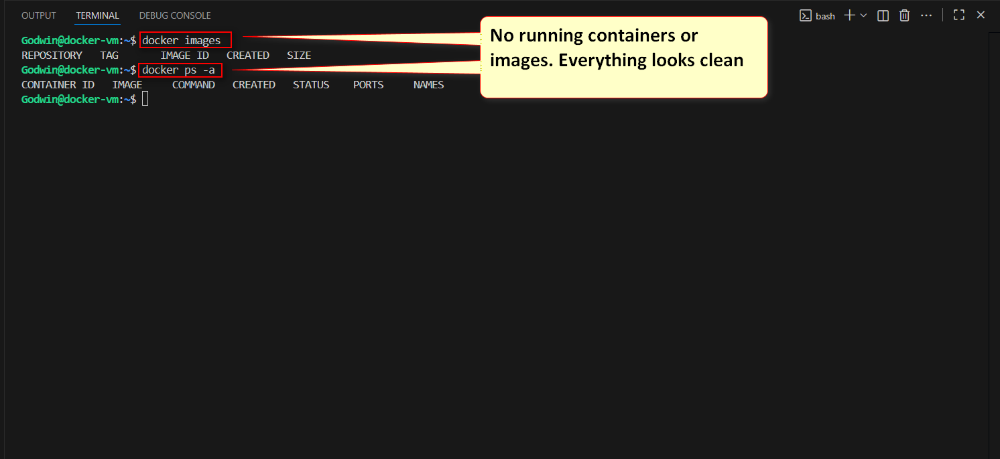

1.  Create a host directory dedicated to web logs (e.g., a folder for access/error logs).
2.  Run a web server container that:
    * Expose HTTP to your host for browser testing.
    * Mounts the host log directory to the container’s log path (so logs are written on the host).
3.  Open the site in a browser a few times to generate traffic.
4.  Verify that the access and error log files are created on the host and include new entries.
5.  Remove the container. Confirm the log files remain on the host unchanged.
6.  Start a new web container pointing to the same host log directory.
7.  Hit the site again and confirm the same host log files now include new entries (continuous history).

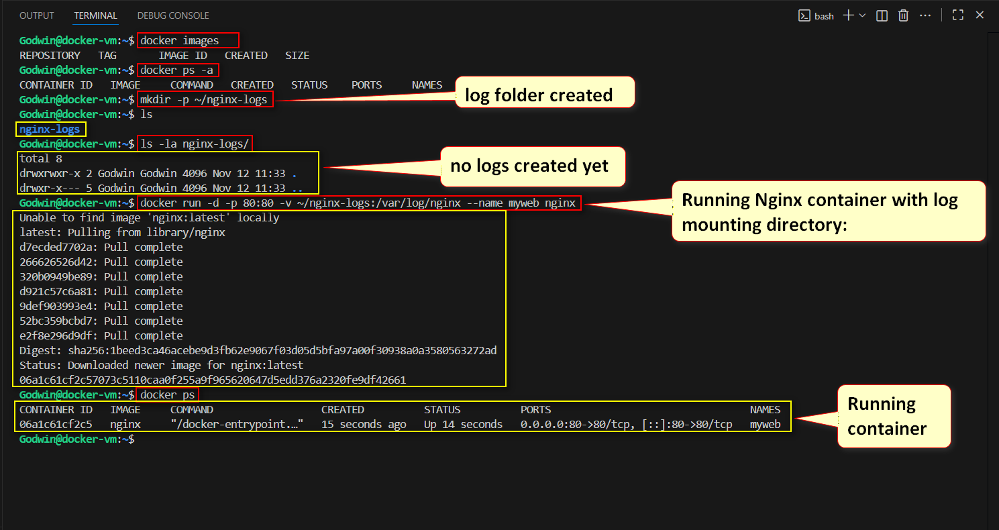
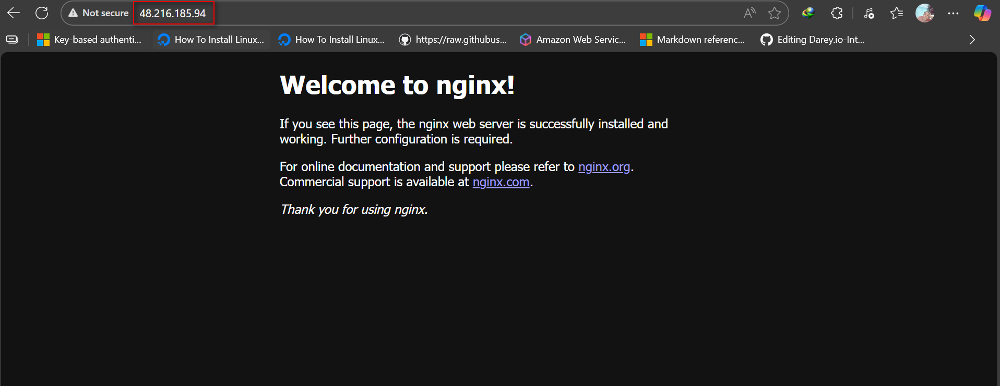
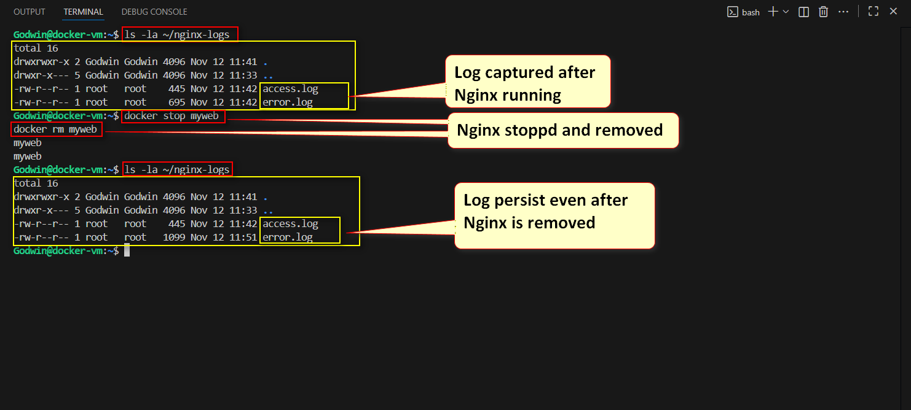
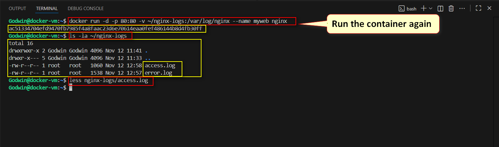

* Host log with new entries


### Step 1.1: Benefits and Risks associated with Bind Mount

 - Bind mounts offer a big advantage when you need real-time access to what’s happening inside a container. Because they point directly to folders on the host machine, logs and other files are instantly available for monitoring, debugging, or feeding into external tools—no docker exec or copying needed. However, this convenience comes with trade-offs.

 - Bind mounts tightly couple a container to a specific host path, which hurts portability and creates setup inconsistencies across environments. They can also trigger permission issues, since host users and container processes may not align. And because the container touches the host filesystem directly, a wrong or overly-open path can introduce serious security risks.

---

## Step 2: Named Volume for Shared Data (Writer/Reader)

1.  Create a user-defined bridge network (for service name resolution and isolation).
2.  Create a named volume (managed by Docker).
3.  Build two minimal containers:
    * **backend (writer):** on a specific HTTP path (e.g., `/write`), it writes/updates `/data/message.txt` in the mounted named volume.
    * **frontend (reader):** on its root path, it reads `/data/message.txt` from the same named volume and returns the content; if missing, returns a clear “no data” message.
4.  Run both containers attached to the same custom network and mount the same named volume at `/data`.
5.  Test the flow:
    * Load the frontend first; you should see “no data”.
    * Trigger the backend endpoint that writes a message.
    * Refresh the frontend; you should now see the message content.
6.  Stop and remove the backend container, then refresh the frontend.
    * Confirm the data is still available (persisted in the volume).
7.  Re-create the backend and write a new message.
    * Confirm the frontend now shows the updated content.


**Custom Network and Volume Created**
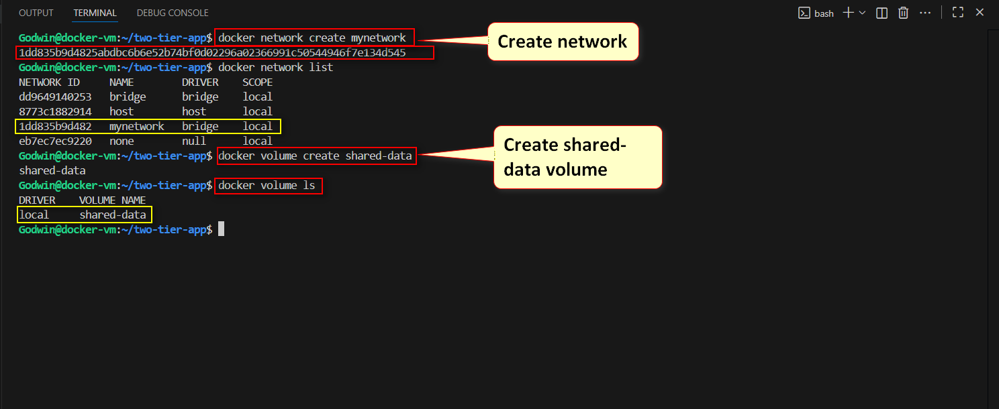
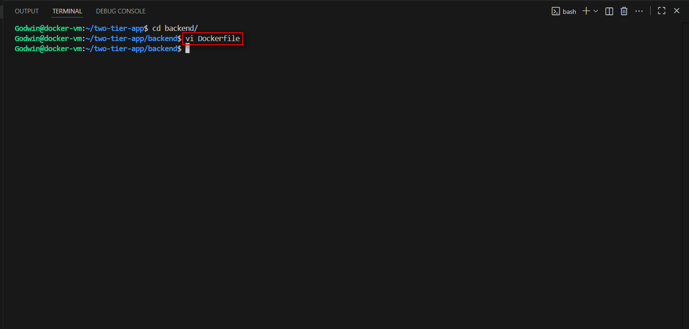


**Backend Configuration**

**Dockerfile**
```dockerfile
# Use the official Node.js image
FROM node:18

# Set the working directory inside the container
WORKDIR /app

# Install required dependencies
RUN npm init -y && npm install express fs

# Create index.js with API logic
RUN echo "const express = require('express'); \
const fs = require('fs'); \
const app = express(); \
const DATA_FILE = '/data/message.txt'; \
app.get('/write', (req, res) => { fs.writeFileSync(DATA_FILE, 'Hello from Backend!'); res.send('Data written!'); }); \
app.listen(80, () => console.log('Backend running on port 80'));" > index.js

# Expose port 80 to the host
EXPOSE 80

# Run the application
CMD ["node", "index.js"]
```

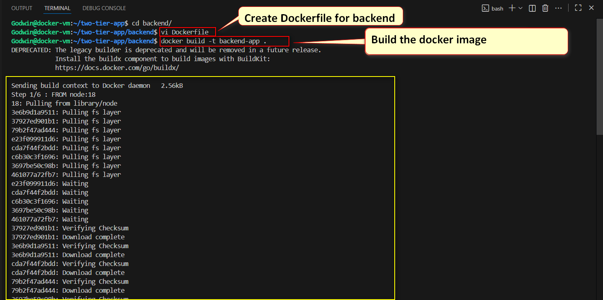
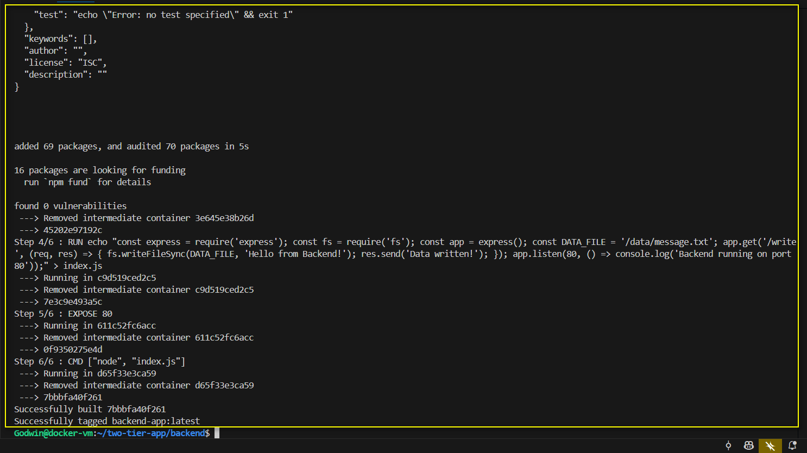


**Also, run the backend container with the shared volume:**

```Bash
docker run -d --name backend --network mynetwork -v shared-data:/data backend-app
```


**Frontend Configuration**

Inside two-tier-app/frontend/Dockerfile, add:

```Dockerfile
# Use the official Node.js image
FROM node:18

# Set the working directory inside the container
WORKDIR /app

# Install required dependencies
RUN npm init -y && npm install express fs

# Create index.js to serve data
RUN echo "const express = require('express'); \
const fs = require('fs'); \
const app = express(); \
const DATA_FILE = '/data/message.txt'; \
app.get('/', (req, res) => { res.send(fs.existsSync(DATA_FILE) ? fs.readFileSync(DATA_FILE, 'utf8') : 'No data found.'); }); \
app.listen(80, () => console.log('Frontend running on port 80'));" > index.js

# Expose port 80 to the host
EXPOSE 80

# Run the application
CMD ["node", "index.js"]
```

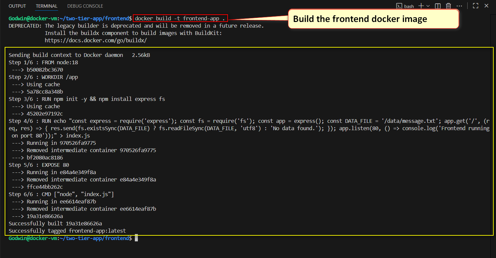
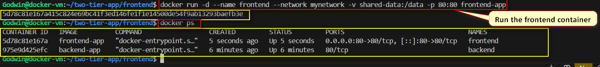


Testing the Flow
Test the flow:

Load the frontend first; you should see “no data”.
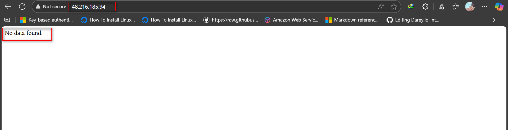

Trigger the backend endpoint that writes a message.
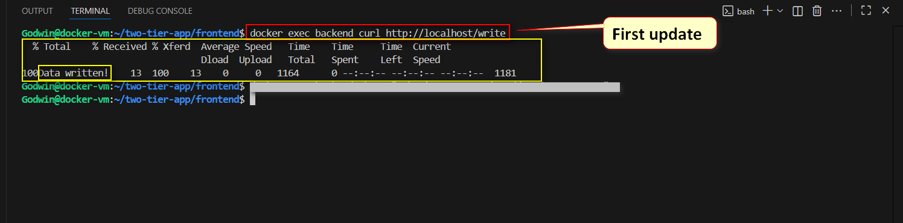

Refresh the frontend; you should now see the message content.
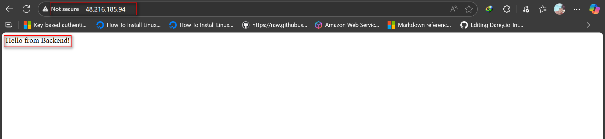
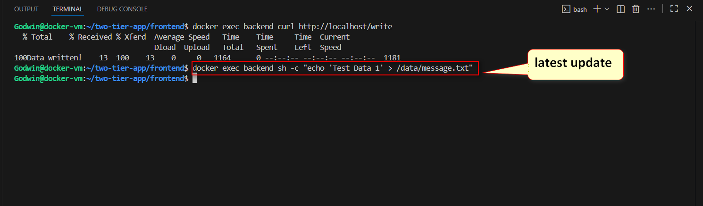
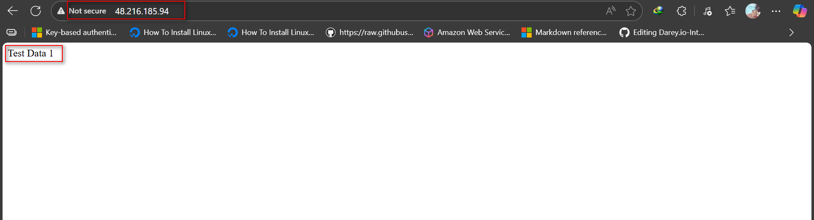

Stop and remove the backend container, then refresh the frontend.
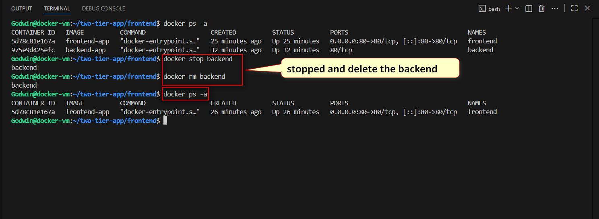

Confirm the data is still available (persisted in the volume).
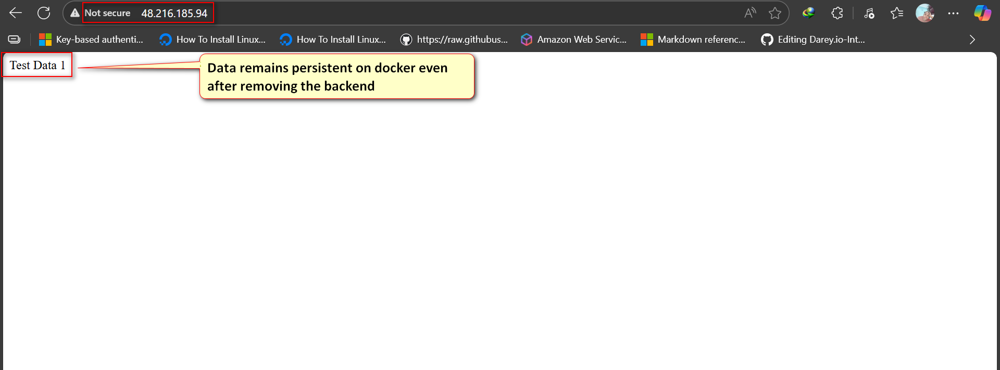

Re-create the backend and write a new message.
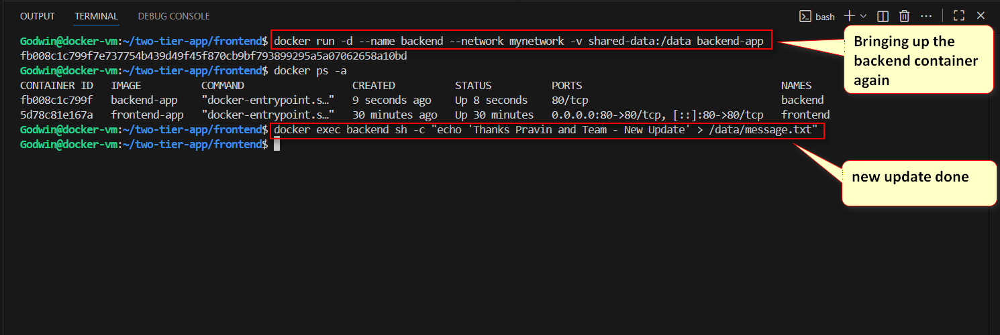

Confirm the frontend now shows the updated content.
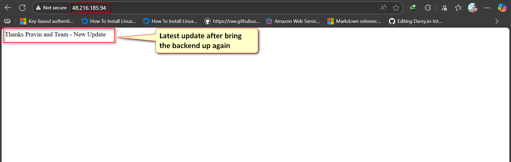


### Step 2.1: Why Docker volumes are better than bind mounts for multi-container sharing

- Docker volumes are the better choice when multiple containers need to share data because Docker manages them entirely, making them portable, secure, and consistent across any environment. You don’t have to worry about host-level permissions or paths, and Docker’s built-in tooling makes backing up or migrating data straightforward. Volumes also provide stronger isolation and can use advanced drivers for cloud storage, encryption, or network-attached systems, which makes them ideal for production.

- Bind mounts still have their place, mainly in development, where you need instant updates from your host machine—such as hot-reloading code, viewing logs, or integrating with existing host tools. However, this convenience comes with lower portability and more security responsibilities.

### Step 2.2: Reflection

**Docker Volumes** shine in production for persistent data like databases, uploads, and shared caches. They're portable, secure, and fully managed by Docker without worrying about host paths.

**Bind Mounts** excel during development for live code editing and log monitoring, though they tie you to specific host directories and can cause permission headaches.

**The Surprise Factor:** Docker volumes feel like magic—they hide the messy filesystem details (buried in /var/lib/docker/volumes/) while seamlessly handling permissions between containers. No manual configuration needed, yet everything just works across different environments!