# ASSIGNMENT 45 Report

## Docker Networking — Connect Frontend ↔ Backend via Custom Bridge (DNS by Name)

Docker networking is fundamental to building modern containerized applications. This assignment explores how containers communicate, demonstrating why the default bridge network's limitations necessitate custom networks. By creating a user-defined bridge, we enable automatic DNS resolution between containers—allowing services to discover each other by name rather than fragile IP addresses. This mirrors real-world microservices architectures where applications must communicate reliably and securely. Understanding these networking concepts is essential for deploying scalable, maintainable distributed systems that form the backbone of today's cloud-native applications.

### Objective
Understand and prove Docker networking fundamentals by:
* Showing how containers on the default bridge are isolated.
* Creating a custom bridge network so containers can reach each other by name (Docker-provided DNS).
* Verifying connectivity without host port mapping for container↔container traffic.

**Details doc:** [https://github.com/pravinmishraaws/Docker-Demo/blob/main/05_Docker_Networking.md](https://github.com/pravinmishraaws/Docker-Demo/blob/main/05_Docker_Networking.md)

### What to Build:
1.  A custom bridge network (e.g., `my-net`).
2.  Two containers:
    * `backend`: any simple HTTP server (e.g., Nginx as an API stand-in).
    * `frontend`: a tiny app container that can make HTTP requests (your own minimal Node.js app is fine).
3.  Verified connectivity frontend → backend using the backend’s container name (not IP, not localhost).
4.  A host port is exposed on frontend so you can also open it in a browser.

---

### Step 1: Prove default bridge isolation

Before the isolation prove, below is the list of built-in docker network

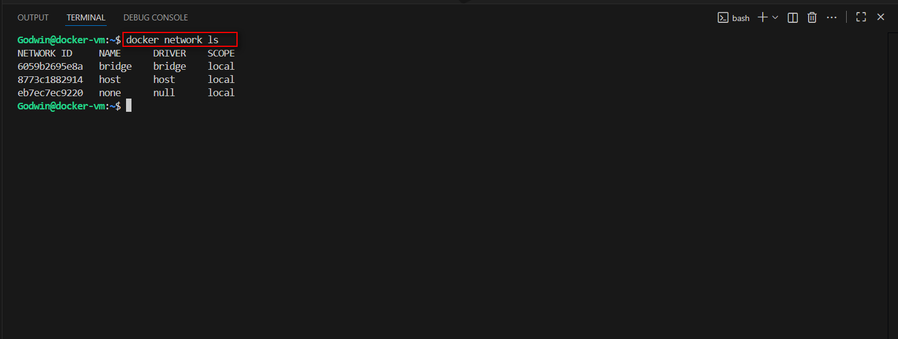

**Now, to prove default bridge isolation:**
* Run an HTTP container (e.g., Nginx) on the default bridge.
* Verify it’s running
* Start a second throwaway container with curl and try to reach the first by container name.
* Try to ping by name (this will fail).

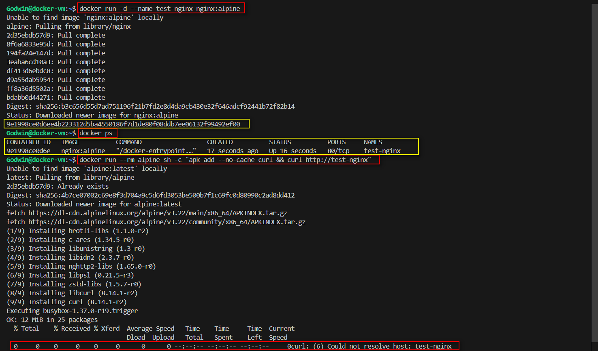

**Failed ping attempt**

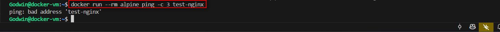


The `curl http://test-nginx` command FAILS with a DNS resolution error.
This proves the default bridge doesn't provide automatic name-to-IP DNS resolution.

---

### Step 2: Create a Custom Bridge Network, Build and Prepare 2 Services

**Custom bridge network:**
* Create a custom bridge network
* Verify it was created
* Inspect the network (note the subnet and gateway)

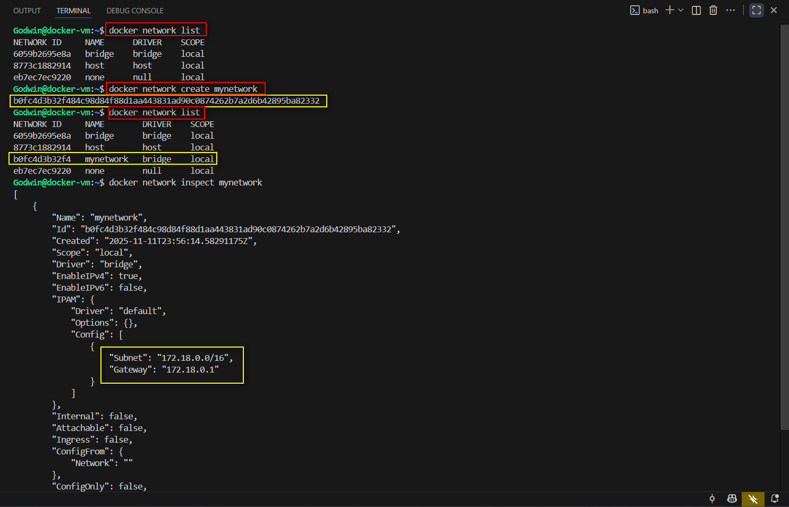

**Why This Matters:**
User-defined bridge networks provide:
* **Automatic DNS resolution:** Containers can reach each other by name
* **Better isolation:** You control which containers can communicate
* **Advanced configuration:** Custom IP ranges, gateways, etc.

**Next is to create the services:**
* `backend`: a simple HTTP responder (Nginx “Welcome” page is enough).
* `frontend`: a tiny app container capable of making HTTP calls.
* Keep both images small and predictable.

**Create and update the Dockerfile:**
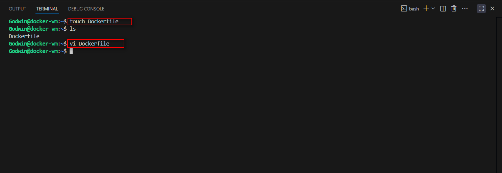

```dockerfile
# Use the official Node.js 18 image
FROM node:18

# Set the working directory inside the container
WORKDIR /app

# Initialize a new Node.js app and install Express
RUN npm init -y && npm install express

# Create index.js with basic Express code running on port 80
RUN echo "const express = require('express'); \
const app = express(); \
app.get('/', (req, res) => res.send('Hello from Frontend')); \
const PORT = 80; \
app.listen(PORT, () => console.log('Frontend running on port ' + PORT));" > index.js

# Expose port 80 to the host
EXPOSE 80

# Run the application
CMD ["node", "index.js"]
```

Run the Dockerfile using ```docker build -t frontend-app .```

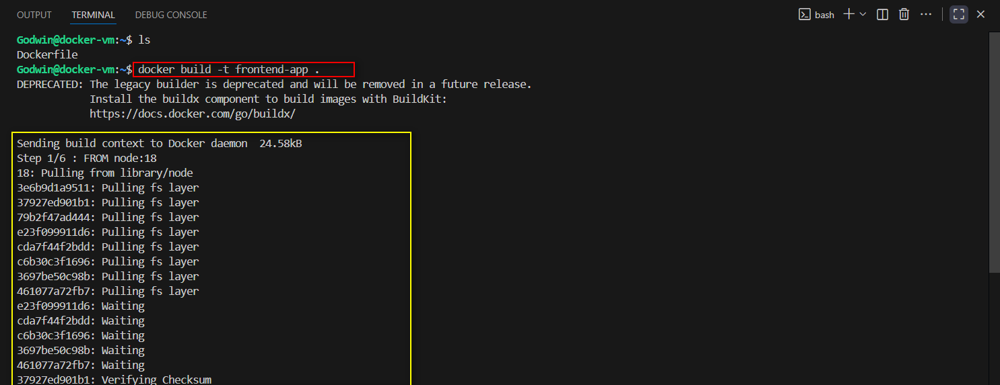
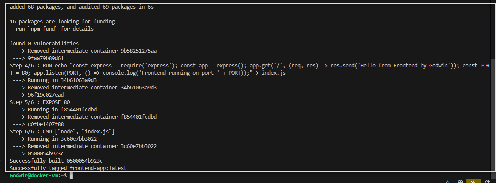


Testing the VM IP on a web browser:

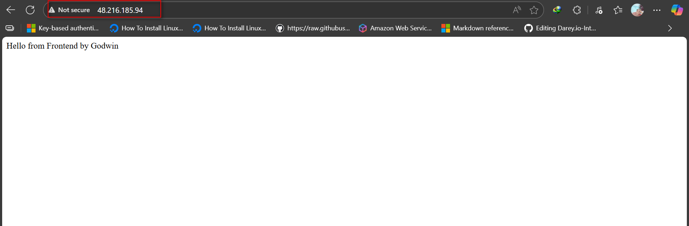

**Attached the frontend to the custom network:**


**Build and attached the Backend Service to the custom network:**

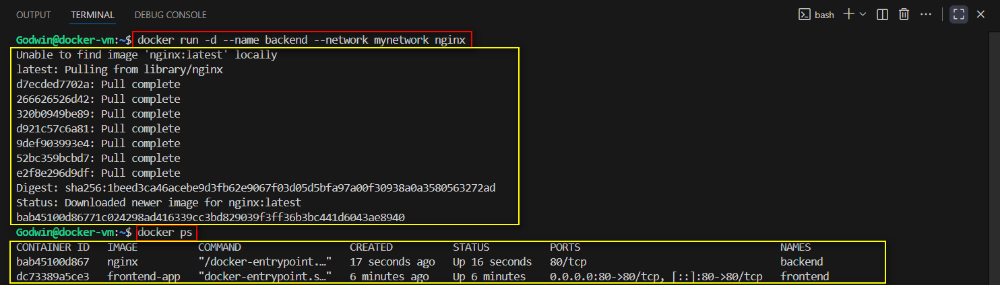


### Step 3: Verification

I verified both services are under the custom bridge network using ```docker network inspect mynetwork```

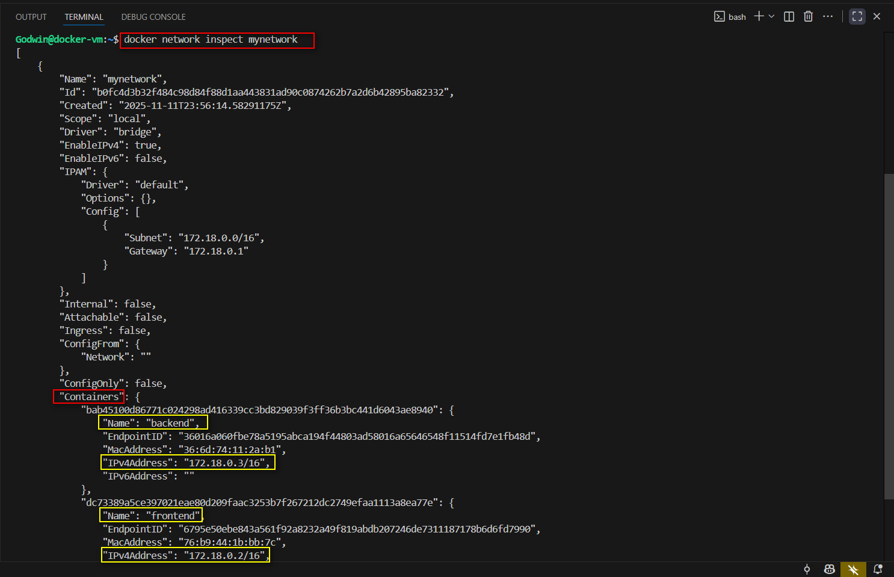

**Basic update and installation:**

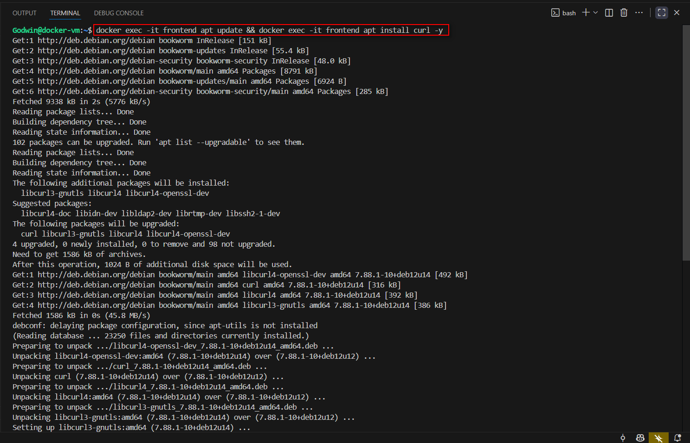


**Verify name-based connectivity with curl to backend API from frontend:**

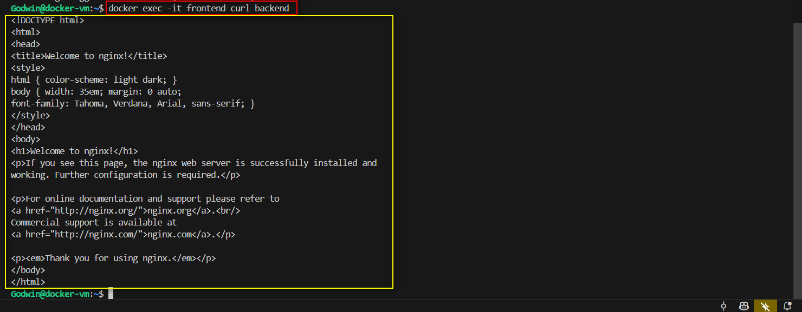


**Ping Backend:**

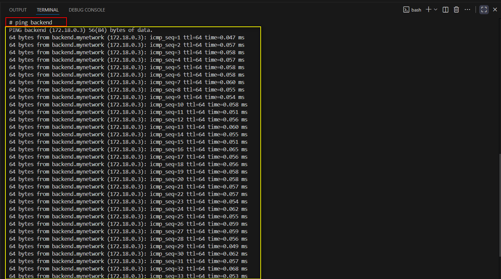

**Clean teardown**

```Bash
# Stop and remove containers
docker stop frontend backend
docker rm frontend backend

# Remove the custom network
docker network rm my-net

# Verify cleanup
docker ps -a
docker network ls

# Optional: Remove the frontend image
docker rmi frontend-app

# Optional: Remove frontend app directory
rm -rf docker-frontend
```

**Why Cleanup Matters:**

* Prevents resource exhaustion on shared systems.
* Avoids naming conflicts in future assignments.
* Good practice for production environments.
* Keeps the Docker environment clean and organized.

### Step 4: Key Concepts and Reflection

**Concepts**

- 1. Why containers can talk to each other by name: When you put containers on a user-defined Docker network, Docker gives them their own internal DNS. That DNS automatically knows each container’s name and IP. So if one container says “connect to backend,” Docker resolves the backend to its correct IP. No manual setup needed.

- 2. Why you can’t use localhost between containers: Every container has its own localhost. It doesn’t point to other containers — only to itself. So trying to reach another service using localhost will always fail.

- 3. When you actually need to expose ports:
* You do need port mapping (the -p option) when something outside Docker, like your browser or host computer, needs to reach a container.
* You do not need port mapping when containers talk to each other on the same network — they communicate internally using their container names and internal ports.

**Reflection:**

Using Docker’s default bridge network caused container-to-container DNS to fail, so the frontend couldn’t reach the backend by name—only by an IP that kept changing. Creating a custom bridge network solved this because it enables Docker’s built-in DNS, letting services communicate reliably using stable names like http://backend/.

This is the same principle real microservices rely on—for example, letting an e-commerce payment service call inventory-service or notification-service without worrying about IPs.

It also improves security: by not exposing backend ports publicly, the backend stays isolated inside the private network, reducing the attack surface while keeping everything fully functional.