# ASSIGNMENT 44 Report

## Multi-Stage Docker Build for a React App (Builder → Nginx Runtime)

This assignment explores multi-stage Docker builds by comparing a basic single-stage container with an optimized multi-stage version for a React application. Multi-stage builds separate compilation from runtime, producing images up to 96% smaller. This approach matters because smaller images deploy faster, cost less in cloud storage, and significantly improve security by removing unnecessary build tools that hackers could exploit. In production environments, this translates to quicker scaling, reduced attack surfaces, and more efficient CI/CD pipelines—essential skills for modern DevOps professionals.

### Objective
Use multi-stage builds to produce a small, production-ready container for a React application. Compare it with a single-stage baseline and explain the improvements in size, security, and deploy speed.

**Application repo:** [https://github.com/eyolegoo/my-react-app](https://github.com/eyolegoo/my-react-app)

### My Approach:
* A single-stage baseline image for `my-react-app`
* An optimized multi-stage image that:
    * Builds the React app in a Node builder stage
    * Serves static files from an Nginx runtime stage
* A running container reachable at `http://<IP>:3000` (or `:80` if you choose Nginx default)
* A short analysis of image size reduction and security benefits

---

## Step 1: Create a single-stage baseline

1.  Clone the app repository and navigate to `my-react-app`
2.  Create the `.dockerignore` file
3.  Add a `Dockerfile.single` in the project root.
4.  Build and run the baseline container.
5.  Open the app in a browser and confirm it loads correctly.

**Cloned repo**
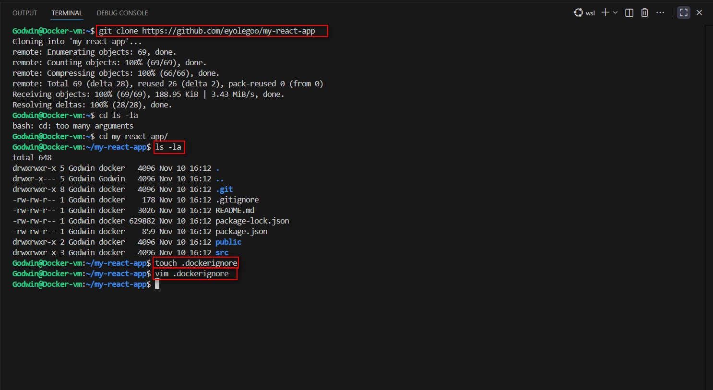

**.dockerignore file**
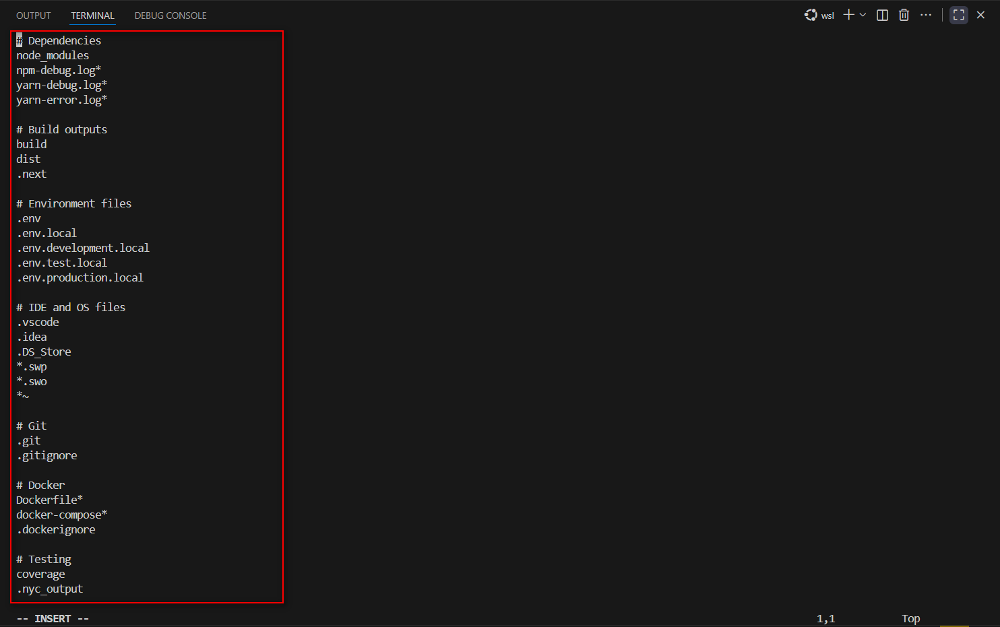

**Dockerfile.single**
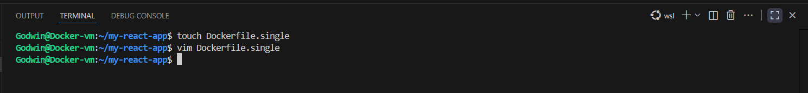

```dockerfile
FROM node:18

WORKDIR /app

COPY . .

# Install all dependencies
RUN npm install

# Build the app
RUN npm run build

# Install a simple server to serve the built app
RUN npm install -g serve

EXPOSE 3000

CMD ["serve", "-s", "build", "-l", "3000"]
```

Build the container

Bash

```Docker build -f Dockerfile.single -t my-react-app:single ```

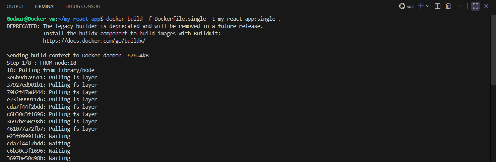
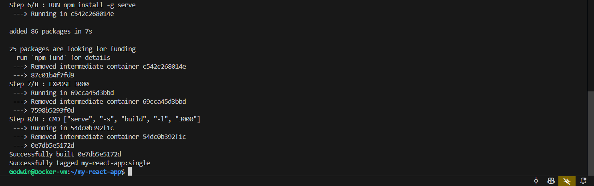
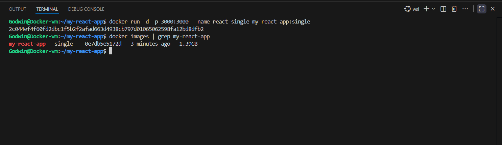
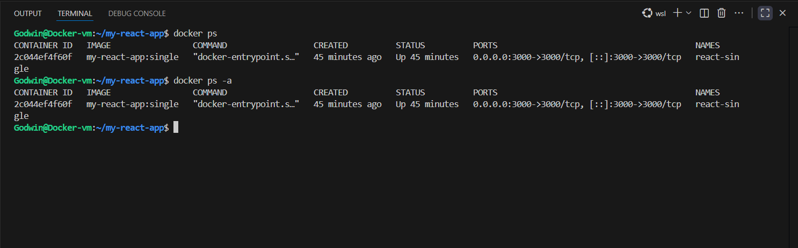


Testing the VM IP on the web browser

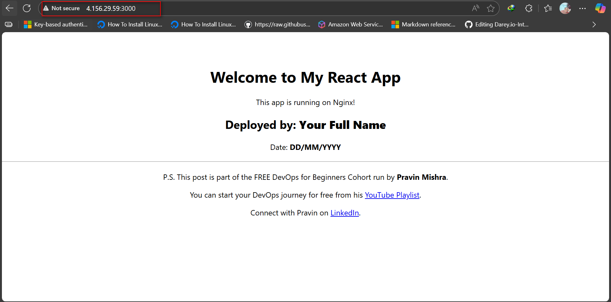

### Step 2: Design the multi-stage build

* Add a new Dockerfile (this will be your final image).
* Stage 1 (builder):
* Stage 2 (runtime):
* Build and run the multi-stage image.
* Open the app in a browser and verify it loads and routes correctly.

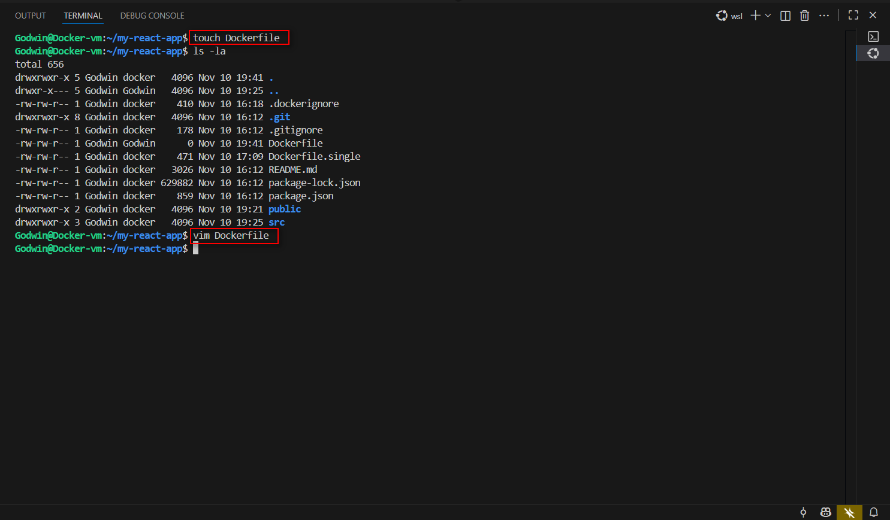

```Dockerfile
# Multi-stage Dockerfile for Production
# Stage 1: Builder - compile and build the React app
# Stage 2: Runtime - serve static files with Nginx

# ================================================
# Stage 1: Build Stage
# ================================================
FROM node:18-alpine AS builder

# Set working directory
WORKDIR /app

# Copy dependency files first (for better layer caching)
# If package.json/package-lock.json don't change, this layer is cached
COPY package*.json ./

# Install dependencies
RUN npm ci --only=production=false

# Copy the rest of the application source
COPY . .

# Build the React application
# This creates an optimized production build in the /app/build directory
RUN npm run build


# ================================================
# Stage 2: Runtime Stage (Production)
# ================================================
FROM nginx:alpine

# Remove default Nginx static content
RUN rm -rf /usr/share/nginx/html/*

# Copy built React app from builder stage to Nginx web root
```

**Nginx to serve the React app**


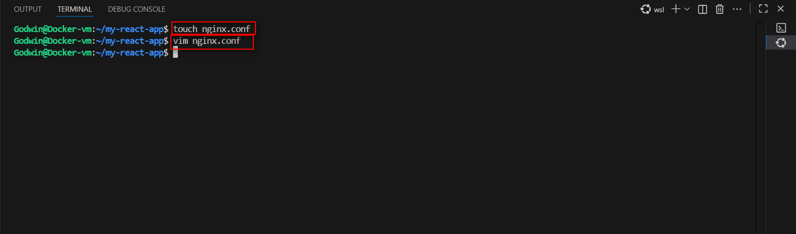
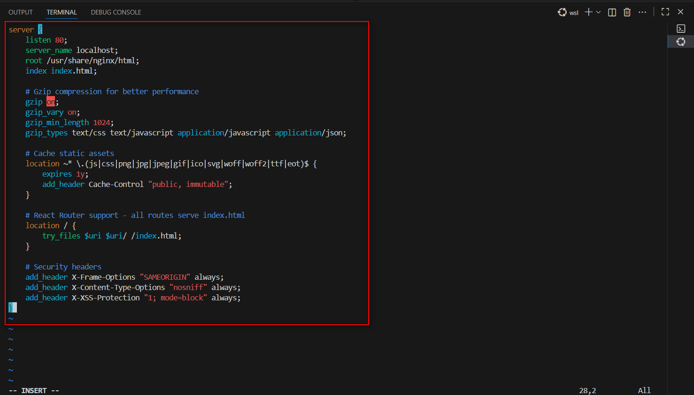

Run the build

Bash

```docker build -t my-react-app:multistage .```


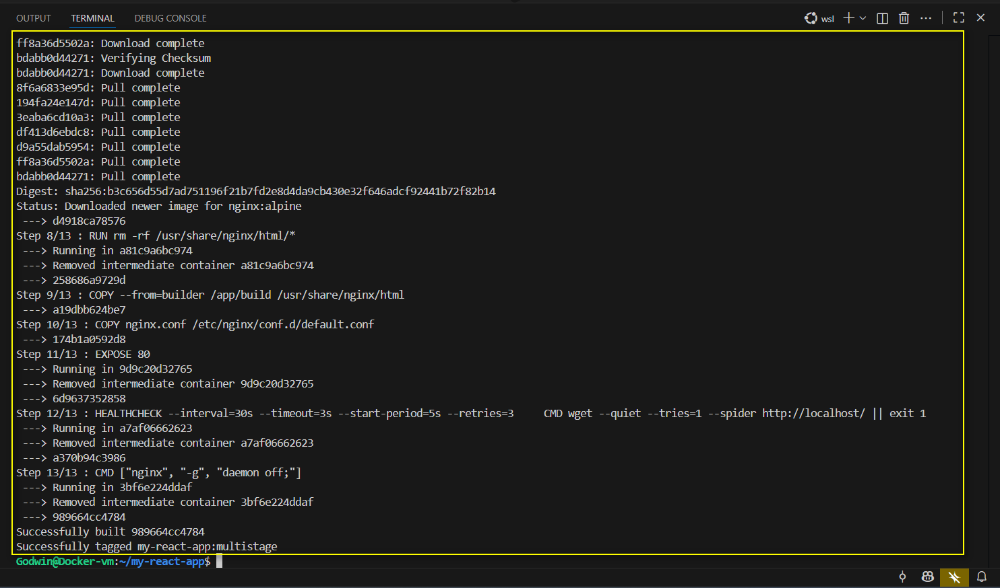


Testing the VM IP on the web browser after the multistage run

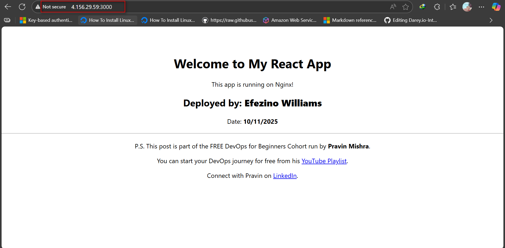


### Step 3: Images Size Comparison and Analysis

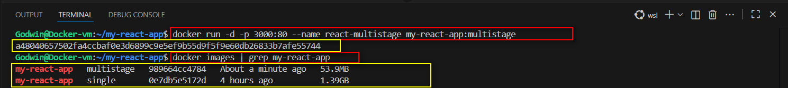

```
Size Reduction = ((Single - Multi) / Single) × 100 
Example: ((1390MB - 53.9MB) / 1390MB) × 100 = 96.122%
```

**Analysis:**
The multi-stage approach achieved a remarkable 96.122% size reduction, shrinking the image from 1.39GB to just 53.9MB by keeping build tools separate from production runtime. This dramatically improves security by removing Node.js and npm from the final container, leaving only Nginx and static files—minimizing potential attack vectors. Additionally, copying dependency files before source code enables Docker's layer caching, cutting rebuild times from minutes to seconds when only application code changes. These optimizations make deployments faster, safer, and more efficient.

### Step 3.1: Reflection

**Image Sizes:** Single-stage was 1390MB while multi-stage came out to just 53.9MB — a 96.122% reduction. Separating build tools from runtime made a massive difference in deployment efficiency.

**Security Improvement:** Removing Node.js and npm from the final image eliminates thousands of potential vulnerabilities. The lean runtime with only Nginx and static files provides minimal attack surface for hackers.

**Production Change:** I'd add environment variables for configurable API endpoints without rebuilding. I'd also implement SSL certificates and security headers for encrypted, secure connections.