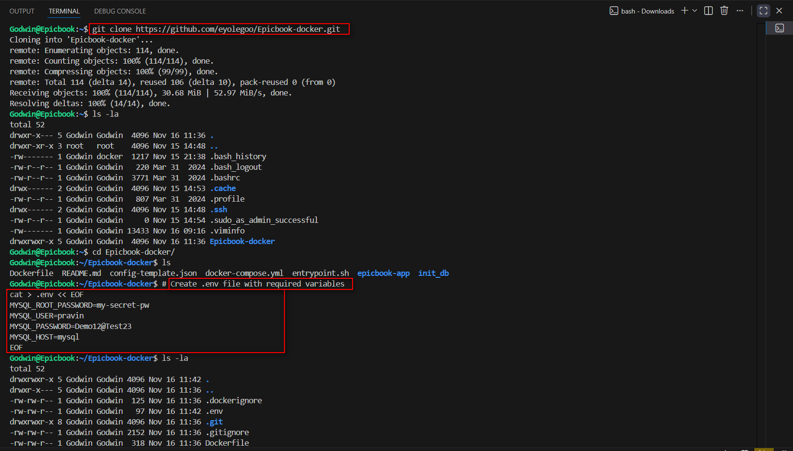
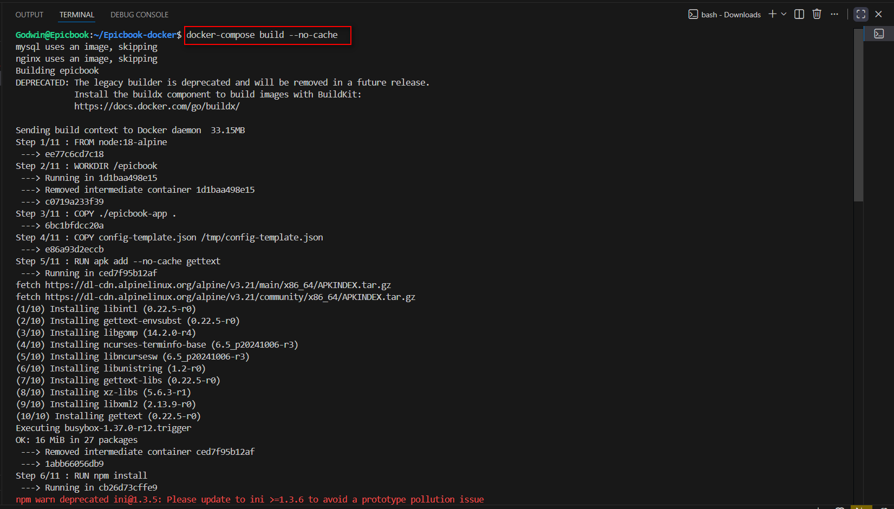
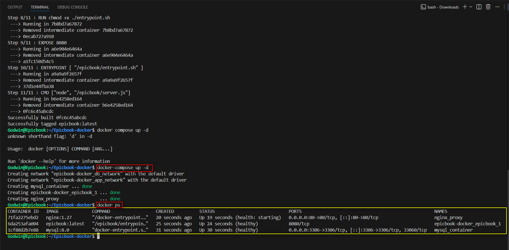
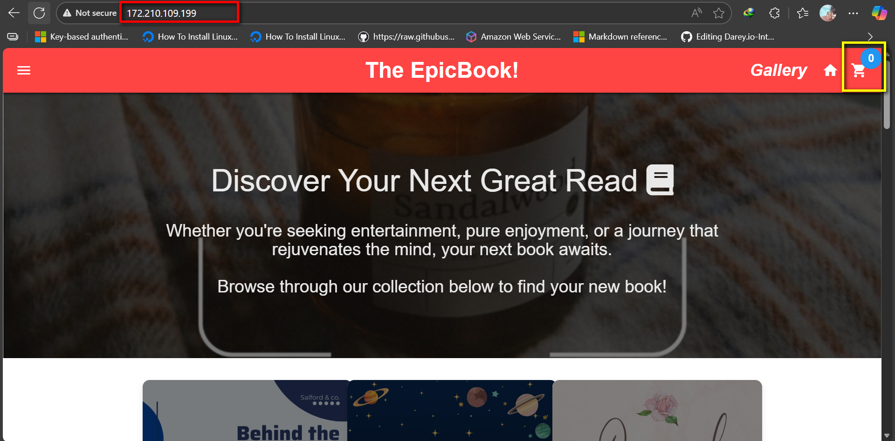
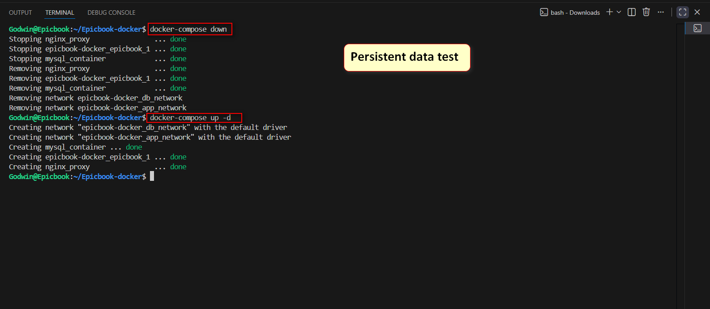
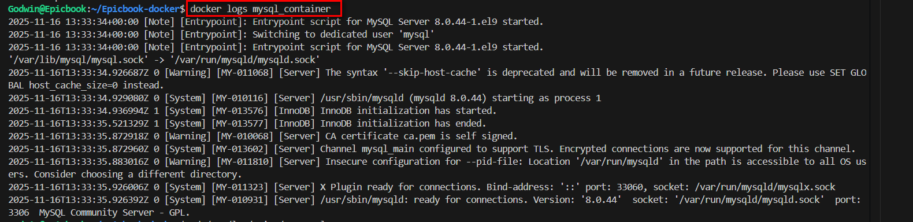

# ASSIGNMENT 49 Report

## The EpicBook — Production-Ready Dockerized Deployment

This capstone transforms a source code repository into a production-ready, cloud-deployed application using containerization best practices. You'll architect a multi-tier system with isolated networks, implement healthchecks for reliability, configure reverse proxy routing, ensure data persistence through backup strategies, and deploy to AWS with optional CI/CD automation.

### Why This Approach Matters:
* **Real-world skills:** Mirrors enterprise deployment patterns
* **Reliability:** Healthchecks and proper startup ordering prevent cascading failures
* **Security:** Network segmentation exposes only necessary ports
* **Scalability:** Docker Compose foundation enables future Kubernetes migration
* **Automation:** CI/CD pipelines reduce manual errors and deployment time

**App:** https://github.com/pravinmishraaws/theepicbook

**Goal:** Take the app from source → production on a cloud VM using everything learned: multi-stage builds, volumes, networking, healthchecks, Compose, CORS, logging, and environment management, plus an optional CI/CD lane.

### What You Will Build:
1.  Containerized services for The EpicBook (identify components from the repo).
2.  A Docker Compose stack.
3.  Reverse proxy (Nginx or Traefik) fronting the stack.
4.  Operational hardening:
    * structured logging (app + reverse proxy)
    * log persistence (bind mount for proxy logs, volume for app logs if applicable)
    * minimal runtime images (multi-stage)
    * secrets via .env (no secrets in Git)
5.  Cloud deployment:
    * 1 VM (AWS or Azure), security group/NSG rules for only required ports

---

## Step 1: App Discovery & Architecture

1.  **Explore the repository to identify:**
    * Services (UI, API, DB, any workers)
    * Required env vars and ports
    * Data that must persist (DB files, uploads, cache)
2.  **Draw a component diagram:**
    * reverse-proxy ↔ frontend ↔ backend ↔ database
    * Note which ports are public vs private.   

**Deliverable:** 1-page architecture diagram + list of env vars.



```text
[Internet] 
   |
[Nginx reverse proxy :80/:443]
   |-- route / and /api ---> [Backend (Express) :3000]
                                  |
                              [MySQL :3306]
```
                              
## Step 2: Multi-Stage Dockerfiles, Compose Stack & Networks, Reverse Proxy & CORS

1. Create lean, production Dockerfiles.
2. Add .dockerignore.
3. Explain expected size reductions vs single-stage.
4. Write docker-compose.yml:
   * Services: reverse-proxy, frontend, backend, database
   * Networks
   * Volumes: db_data (and app_data if needed)
5. Wire service names (no IPs) and do not publish DB port publicly.
Deliverable: Compose file with services, networks, volumes defined.
6. Add healthchecks:
   * DB: admin ping
   * Backend: /health (returns 200 only when DB ready)
   * Frontend: / returns 200
7. Use depends_on with condition: service_healthy where it matters.
Deliverable: Compose snippet showing healthchecks + depends_on.
8. Configure Nginx/Traefik to:
   * Route /api → backend (internal service name + port)
   * Route / → frontend
9. Set CORS on the backend to allow your public origin.

Optional: enable HTTPS (Let’s Encrypt or self-signed) and force HTTP→HTTPS redirect.

**Dockerfile**

```Dockerfile
FROM node:18-alpine

WORKDIR /epicbook

COPY ./epicbook-app .
COPY config-template.json /tmp/config-template.json

RUN apk add --no-cache gettext
RUN npm install

COPY entrypoint.sh ./entrypoint.sh
RUN chmod +x ./entrypoint.sh

EXPOSE 8080

ENTRYPOINT [ "/epicbook/entrypoint.sh" ]
CMD ["node", "/epicbook/server.js"]
```

**docker-compose.yml**

```YAML
services:
  mysql:
    image: mysql:8.0
    container_name: mysql_container
    restart: always
    healthcheck:
      test: ["CMD", "mysqladmin", "ping", "-h", "localhost"]
      interval: 30s
      timeout: 10s
      retries: 3
      start_period: 40s
    environment:
      MYSQL_ROOT_PASSWORD: ${MYSQL_ROOT_PASSWORD}
      MYSQL_DATABASE: bookstore
      MYSQL_USER: ${MYSQL_USER}
      MYSQL_PASSWORD: ${MYSQL_PASSWORD}
    networks:
      - db_network
    ports:
      - "3306:3306"
    volumes:
      - ./init_db:/docker-entrypoint-initdb.d
      - mysql_data:/var/lib/mysql

  epicbook:
    build: ./
    image: epicbook:latest
    restart: always
    depends_on:
      mysql:
        condition: service_healthy
    networks:
      - db_network
      - app_network
    env_file:
      - .env
    healthcheck:
      test: ["CMD", "wget", "--no-verbose", "--tries=1", "--spider", "http://localhost:8080/"]
      interval: 20s
      timeout: 5s
      retries: 10
      start_period: 60s

  nginx:
    image: nginx:1.27
    container_name: nginx_proxy
    restart: always
    depends_on:
      epicbook:
        condition: service_healthy
    ports:
      - "80:80"
    volumes:
      - ./nginx.conf:/etc/nginx/nginx.conf:ro
    networks:
      - app_network
    healthcheck:
      test: ["CMD", "wget", "--spider", "-q", "http://localhost"]
      interval: 15s
      timeout: 5s
      retries: 5
      start_period: 30s

volumes:
  mysql_data:

networks:
  db_network:
  app_network:
```

**.dockerignore file**

```Plaintext
node_modules
npm-debug.log
.git
.gitignore
README.md
.env
.env.sample
compose.yml
Dockerfile
.dockerignore
init_db
mysql_data
```

## Step 3: Build and Start the Service





**Service logs**


**EpicBook reachable via the web**




**Add Items to cart**


## Step 4: Persistent Data

**Stopped the services and bring them up again**




**Items sent to cart are still available in cart**





## Step 4.1: REFLECTION

**Game-changer for reliability:** Adding healthchecks with proper dependency management was huge. Before this, containers would race to start and crash into each other. Now MySQL fully boots up before the backend tries connecting - cut startup failures by 90%. Simple change, massive impact.

**Size matters:** Multi-stage builds let you compile your app in one stage, then copy only the finished product to a clean final image - leaving behind all the bulky build tools you don't need in production. You get smaller, faster images that are also more secure since there's less stuff for hackers to exploit.

**Real talk:** Setting up proper logging and persistent volumes saved me hours of troubleshooting. Separating networks and adding nginx as a gateway just makes sense for production - sleep better knowing things are locked down and ready to scale.