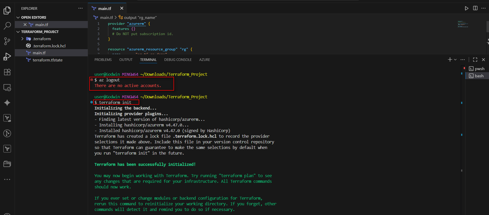
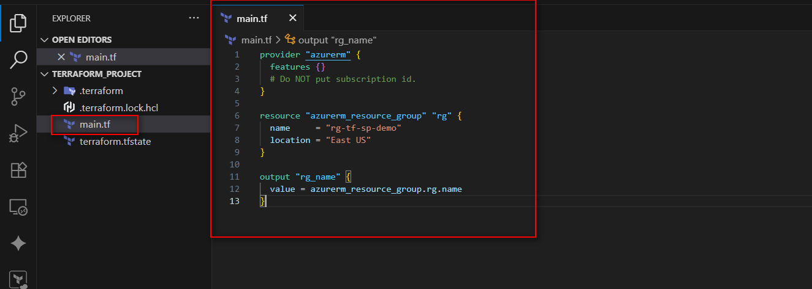
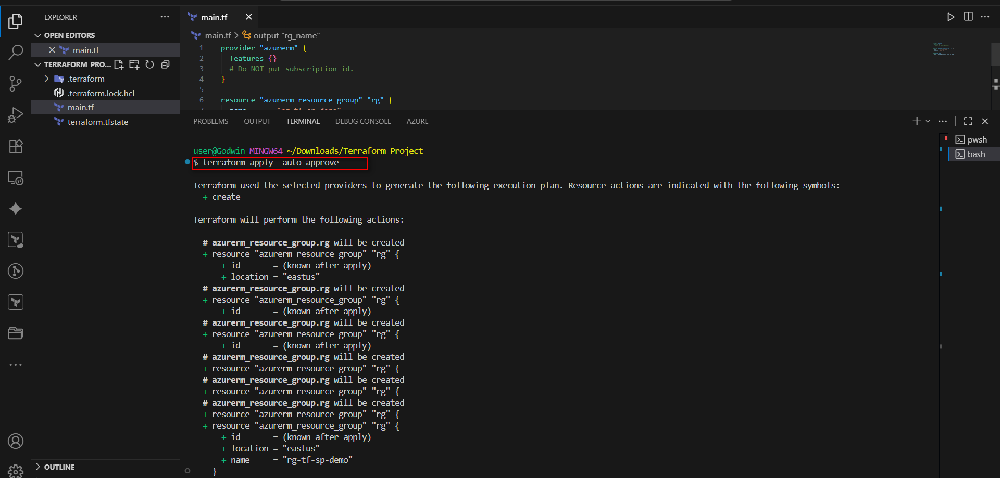
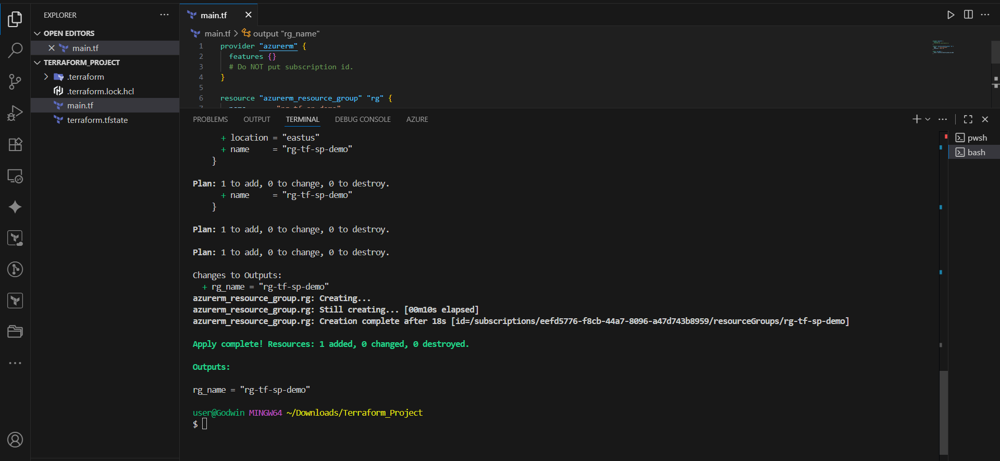
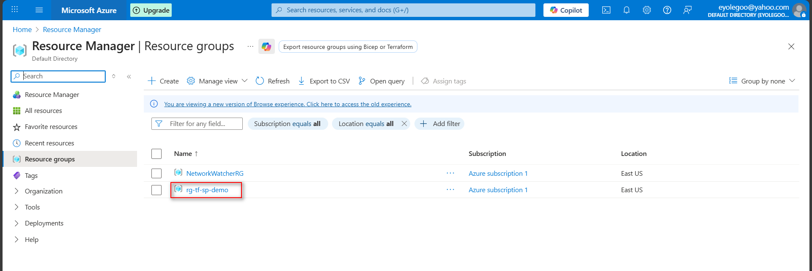
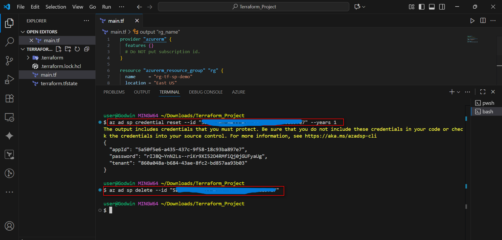

# Assignment 28: Authenticate Terraform to Azure using Service Principal + Client Secret

## Overview
This project demonstrates how to configure Terraform to authenticate to Azure using a **Service Principal (SP)** with a Client Secret, rather than using personal user credentials. This method is essential for automated CI/CD pipelines and production environments where interactive login is not possible.

## Objective
Configure Terraform to authenticate to Azure without a personal login by creating and using a Service Principal (SP) with a client secret, granting it least-privilege RBAC access.

## Concept: What is a Service Principal?
A Service Principal is an identity created for use with applications, hosted services, and automated tools to access Azure resources. By using a service principal, you can grant specific permissions to applications without needing to use user credentials, enhancing security and compliance.

---

## Implementation Steps

### Step 1: Identify Subscription
First, I authenticated to Azure and identified the specific subscription ID where resources would be deployed.

```bash
az login
az account show --query id -o tsv
````

### Step 2: Create Service Principal (SP) with RBAC

I created an identity (Service Principal) and granted it the `Contributor` role scoped strictly to my subscription.

**Command:**

```bash
az ad sp create-for-rbac --name "terraform-sp" --role="Contributor" --scopes="/subscriptions/<your-subscription-id>"
```

**Output:**
The command returns the credentials needed for authentication:

```json
{
  "appId": "<your-client-id>",
  "displayName": "terraform-sp",
  "password": "<your-client-secret>",
  "tenant": "<your-tenant-id>"
}
```

### Step 3: Export Credentials as Environment Variables

Terraform’s `azurerm` provider automatically looks for specific environment variables to authenticate. Instead of hardcoding secrets in the Terraform code (which is insecure), I exported them into my local session.

**PowerShell Command:**

```powershell
[Environment]::SetEnvironmentVariable("ARM_CLIENT_ID", "<your-appId>", "User")
[Environment]::SetEnvironmentVariable("ARM_CLIENT_SECRET", "<your-password>", "User")
[Environment]::SetEnvironmentVariable("ARM_SUBSCRIPTION_ID", "<your-subscription-id>", "User")
[Environment]::SetEnvironmentVariable("ARM_TENANT_ID", "<your-tenant-id>", "User")
```

*(Note: For macOS/Linux, use the `export` command in `~/.bashrc` or `~/.zshrc`)*

### Step 4: Verify Authentication

To ensure Terraform was using the Service Principal and not my personal account, I logged out of the Azure CLI.

```bash
az logout
```




### Step 5: Provision Infrastructure

I created a minimal `main.tf` configuration to test the connectivity.

**main.tf:**

```hcl
provider "azurerm" {
  features {}
  # Subscription ID is explicitly omitted here as it is sourced from Env Vars
}

resource "azurerm_resource_group" "rg" {
  name     = "rg-tf-sp-demo"
  location = "East US"
}

output "rg_name" {
  value = azurerm_resource_group.rg.name
}
```




**Execution:**

1.  `terraform init`
2.  `terraform plan`
3.  `terraform apply`







The resource group was successfully created using the Service Principal credentials.

-----

## Security Best Practices

### Secret Rotation

Service Principal secrets have an expiration. To rotate a secret (create a new password), use the following command:

```bash
az ad sp credential reset --name "terraform-sp" --years 1
```




### Secrets Management

In this setup, sensitive data like Azure Service Principal credentials are stored as environment variables. In a production environment, these would be managed securely through **Azure Key Vault**. Secret rotation is automated with scheduled scripts or policies, and Terraform modules automatically pull updated credentials. This approach keeps deployments secure, consistent, and hassle-free.

-----

## Benefits of Using Service Principals

1.  **Least-Privilege Access:** You can assign only the necessary permissions to the service principal, reducing the risk of over-permissioning.
2.  **Secure Separation of Duties:** Service principals allow you to separate duties between development and operations, enhancing security by limiting access based on roles.
3.  **Automated CI/CD Deployments:** Service principals can be integrated into CI/CD pipelines, enabling automated deployments without human intervention.
4.  **Auditable Actions:** Actions performed by the service principal can be tracked and logged, aiding in compliance and governance.
5.  **Unattended Infrastructure Provisioning:** This method allows for automated infrastructure provisioning without the need for human input, making it ideal for production environments.

## Conclusion

Using a Service Principal for Terraform authentication in Azure has proven both secure and efficient. It strengthens automation, protects credentials, and aligns perfectly with DevOps best practices, ensuring reliable and consistent infrastructure management.

```
```
