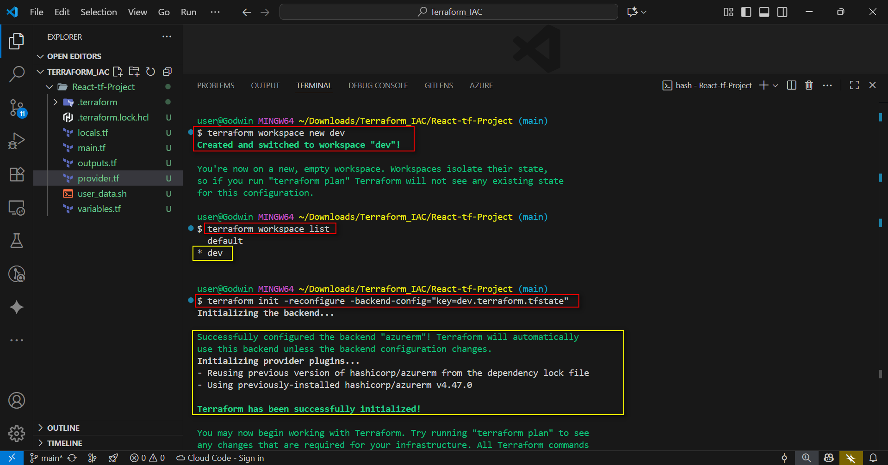
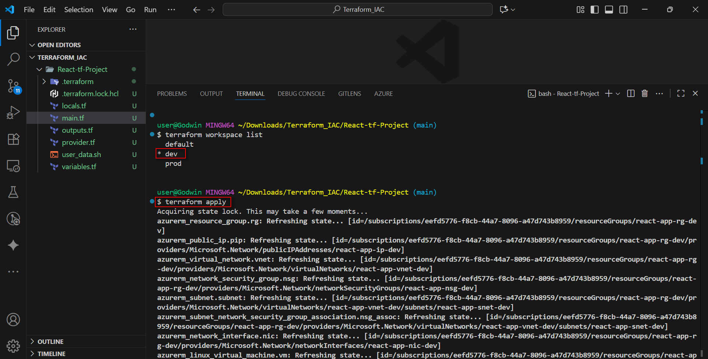
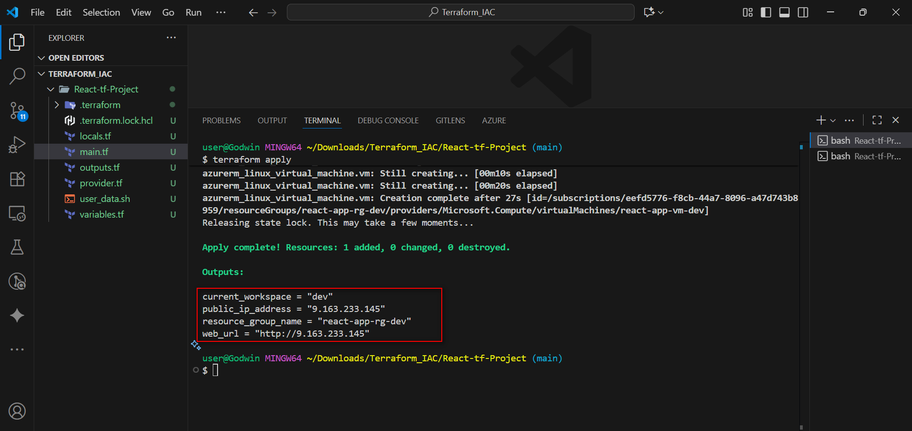
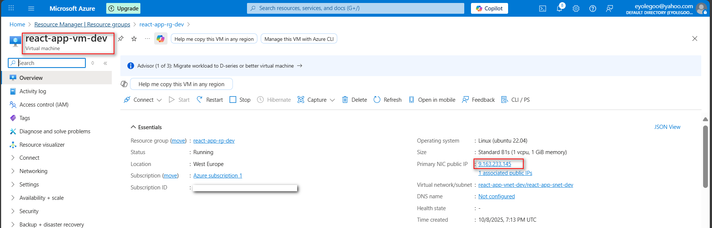
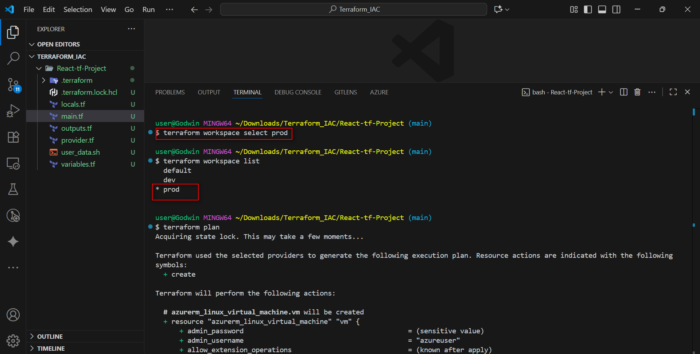
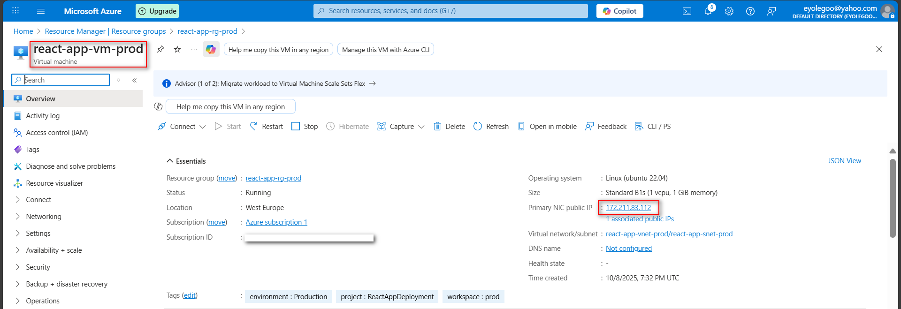
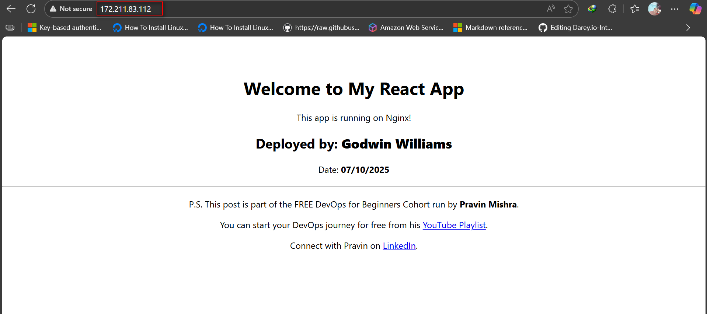
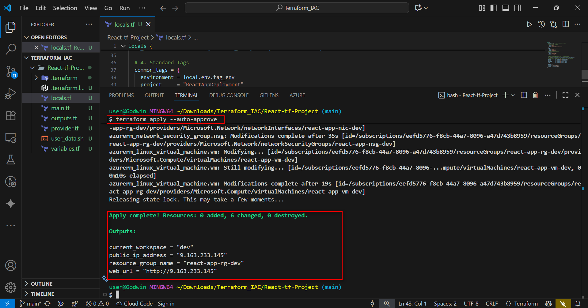
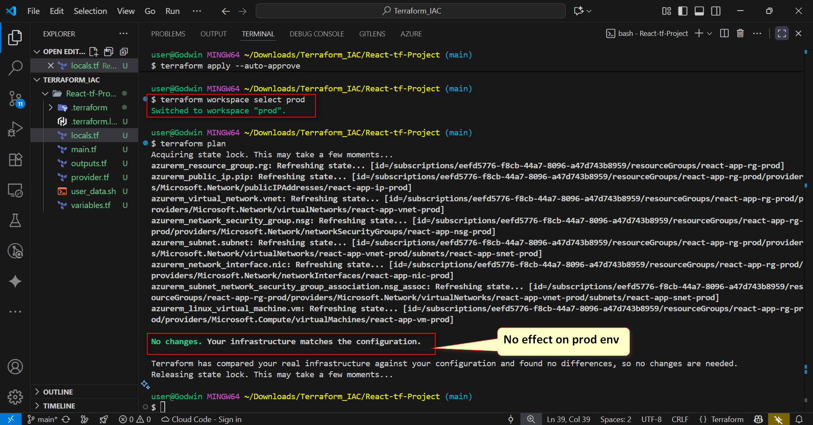
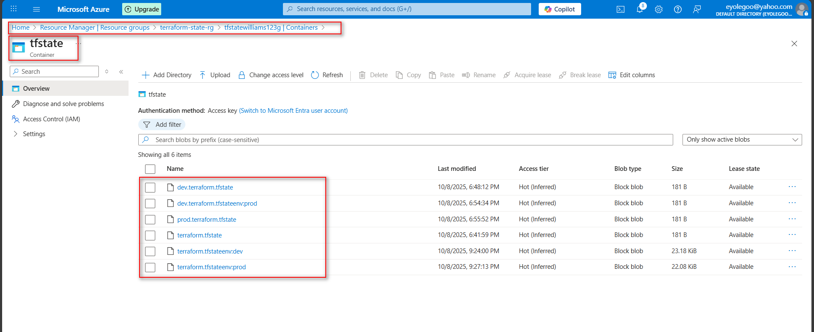

# ASSIGNMENT 31 Report: Deploy a React App with Terraform Workspaces (dev & prod)

In this project, I deployed a full-stack React application to two separate environments — Development and Production — on Azure. I used Infrastructure as Code (IaC) to define all the infrastructure in code rather than setting it up manually.
This approach made deployments consistent and repeatable, while also letting me track every change through version control. It helped eliminate drift in configuration and ensured both environments stayed identical — true, reliable copies of each other from setup to deployment.

## Real-World Scenario
Your team serves a React Application from Azure. You are asked to:
* Stand up two identical stacks (dev & prod) with separate state via workspaces.
* Use variables (maps/locals) so names, tags, and settings adapt by environment.
* Build the React app locally and publish the build artifacts to each environment.

## Objective
Use one Terraform root module to create two separate environments (dev & prod) by leveraging:
* Dynamic variables (variables + locals + per-env maps)
* Terraform workspaces (dev, prod) to isolate names and resources
* Create all require resource to deploy our React Application
* Prove that switching workspaces does not replace the other environment

---

## Step 1: Needed Resource

**Azure provider block**
* A resource group (e.g. terraform-state-rg)
* Virtual Network and Subnet
* Network Security Group to allow ports 22 (SSH), 443 (HTTPS) and 80 (HTTP)
* Public IP address
* Network Interface
* Ubuntu 22.04 Virtual Machine with:
    * Admin username and password or SSH key
    * Size: Standard B1s
    * Nsg and public IP association

**Background Activities**
* Connects via SSH to the VM using
* Installs Node.js, npm, Git, and Nginx
* Clones the React app from GitHub
* Builds and deploys the app to `/Var/www/html`
* Configures Nginx to serve the app
* Separates Workspace environments using Terraform

**The core idea is:**
1.  **Setup the State Storage (Prerequisite):** Create the Azure resources needed to store the Terraform state files securely.
2.  **Define the Application Infrastructure:** Create a single set of Terraform files that can provision a full environment (dev or prod).
3.  **Deploy using Workspaces:** Use terraform workspace to isolate the state for dev and prod, allowing us to deploy two identical, independent stacks from the same code.

---

## Step 2: Setup the State Storage (Prerequisite)

Before running any Terraform command, you must manually create the resources for the remote state backend in Azure.

**Pre-Deployment Azure Setup**
* Create a Resource Group for State: Name: `terraform-state-rg` (matches provider.tf)
* Create a Storage Account: Name: `tfstatewilliams123g` (must be globally unique; matches provider.tf). Disable "Hierarchical namespace".
* Create a Container: Name: `tfstate` (matches provider.tf)

**Create a Resource group**
```bash
az group create --name terraform-state-rg --location West Europe
````

**Create a Storage Account**

```bash
az storage account create --name tfstatewilliams123g  --resource-group terraform-state-rg --location westus  --sku Standard_LRS  --encryption-services blob
```

**Create a Container**

```bash
az storage container create  --name tfstate --account-name tfstatewilliams123g
```

### Module Structure

```text
React-tf-Project/
├── local.tf        # Defines environment-specific maps and data
├── main.tf         # Defines resources (VM, Network, etc.) and the remote backend
├── outputs.tf      # Defines outputs (like the public IP addresses)
├── provider.tf     # Defines the Azure provider configuration
├── user_data.sh    # Shell script to install Node, Nginx, and deploy the React app
└── variables.tf    # Defines input variables
```

  * **Locals.tf:** The core of environment switching. Uses terraform.workspace to dynamically pick names and settings for dev or prod.
  * **Main.tf:** Defines the complete VM network and VM resource, using locals.tf to select the name/size and user\_data.sh to deploy the app.
  * **Outputs.tf:** Displays the resulting Public IP and URL for easy access.
  * **Provider.tf:** Defines the Azure provider and the remote state backend configuration.
  * **User\_data.sh:** Executes all the required installation, cloning, editing (with your details), building, and Nginx configuration steps on the Ubuntu VM during its initial boot.
  * **Variables.tf:** Defines user-configurable settings. Remember to update

-----

## Step 3: Terraform Script Infrastructure setup

### Locals.tf

```hcl
locals {
  # 1. Environment Map: Configuration map based on workspace
  environment_map = {
    # Settings for 'dev' workspace
    dev = {
      suffix  = "dev"
      vm_size = "Standard_B1s"
      tag_env = "Development should be continous"
    }
    # Settings for 'prod' workspace
    prod = {
      suffix  = "prod"
      vm_size = "Standard_B1s"
      tag_env = "Production"
    }
    # Fallback for 'default' workspace
    default = {
      suffix  = "test"
      vm_size = "Standard_B1s"
      tag_env = "Testing"
    }
  }

  # 2. Dynamic Selection: Pulls settings based on current workspace name
  env = lookup(local.environment_map, terraform.workspace, local.environment_map.default)

  # 3. Dynamic Resource Name Generation (e.g., react-app-rg-dev or react-app-rg-prod)
  resource_group_name = "${var.base_name}-rg-${local.env.suffix}"
  vnet_name           = "${var.base_name}-vnet-${local.env.suffix}"
  subnet_name         = "${var.base_name}-snet-${local.env.suffix}"
  nsg_name            = "${var.base_name}-nsg-${local.env.suffix}"
  public_ip_name      = "${var.base_name}-ip-${local.env.suffix}"
  nic_name            = "${var.base_name}-nic-${local.env.suffix}"
  vm_name             = "${var.base_name}-vm-${local.env.suffix}"

  # 4. Standard Tags
  common_tags = {
    environment = local.env.tag_env
    project     = "ReactAppDeployment"
    workspace   = terraform.workspace
  }
}
```

### Main.tf

```hcl
# --- 1. Resource Group ---
resource "azurerm_resource_group" "rg" {
  name     = local.resource_group_name
  location = var.location
  tags     = local.common_tags
}

# --- 2. Virtual Network and Subnet ---
resource "azurerm_virtual_network" "vnet" {
  name                = local.vnet_name
  location            = azurerm_resource_group.rg.location
  resource_group_name = azurerm_resource_group.rg.name
  address_space       = ["10.0.0.0/16"]
  tags                = local.common_tags
}

resource "azurerm_subnet" "subnet" {
  name                 = local.subnet_name
  resource_group_name  = azurerm_resource_group.rg.name
  virtual_network_name = azurerm_virtual_network.vnet.name
  address_prefixes     = ["10.0.2.0/24"]
}

# --- 3. Network Security Group (NSG) to allow 22, 80, 443 ---
resource "azurerm_network_security_group" "nsg" {
  name                = local.nsg_name
  location            = azurerm_resource_group.rg.location
  resource_group_name = azurerm_resource_group.rg.name
  tags                = local.common_tags

  # Dynamic block for required ports: 22 (SSH), 80 (HTTP), 443 (HTTPS)
  dynamic "security_rule" {
    for_each = {
      ssh   = 22
      http  = 80
      https = 443
    }
    content {
      name                       = "Allow-${security_rule.key}"
      priority                   = 100 + security_rule.value
      direction                  = "Inbound"
      access                     = "Allow"
      protocol                   = "Tcp"
      source_port_range          = "*"
      destination_port_range     = security_rule.value
      source_address_prefix      = "Internet"
      destination_address_prefix = "*"
    }
  }
}

# Associate NSG with the Subnet
resource "azurerm_subnet_network_security_group_association" "nsg_assoc" {
  subnet_id                 = azurerm_subnet.subnet.id
  network_security_group_id = azurerm_network_security_group.nsg.id
}

# --- 4. Public IP Address ---
resource "azurerm_public_ip" "pip" {
  name                = local.public_ip_name
  location            = azurerm_resource_group.rg.location
  resource_group_name = azurerm_resource_group.rg.name
  allocation_method   = "Static"
  tags                = local.common_tags
}

# --- 5. Network Interface (NIC) ---
resource "azurerm_network_interface" "nic" {
  name                = local.nic_name
  location            = azurerm_resource_group.rg.location
  resource_group_name = azurerm_resource_group.rg.name
  tags                = local.common_tags

  ip_configuration {
    name                          = "internal"
    subnet_id                     = azurerm_subnet.subnet.id
    private_ip_address_allocation = "Dynamic"
    public_ip_address_id          = azurerm_public_ip.pip.id
  }
}

# --- 6. Ubuntu 24.04 Virtual Machine ---
resource "azurerm_linux_virtual_machine" "vm" {
  name                            = local.vm_name
  location                        = azurerm_resource_group.rg.location
  resource_group_name             = azurerm_resource_group.rg.name
  size                            = local.env.vm_size
  admin_username                  = var.vm_admin_username
  admin_password                  = var.vm_admin_password
  disable_password_authentication = false
  network_interface_ids           = [azurerm_network_interface.nic.id]
  tags                            = local.common_tags

  os_disk {
    caching              = "ReadWrite"
    storage_account_type = "Standard_LRS"
  }

  source_image_reference {
    publisher = "Canonical"
    offer     = "0001-com-ubuntu-server-jammy" # Ubuntu 22.04 LTS
    sku       = "22_04-lts"
    version   = "latest"
  }

  # Executes the user_data.sh script on first boot
  custom_data = base64encode(file("user_data.sh"))
}
```

### Outputs.tf

```hcl
output "current_workspace" {
  description = "The current active Terraform workspace."
  value       = terraform.workspace
}

output "public_ip_address" {
  description = "The Public IP Address of the current environment's VM."
  value       = azurerm_public_ip.pip.ip_address
}

output "web_url" {
  description = "The HTTP web URL for the current environment."
  value       = "http://${azurerm_public_ip.pip.ip_address}"
}

output "resource_group_name" {
  description = "The name of the Resource Group created."
  value       = azurerm_resource_group.rg.name
}
```

### Provider.tf

```hcl
# Define the Azure Provider
provider "azurerm" {
  features {}
}

# Remote Backend Configuration
# These values MUST match the resources created by backend_setup.tf
terraform {
  backend "azurerm" {
    resource_group_name  = "terraform-state-rg"
    storage_account_name = "tfstatewilliams123g"
    container_name       = "tfstate"
    # key is set by CLI command during workspace setup
  }
}
```

### User\_data.sh

```bash
#!/bin/bash

# --- Environment Variables (Goal 1 Configuration) ---
FULL_NAME="Godwin Williams"
DEPLOY_DATE="07/10/2025"
REPO_URL="[https://github.com/eyolegoo/my-react-app.git](https://github.com/eyolegoo/my-react-app.git)"
VM_USER="azureuser" # Matches var.vm_admin_username

# --- 1. System Update and Installation ---
echo "Starting system update and package installation (Node.js, npm, Nginx)..."
sudo apt update
sudo apt install -y nodejs npm
sudo apt install -y nginx

# Start and enable Nginx service
sudo systemctl start nginx
sudo systemctl enable nginx

# --- 2. Clone and Edit React App ---
echo "Cloning and configuring React application..."
cd /home/$VM_USER
git clone $REPO_URL

# Navigate to the source and edit App.js using sed
echo "Editing App.js to include name and date..."
cd my-react-app/src/
# Replace Full Name line
sudo sed -i "s|<h2>Deployed by: <strong>Your Full Name</strong></h2>|<h2>Deployed by: <strong>${FULL_NAME}</strong></h2>|g" App.js
# Replace Date line
sudo sed -i "s|<p>Date: <strong>DD/MM/YYYY</strong></p>|<p>Date: <strong>${DEPLOY_DATE}</strong></p>|g" App.js

# --- 3. Build the React App ---
echo "Building React application..."
cd /home/$VM_USER/my-react-app
npm install
npm run build

# --- 4. Deploy the Build Files to Nginx Web Directory ---
echo "Deploying build files to Nginx web root /var/www/html..."
sudo rm -rf /var/www/html/*
sudo cp -r build/* /var/www/html/
sudo chown -R www-data:www-data /var/www/html
sudo chmod -R 755 /var/www/html

# --- 5. Configure Nginx for React (SPA Routing) ---
echo "Configuring Nginx for Single-Page Application (SPA) routing..."
NGINX_CONF='server {
    listen 80;
    server_name _;
    root /var/www/html;
    index index.html;

    location / {
        try_files $uri $uri/ /index.html;
    }

    error_page 404 /index.html;
}'
echo "$NGINX_CONF" | sudo tee /etc/nginx/sites-available/default > /dev/null

# --- 6. Restart Nginx to apply the changes ---
echo "Restarting Nginx service..."
sudo systemctl restart nginx
sudo systemctl status nginx | grep 'Active:'
echo "Deployment script finished."
```

### Variables.tf

```hcl
variable "location" {
  description = "The Azure region to deploy resources."
  type        = string
  default     = "West Europe"
}

variable "vm_admin_username" {
  description = "The username for the Virtual Machine's administrator account."
  type        = string
  default     = "azureuser"
}

variable "vm_admin_password" {
  description = "The password for the Virtual Machine's administrator account."
  type        = string
  default     = "ReactDeploy_2025!" # <<< SECURELY CHANGE THIS
  sensitive   = true
}

variable "base_name" {
  description = "Base name for resources to be combined with environment suffix."
  type        = string
  default     = "react-app"
}
```

-----

## Step 4: Deploy using Workspaces

I initialized the using:

```bash
terraform init -reconfigure
```


*NB terraform init would work but because I fixed an issue on the state storage that is why the terraform init -reconfigure was used*

### Step 4.1: Create Workspaces

Workspace were created using:

```bash
terraform workspace new dev
terraform workspace new prod
```




Select dev environment using:

```bash
terraform workspace select dev
```

Then deploy using:

```bash
terraform plan
terraform apply
```






VM created as confirmed on the console:



Tested the output of the web url on a browser, this confirmed successful deployment on dev:


Select prod environment using:

```bash
terraform workspace select prod
```




Then deploy using:

```bash
terraform plan
terraform apply
```


VM created as confirmed on the console:




Tested the output of the web url on a browser, this confirmed successful deployment on prod:



-----

## Step 5: Prove Isolation

Switch back to dev and run terraform plan to confirm its present state.


Make a slight change on the tag\_evn for dev.


Then plan and apply.




Now switch back to prod and verify the effect from the last deployment on dev.




This shows that the change made in dev did not cause any drift or required update in the prod environment. Isolation is confirmed.




-----

## Step 5.1: Reflection on the Assignment

This project showed me how important it is to manage Terraform state carefully. At first, I struggled with workspaces because the state is stored remotely, but once I used the right commands, it worked. I also ran into an error with the VM image, which reminded me that cloud resources can fail if dependencies aren’t set up correctly. In the end, using workspaces and dynamic locals made it easy to separate dev and prod, and I was able to deploy two identical but independent web apps successfully.
