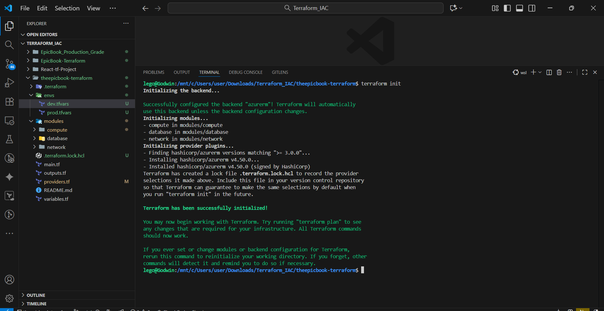
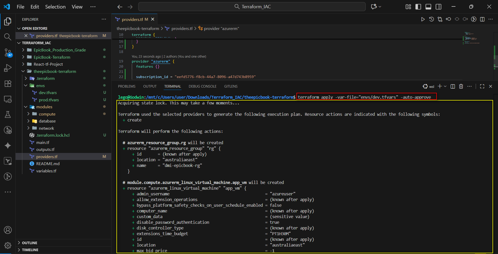
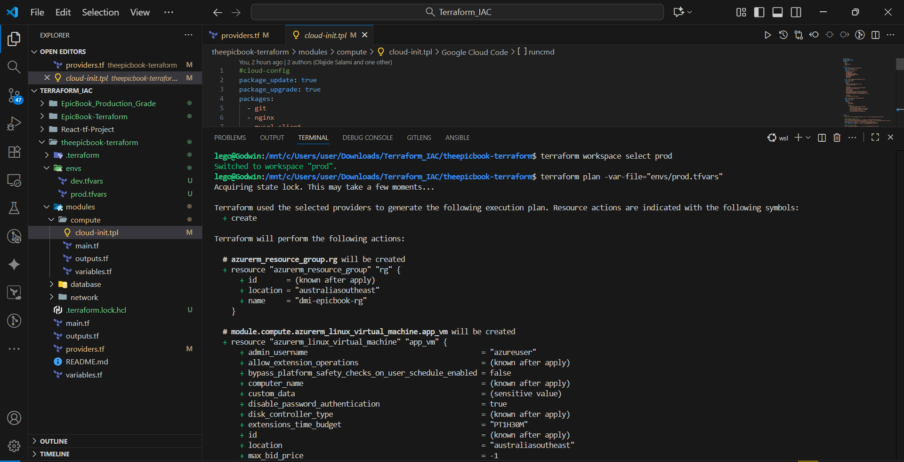
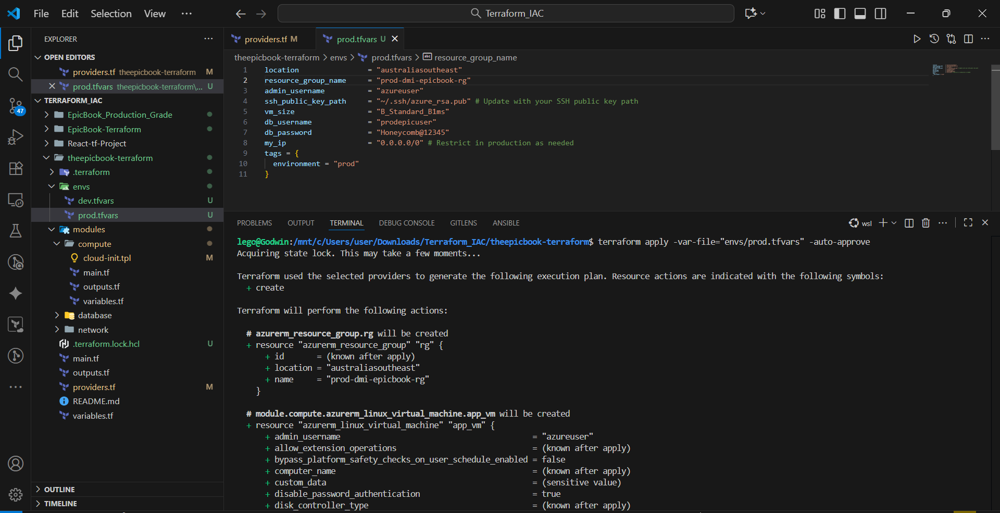
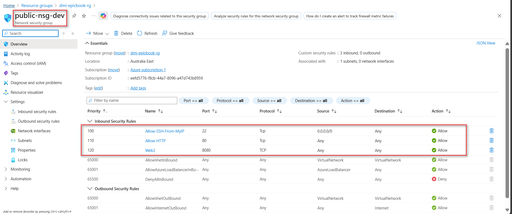
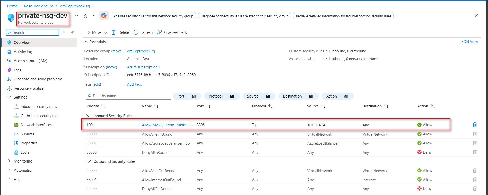
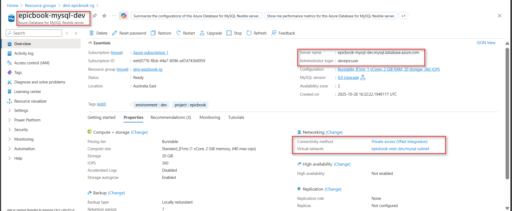

# ASSIGNMENT 32 Report
## EpicBook on Azure/AWS with Production-Grade Terraform

This deployment with Terraform is about building a reliable, scalable infrastructure using Infrastructure as Code. This approach ensures consistency, repeatability, and easier maintenance across environments. By automating the setup of networks, databases, and servers, teams reduce human error and accelerate deployment cycles. Terraform’s modular, version-controlled design also improves collaboration and disaster recovery—making it essential for maintaining a stable, production-ready cloud environment for EpicBook.

A team is standardizing on Terraform for repeatable environments. Security requires private DB, restricted NSGs, and remote, locked Terraform state so ten engineers can work safely. My task is to structure code so dev and prod are identical but isolated, differing only by variables and workspaces.

### Objective
Build the entire EpicBook stack on Azure or AWS (you decide) using production-grade Terraform patterns:
* Dynamic variables (locals + maps; env-aware naming & settings)
* Reusable modules (network, database, compute/app, optionally nginx)
* Workspaces (dev, prod) from a single codebase
* Remote backend (state stored in Azure Storage or S3)
* State file locking (Azure Blob lease or AWS DynamoDB)
* Two parallel environments deployed from your machine: dev and prod

---

### Step 1: What to Setup with terraform

**What I Must Build (Minimum)**

1.  **Networking (Module)**
    * VNet 10.0.0.0/16
    * Subnets:
        * public-subnet 10.0.1.0/24 (VM)
        * mysql-subnet 10.0.2.0/24 (Flexible Server with subnet delegation)
    * NSGs:
        * Public: allow 22 from your IP, allow 80 from Internet, deny all else
        * Private: allow 3306 only from 10.0.1.0/24

2.  **Database (Module)**
    * Azure Database for MySQL – Flexible Server, Private access (VNet integration) in mysql-subnet
    * DB epicbook, admin creds via variables (never hardcode)
    * Ensure Private DNS is created/linked

3.  **Compute/App (Module)**
    * Ubuntu 22.04 LTS VM (B1s) in public-subnet with Public IP
    * Provision Node.js, npm, git, mysql-client, Nginx
    * Deploy EpicBook (frontend build + backend service)
    * Nginx serves SPA and reverse-proxies /api to backend (localhost port)

**Project Structure:**

```bash
user@Godwin MINGW64 ~/Downloads/Terraform_IAC/theepicbook-terraform (main)
$ tree
.
|-- README.md
|-- envs
|   |-- dev.tfvars
|   `-- prod.tfvars
|-- main.tf
|-- modules
|   |-- compute
|   |   |-- cloud-init.tpl
|   |   |-- main.tf
|   |   |-- outputs.tf
|   |   `-- variables.tf
|   |-- database
|   |   |-- main.tf
|   |   |-- outputs.tf
|   |   `-- variables.tf
|   `-- network
|       |-- main.tf
|       |-- outputs.tf
|       `-- variables.tf
|-- outputs.tf
|-- providers.tf
`-- variables.tf
````

**File Contents:**

**`main.tf`**

```hcl
resource "azurerm_resource_group" "rg" {
  name     = var.resource_group_name
  location = var.location
}

module "network" {
  source              = "./modules/network"
  resource_group_name = var.resource_group_name
  location            = var.location
  my_ip               = var.my_ip
  depends_on          = [azurerm_resource_group.rg]
  tags = merge(var.tags, { project="epicbook", environment=terraform.workspace })
}

module "database" {
  source              = "./modules/database"
  resource_group_name = var.resource_group_name
  location            = var.location
  subnet_id           = module.network.mysql_subnet_id
  db_username         = var.db_username
  db_password         = var.db_password
  depends_on          = [azurerm_resource_group.rg]
  tags = merge(var.tags, { project="epicbook", environment=terraform.workspace })
}

module "compute" {
  source              = "./modules/compute"
  resource_group_name = var.resource_group_name
  location            = var.location
  admin_username      = var.admin_username
  ssh_public_key_path = var.ssh_public_key_path
  subnet_id           = module.network.public_subnet_id
  db_host             = module.database.db_host
  db_username         = var.db_username
  db_password         = var.db_password
  public_ip_sku       = var.public_ip_sku
  depends_on          = [azurerm_resource_group.rg]
  tags = merge(var.tags, { project="epicbook", environment=terraform.workspace })
}
```

**`outputs.tf`**

```hcl
output "app_public_ip" {
  value       = module.compute.app_public_ip
  description = "Public IP of the app VM"
}

output "db_host" {
  value       = module.database.db_host
  description = "Private FQDN of MySQL Flexible Server"
}
```

**`providers.tf`**

```hcl
terraform {
  required_providers {
    azurerm = {
      source  = "hashicorp/azurerm"
      version = ">=3.0"
    }
  }
}

terraform {
  backend "azurerm" {
    resource_group_name  = "epicbook-rg"
    storage_account_name = "tfstateepicbooklego"
    container_name       = "tfstate"
    key                  = "terraform.tfstate"
  }
}

provider "azurerm" {
  features {}

  subscription_id = "kef57743-f8cb-44n7-2396-a47d75b8959"
}
```

**`variables.tf`**

```hcl
variable "location" { type = string }
variable "resource_group_name" { type = string }
variable "admin_username" { type = string }
variable "ssh_public_key_path" { type = string }
variable "db_username" { type = string }

variable "db_password" {
  type = string
  sensitive = true
}
variable "vm_size" { type = string }

variable "tags" {
    type = map(string)
    default = {}
    }

variable "public_ip_sku" {
    type = string
    default = "Standard"
    }
variable "my_ip" { type = string }
```

**`envs/dev.tfvars`**

```hcl
location                = "australiaeast"
resource_group_name     = "dmi-epicbook-rg"
admin_username          = "azureuser"
ssh_public_key_path     = "~/.ssh/azure_rsa.pub" # Update with your SSH public key path
vm_size                 = "B_Standard_B1ms"
db_username             = "devepicuser"
db_password             = "Honeycomb@123"
my_ip                   = "0.0.0.0/0"
tags = {
  environment = "dev"
}
```

**`envs/prod.tfvars`**

```hcl
location                = "australiasoutheast"
resource_group_name     = "prod-dmi-epicbook-rg"
admin_username          = "azureuser"
ssh_public_key_path     = "~/.ssh/azure_rsa.pub" # Update with your SSH public key path
vm_size                 = "B_Standard_B1ms"
db_username             = "prodepicuser"
db_password             = "Honeycomb@12345"
my_ip                   = "0.0.0.0/0" # Restrict in production as needed
tags = {
  environment = "prod"
}
```

**`modules/compute/main.tf`**

```hcl
resource "azurerm_public_ip" "app_pip" {
  name                = "app-pip-${terraform.workspace}"
  location            = var.location
  resource_group_name = var.resource_group_name
  allocation_method   = "Static"
  sku                 = var.public_ip_sku
}

resource "azurerm_network_interface" "app_nic" {
  name                = "app-nic-${terraform.workspace}"
  location            = var.location
  resource_group_name = var.resource_group_name

  ip_configuration {
    name                          = "internal"
    subnet_id                     = var.subnet_id
    private_ip_address_allocation = "Dynamic"
    public_ip_address_id          = azurerm_public_ip.app_pip.id
  }
}

resource "azurerm_linux_virtual_machine" "app_vm" {
  name                            = "epicbook-vm-${terraform.workspace}"
  resource_group_name             = var.resource_group_name
  location                        = var.location
  size                            = "Standard_B1s"
  admin_username                  = var.admin_username
  network_interface_ids           = [azurerm_network_interface.app_nic.id]
  disable_password_authentication = true

  admin_ssh_key {
    username   = var.admin_username
    public_key = file(var.ssh_public_key_path)
  }

  source_image_reference {
    publisher = "Canonical"
    offer     = "0001-com-ubuntu-server-jammy"
    sku       = "22_04-lts"
    version   = "latest"
  }

  os_disk {
    caching              = "ReadWrite"
    storage_account_type = "Standard_LRS"
  }

  custom_data = base64encode(
    templatefile("${path.module}/cloud-init.tpl", {
      db_host     = var.db_host
      db_username = var.db_username
      db_password = var.db_password
    })
  )

  tags = var.tags
}
```

**`modules/compute/outputs.tf`**

```hcl
output "app_public_ip" {
  value = azurerm_public_ip.app_pip.ip_address
}
```

**`modules/compute/variables.tf`**

```hcl
variable "location" { type = string }
variable "resource_group_name" { type = string }
variable "admin_username" { type = string }
variable "ssh_public_key_path" { type = string }
variable "subnet_id" { type = string }
variable "db_host" { type = string }
variable "db_username" { type = string }

variable "db_password" {
    type = string
    sensitive = true
    }
   
variable "tags" { type = map(string) }
variable "public_ip_sku" { type = string }
```

**`modules/compute/cloud-init.tpl`**

```yaml
#cloud-config
package_update: true
package_upgrade: true
packages:
  - git
  - nginx
  - mysql-client
  - curl

write_files:
  - path: /home/azureuser/Epicbook/.env
    permissions: '0644'
    owner: azureuser:azureuser
    content: |
      DB_HOST=${db_host}
      DB_PORT=3306
      DB_USER=${db_username}
      DB_PASSWORD=${db_password}
      DB_NAME=bookstore
      DB_SSL=true
      PORT=3000

  - path: /etc/systemd/system/Epicbook.service
    permissions: '0644'
    owner: root:root
    content: |
      [Unit]
      Description=EpicBook Node.js App
      After=network.target

      [Service]
      WorkingDirectory=/home/azureuser/Epicbook
      ExecStart=/usr/bin/npm start
      Restart=always
      User=azureuser
      EnvironmentFile=/home/azureuser/Epicbook/.env
      StandardOutput=append:/var/log/epicbook.log
      StandardError=append:/var/log/epicbook-error.log

      [Install]
      WantedBy=multi-user.target

  - path: /etc/nginx/sites-available/default
    permissions: '0644'
    owner: root:root
    content: |
      server {
          listen 80;
          server_name _;

          location / {
              proxy_pass http://localhost:3000;
              proxy_http_version 1.1;
              proxy_set_header Upgrade $http_upgrade;
              proxy_set_header Connection "upgrade";
              proxy_set_header Host $host;
              proxy_cache_bypass $http_upgrade;
          }
      }

runcmd:
  # Log start
  - echo "===== Starting EpicBook VM setup =====" | tee /var/log/epicbook-install.log

  # Install Node.js + npm (LTS)
  - echo "Installing Node.js and npm..." | tee -a /var/log/epicbook-install.log
  - curl -fsSL [https://deb.nodesource.com/setup_lts.x](https://deb.nodesource.com/setup_lts.x) | bash - >> /var/log/epicbook-install.log 2>&1
  - apt-get install -y nodejs >> /var/log/epicbook-install.log 2>&1
  - echo "Node version: $(node -v)" | tee -a /var/log/epicbook-install.log
  - echo "NPM version: $(npm -v)" | tee -a /var/log/epicbook-install.log

  # Clone or update the app
  - echo "Cloning app repository..." | tee -a /var/log/epicbook-install.log
  - git clone [https://github.com/eyolegoo/theepicbook.git](https://github.com/eyolegoo/theepicbook.git) /home/azureuser/Epicbook || (cd /home/azureuser/Epicbook && git pull >> /var/log/epicbook-install.log)
  - chown -R azureuser:azureuser /home/azureuser/Epicbook

  # Install dependencies
  - echo "Installing npm dependencies..." | tee -a /var/log/epicbook-install.log
  - cd /home/azureuser/Epicbook && sudo -u azureuser npm install >> /var/log/epicbook-install.log 2>&1

  # Setup and start the app
  - echo "Setting up systemd service..." | tee -a /var/log/epicbook-install.log
  - systemctl daemon-reload
  - systemctl enable Epicbook
  - systemctl start Epicbook

  # Restart NGINX to pick up new config
  - echo "Restarting NGINX..." | tee -a /var/log/epicbook-install.log
  - systemctl restart nginx

  - echo "===== EpicBook setup complete! =====" | tee -a /var/log/epicbook-install.log
```

**`modules/database/main.tf`**

```hcl
resource "azurerm_mysql_flexible_server" "myepicbooksql" {
  name                = "epicbook-mysql-${terraform.workspace}"
  resource_group_name = var.resource_group_name
  location            = var.location
  administrator_login = var.db_username
  administrator_password = var.db_password
  sku_name            = "B_Standard_B1ms"
  version             = "8.0.21"
  delegated_subnet_id = var.subnet_id
  tags                = var.tags
}

resource "azurerm_mysql_flexible_database" "epicbook_db" {
  name                = "epicbook"
  resource_group_name = var.resource_group_name
  server_name         = azurerm_mysql_flexible_server.myepicbooksql.name
  charset             = "utf8mb4"
  collation           = "utf8mb4_unicode_ci"
}
```

**`modules/database/outputs.tf`**

```hcl
output "db_host" {
  value = azurerm_mysql_flexible_server.myepicbooksql.fqdn
}
```

**`modules/database/variables.tf`**

```hcl
variable "location" { type = string }
variable "resource_group_name" { type = string }
variable "subnet_id" { type = string }
variable "db_username" { type = string }

variable "db_password" {
type = string
sensitive = true
}

variable "tags" { type = map(string) }
```

**`modules/network/main.tf`**

```hcl
resource "azurerm_virtual_network" "vnet" {
  name                = "epicbook-vnet-${terraform.workspace}"
  location            = var.location
  resource_group_name = var.resource_group_name
  address_space       = ["10.0.0.0/16"]
  tags                = var.tags
}

resource "azurerm_subnet" "public" {
  name                 = "public-subnet"
  resource_group_name  = var.resource_group_name
  virtual_network_name = azurerm_virtual_network.vnet.name
  address_prefixes     = ["10.0.1.0/24"]
}

resource "azurerm_subnet" "mysql" {
  name                 = "mysql-subnet"
  resource_group_name  = var.resource_group_name
  virtual_network_name = azurerm_virtual_network.vnet.name
  address_prefixes     = ["10.0.2.0/24"]

  delegation {
    name = "db-delegation"
    service_delegation {
      name    = "Microsoft.DBforMySQL/flexibleServers"
      actions = ["Microsoft.Network/virtualNetworks/subnets/join/action"]
    }
  }
}

resource "azurerm_network_security_group" "public_nsg" {
  name                = "public-nsg-${terraform.workspace}"
  location            = var.location
  resource_group_name = var.resource_group_name

  security_rule {
    name                       = "Allow-SSH-From-MyIP"
    priority                   = 100
    direction                  = "Inbound"
    access                     = "Allow"
    protocol                   = "Tcp"
    source_address_prefix      = var.my_ip
    destination_address_prefix = "*"
    source_port_range          = "*"
    destination_port_range     = "22"
  }

  security_rule {
    name                       = "Allow-HTTP"
    priority                   = 110
    direction                  = "Inbound"
    access                     = "Allow"
    protocol                   = "Tcp"
    source_address_prefix      = "*"
    destination_address_prefix = "*"
    source_port_range          = "*"
    destination_port_range     = "80"
  }
}

resource "azurerm_network_security_group" "private_nsg" {
  name                = "private-nsg-${terraform.workspace}"
  location            = var.location
  resource_group_name = var.resource_group_name

  security_rule {
    name                       = "Allow-MySQL-From-PublicSubnet"
    priority                   = 100
    direction                  = "Inbound"
    access                     = "Allow"
    protocol                   = "Tcp"
    source_address_prefix      = "10.0.1.0/24"
    destination_address_prefix = "*"
    source_port_range          = "*"
    destination_port_range     = "3306"
  }
}

resource "azurerm_subnet_network_security_group_association" "public_assoc" {
  subnet_id                 = azurerm_subnet.public.id
  network_security_group_id = azurerm_network_security_group.public_nsg.id
}

resource "azurerm_subnet_network_security_group_association" "mysql_assoc" {
  subnet_id                 = azurerm_subnet.mysql.id
  network_security_group_id = azurerm_network_security_group.private_nsg.id
}

resource "azurerm_private_dns_zone" "mysql_dns" {
  name                = "privatelink.mysql.database.${terraform.workspace}.azure.com"
  resource_group_name = var.resource_group_name
  tags                = var.tags
}

resource "azurerm_private_dns_zone_virtual_network_link" "dns_link" {
  name                  = "link-${terraform.workspace}"
  resource_group_name   = var.resource_group_name
  private_dns_zone_name = azurerm_private_dns_zone.mysql_dns.name
  virtual_network_id    = azurerm_virtual_network.vnet.id
  depends_on            = [azurerm_virtual_network.vnet]
}
```

**`modules/network/outputs.tf`**

```hcl
output "public_subnet_id" {
  value = azurerm_subnet.public.id
}

output "mysql_subnet_id" {
  value = azurerm_subnet.mysql.id
}

output "private_dns_zone_id" {
  value = azurerm_private_dns_zone.mysql_dns.id
}
```

**`modules/network/variables.tf`**

```hcl
variable "location" { type = string }
variable "resource_group_name" { type = string }
variable "my_ip" { type = string }
variable "tags" { type = map(string) }
```

-----

### Step 2: Initialization and Workspaces

I ran the init command to download the necessary provider plugins and configure your Azure backend.

```bash
terraform init
```



-----

### Step 3: Workspaces creation and deployment

Workspaces help isolate the environments. I created one for dev and one for prod.

```bash
terraform workspace new dev
terraform workspace new prod
```

Now we can view the workspaces using:

```bash
terraform workspace list
```

#### Step 3.1: Deploy the 'dev' Environment

Since I’m starting with dev environment, I switched to dev using:

```bash
terraform workspace select dev
```

On dev, I ran the plan command:

```bash
terraform plan -var-file="envs/dev.tfvars"
```


Followed by the apply command:

```bash
terraform apply -var-file="envs/dev.tfvars" -auto-approve
```




I entered the VM IP on a web browser `http://68.218.0.124`


#### Step 3.2: Deploy the 'prod' Environment

I switched to prod environment using:

```bash
terraform workspace select prod
```

On prod, I ran the plan command:

```bash
terraform plan -var-file="envs/prod.tfvars"
```




Followed by the apply command:

```bash
terraform apply -var-file="envs/prod.tfvars" -auto-approve
```




-----

### Step 4: State Locking Prove

Remote backends stop multiple users from applying changes simultaneously, protecting your infrastructure from conflicts and corruption during collaborative Terraform operations

1.  Open two terminals in the same terraform-epicbook directory.
2.  In Terminal A, start an apply and wait at the confirmation prompt (remove `-auto-approve`).
3.  In Terminal B, try to run any command that modifies state, like plan or apply.

Observe the error. Terminal B will immediately show an error message, proving the lock is working:


#### Infra Evidence









#### App Evidence


-----

### Step 4.1: Reflection

**Reflection**
This project helped me to think beyond writing Terraform code — I had to approach it like a true infrastructure architect. I learned how small configuration errors in networking or DNS can disrupt entire deployments, and how crucial logging and sequencing are for troubleshooting. Though the process was challenging, each error became a lesson that strengthened my understanding of real-world cloud automation and infrastructure design.

**Terraform Insight**
I finally understood how Terraform Workspaces isolate environments — like having separate universes for dev and prod, each with its own state and variables.

**Production Improvement**
I’d enable remote state locking and versioning in Azure Blob Storage to prevent conflicts, support collaboration, and allow easy rollbacks — key for a reliable production setup.
