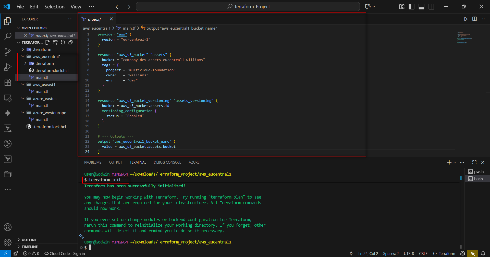
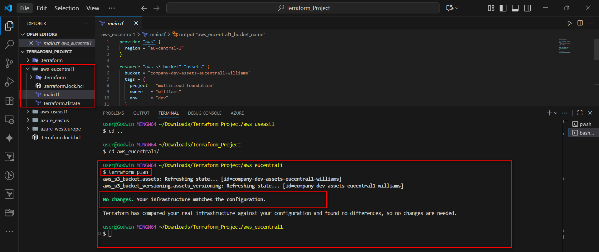
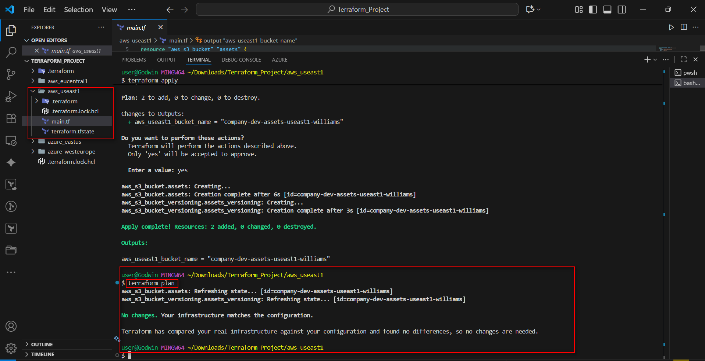
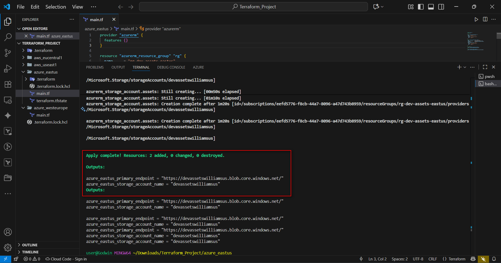
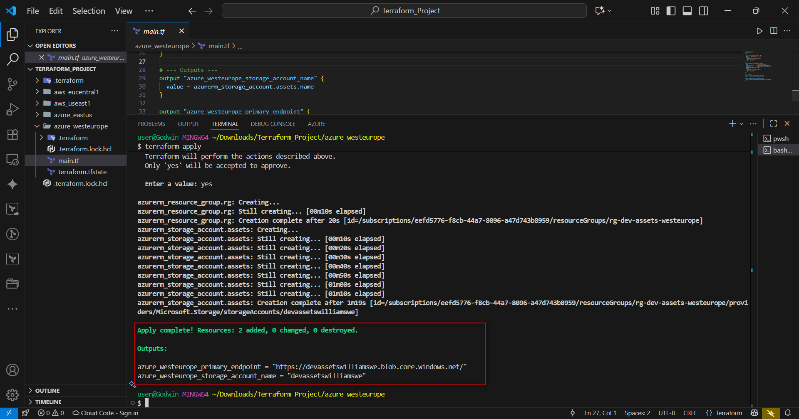
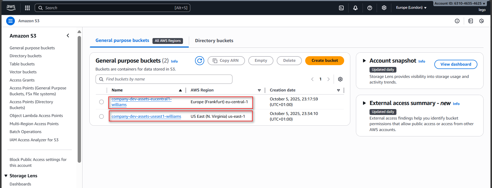
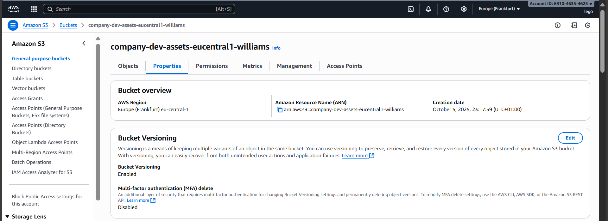
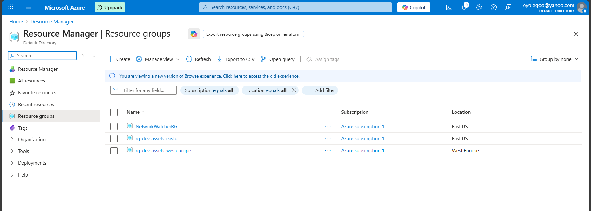
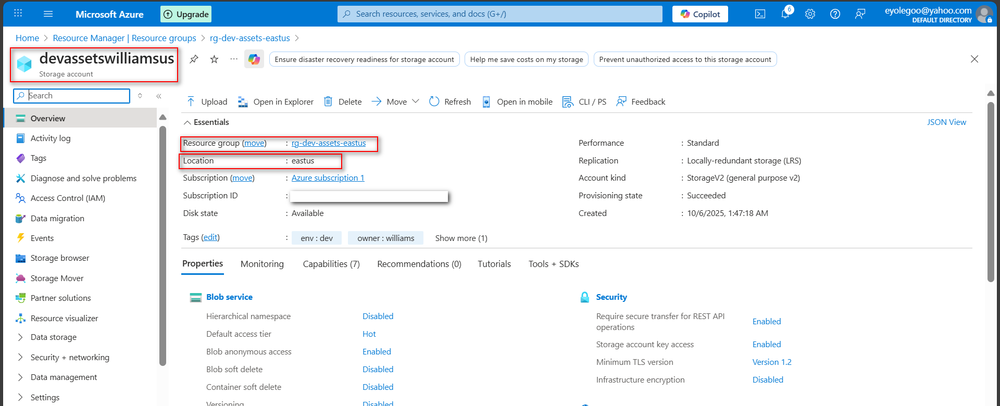
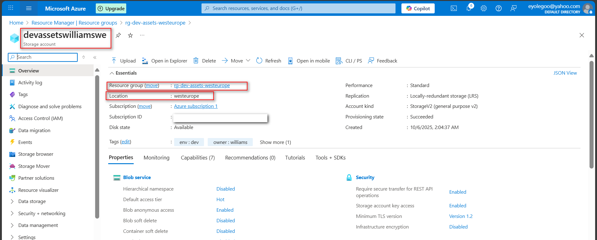

-----

# Multi-Cloud + Multi-Region Deployment with Terraform (Azure + AWS)

**Assignment 29** **Author:** Godwin Williams

## 📖 Project Overview

This project demonstrates a resilient, cloud-agnostic infrastructure deployment using **Terraform**. The goal is to establish an "asset landing zone" by provisioning storage foundations across two major cloud providers (**AWS** and **Azure**) and two distinct regions within each cloud.

### Scenario

> Your company needs a resilient, cloud-agnostic “asset landing zone.” Product teams will later push build artifacts and static assets to whichever region/cloud is closest. Today’s goal is to establish the foundations, not the data flows.

### Objective

To build confidence using the Terraform Registry to author configurations from scratch. The objective is to deploy a minimal, low-cost, multi-cloud, multi-region footprint including:

  * **AWS:** S3 buckets in `eu-central-1` and `us-east-1`.
  * **Azure:** Storage accounts (and Resource Groups) in `East US` and `West Europe`.

-----

## 🛠️ Prerequisites

  * Terraform installed locally.
  * AWS CLI configured with appropriate credentials.
  * Azure CLI installed and logged in (`az login`).

-----

## 🏗️ Step 1: Infrastructure Configuration

Below are the Terraform configurations used to provision resources across the different clouds and regions.

### 1\. AWS Configuration (Europe & US)

**Region: Euro-Central-1**

```hcl
provider "aws" {
  region = "eu-central-1"
}

resource "aws_s3_bucket" "assets" {
  bucket = "company-dev-assets-eucentral1-williams"
  tags = {
    project = "multicloud-foundation"
    owner   = "williams"
    env     = "dev"
  }
}

resource "aws_s3_bucket_versioning" "assets_versioning" {
  bucket = aws_s3_bucket.assets.id
  versioning_configuration {
    status = "Enabled"
  }
}

# --- Outputs ---
output "aws_eucentral1_bucket_name" {
  value = aws_s3_bucket.assets.bucket
}
```

**Region: US-East-1**

```hcl
provider "aws" {
  region = "us-east-1"
}

resource "aws_s3_bucket" "assets" {
  bucket = "company-dev-assets-useast1-williams"
  tags = {
    project = "multicloud-foundation"
    owner   = "williams"
    env     = "dev"
  }
}

resource "aws_s3_bucket_versioning" "assets_versioning" {
  bucket = aws_s3_bucket.assets.id
  versioning_configuration {
    status = "Enabled"
  }
}

# --- Outputs ---
output "aws_useast1_bucket_name" {
  value = aws_s3_bucket.assets.bucket
}
```

### 2\. Azure Configuration (East US & West Europe)

**Region: East US**

```hcl
provider "azurerm" {
  features {}
}

resource "azurerm_resource_group" "rg" {
  name     = "rg-dev-assets-eastus"
  location = "East US"
  tags = {
    project = "multicloud-foundation"
    owner   = "williams"
    env     = "dev"
  }
}

resource "azurerm_storage_account" "assets" {
  name                     = "devassetswilliamsus"
  resource_group_name      = azurerm_resource_group.rg.name
  location                 = azurerm_resource_group.rg.location
  account_tier             = "Standard"
  account_replication_type = "LRS"
  tags = {
    project = "multicloud-foundation"
    owner   = "williams"
    env     = "dev"
  }
}

# --- Outputs ---
output "azure_eastus_storage_account_name" {
  value = azurerm_storage_account.assets.name
}

output "azure_eastus_primary_endpoint" {
  value = azurerm_storage_account.assets.primary_blob_endpoint
}
```

**Region: West Europe**

```hcl
provider "azurerm" {
  features {}
}

resource "azurerm_resource_group" "rg" {
  name     = "rg-dev-assets-westeurope"
  location = "West Europe"
  tags = {
    project = "multicloud-foundation"
    owner   = "williams"
    env     = "dev"
  }
}

resource "azurerm_storage_account" "assets" {
  name                     = "devassetswilliamswe"
  resource_group_name      = azurerm_resource_group.rg.name
  location                 = azurerm_resource_group.rg.location
  account_tier             = "Standard"
  account_replication_type = "LRS"
  tags = {
    project = "multicloud-foundation"
    owner   = "williams"
    env     = "dev"
  }
}

# --- Outputs ---
output "azure_westeurope_storage_account_name" {
  value = azurerm_storage_account.assets.name
}

output "azure_westeurope_primary_endpoint" {
  value = azurerm_storage_account.assets.primary_blob_endpoint
}
```



-----

## 🚀 Step 2: Provisioning Resources

With the terraform scripts set, I initialized the directory, planned the deployment, and applied the configuration. I also re-ran the plan to confirm zero drift.

Commands used:

```bash
terraform init
terraform plan
terraform apply
```

### Execution Evidence

**AWS: Euro-central-1 Deployment**


**AWS: US-East-1 Deployment**


**Azure: East US Deployment**


**Azure: West Europe Deployment**


-----

## ✅ Step 3: Verification & Resources Created

Below are the confirmations of the resources created in the cloud consoles.

**AWS S3 Buckets and their Regions**


**Bucket Versioning Enabled**


**Azure Resource Groups**


**Azure Storage Accounts**




-----

## 📚 Concepts & Reflection

### Why Multi-Cloud + Multi-Region?

1.  **Resilience & High Availability:** If one cloud or region goes down, another can keep services running.
2.  **Performance:** Deploying in multiple regions places apps closer to users, reducing delays.
3.  **Compliance:** Some laws require data to stay in specific countries; multi-region setups help meet those rules.
4.  **Flexibility & Cost Optimization:** Businesses can choose the most cost-effective or feature-rich services from each provider.

### The Role of Terraform

Terraform is an Infrastructure as Code (IaC) tool that automates cloud resource creation. It allows us to:

  * Support multi-cloud providers in one configuration.
  * Ensure scalability and reusability with modules.
  * Manage state files to track resources across regions.
  * Simplify automation and CI/CD pipelines for deployment.

### Reflection

This assignment showed me how Terraform makes it possible to build consistent and repeatable infrastructure across different clouds. Separating state files or using provider aliases taught me the value of idempotency and how to avoid accidental changes.

I also learned about real-world challenges like unique naming for S3 buckets or Azure storage accounts, and how tagging helps with governance by linking resources to specific projects and owners. Enabling features like versioning and redundancy highlighted how small configuration choices can greatly improve resilience.

Overall, this project taught me more than just Terraform commands—it reinforced the mindset of planning, documenting, and managing infrastructure as reliable, maintainable code.

-----
