# ASSIGNMENT 30 Report

## Team-Ready State—Remote Backends & Locking (Azure + AWS)

### Real-World Scenario
A team of 10 engineers is moving off local state to avoid “it works on my machine.” You must:

Stand up team backends (Azure + AWS) for different projects. Enforce locking so two engineers can’t apply at the same time. Provide a short runbook so anyone can onboard and use the backends safely. You’ll use a tiny, low-cost resource per cloud (e.g., an Azure Resource Group; an AWS S3 bucket with basic settings) to keep the demo cheap and fast.

### Objective
Configure remote Terraform state in both Azure and AWS and prove state locking prevents concurrent changes.
You will:
* Set up a remote backend on Azure (Azure Storage)
* Set up a remote backend on AWS (S3 + DynamoDB for locking)
* Validate locking by deliberately attempting concurrent operations
* Document your findings like you would for a team runbook

---

## Step 1: Folder Structure

```text
TERRAFORM-PROJECT/BackendLock
├── AWS_BackendLock/
│   ├── main.tf
├── Azure_BackendLock/
│   ├── main.tf
├── Bootstrap_AWS/     Creates S3 bucket + DynamoDB table
│       └── main.tf            Main project using s3 backend                            
├── Bootstrap_Azure/    Creates RG, Storage Account, Container
        └── main.tf            Main project using azurerm backend
````

### AWS Backend Bootstrap

```hcl
terraform {
  required_providers {
    aws = {
      source  = "hashicorp/aws"
      version = "~> 6.0"
    }
  }
}

provider "aws" {
  region = "us-east-1"
}

# S3 bucket for remote state
resource "aws_s3_bucket" "backend" {
  bucket = "tfstate-williams-prod" # must be globally unique
}

# Enable versioning on the bucket (recommended for state recovery)
resource "aws_s3_bucket_versioning" "backend" {
  bucket = aws_s3_bucket.backend.id
  versioning_configuration {
    status = "Enabled"
  }
}

# Block public access (best practice for state buckets)
resource "aws_s3_bucket_public_access_block" "backend" {
  bucket                  = aws_s3_bucket.backend.id
  block_public_acls       = true
  block_public_policy     = true
  ignore_public_acls      = true
  restrict_public_buckets = true
}

# DynamoDB table for state locking
resource "aws_dynamodb_table" "backend" {
  name         = "terraform_state_lock"
  billing_mode = "PAY_PER_REQUEST"
  hash_key     = "LockID"

  attribute {
    name = "LockID"
    type = "S"
  }
}
```

### Azure Backend Bootstrap

```hcl
terraform {
  required_providers {
    azurerm = {
      source  = "hashicorp/azurerm"
      version = "~> 4.0"
    }
  }
}

provider "azurerm" {
  features {}
}

# Resource Group to hold the backend infra
resource "azurerm_resource_group" "backend" {
  name     = "rg-tfstate-backend"
  location = "East US"
}

# Storage Account for Terraform state
resource "azurerm_storage_account" "backend" {
  name                     = "tfstatewilliamsprod" # must be globally unique
  resource_group_name      = azurerm_resource_group.backend.name
  location                 = azurerm_resource_group.backend.location
  account_tier             = "Standard"
  account_replication_type = "LRS"
}

# Blob Container for state files
resource "azurerm_storage_container" "backend" {
  name                  = "tfstate"
  storage_account_id    = azurerm_storage_account.backend.id  # ✅ modern attribute
  container_access_type = "private"
}
```

## Step 1.1: Backend Provisioning

```bash
cd bootstrap/aws
terraform init
terraform apply
```

This creates the S3 bucket + DynamoDB table.

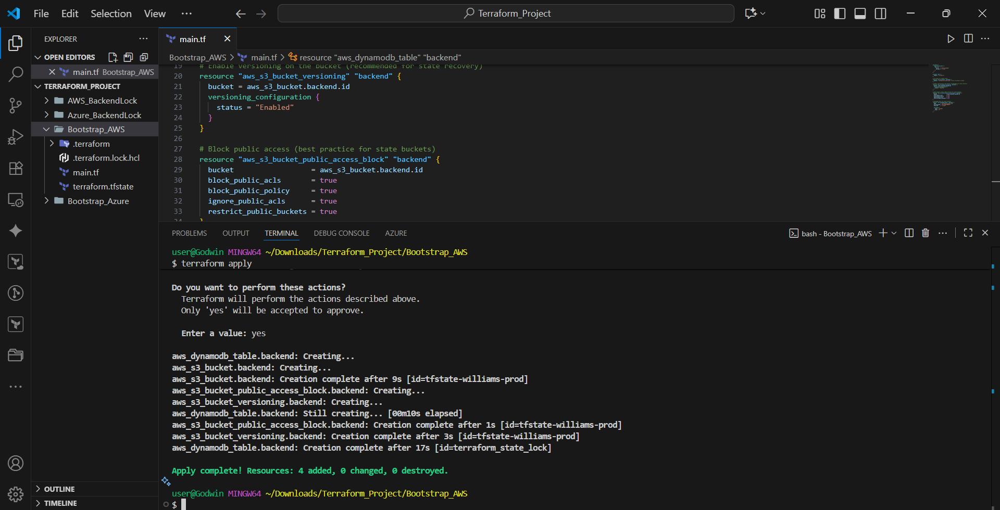

  * Stores state in S3 and use DynamoDB for locking.
  * A minimal resource to validate backend setup.

<!-- end list -->

```bash
cd bootstrap/azure
terraform init
terraform apply
```

This creates the Resource Group, Storage Account, and Container.

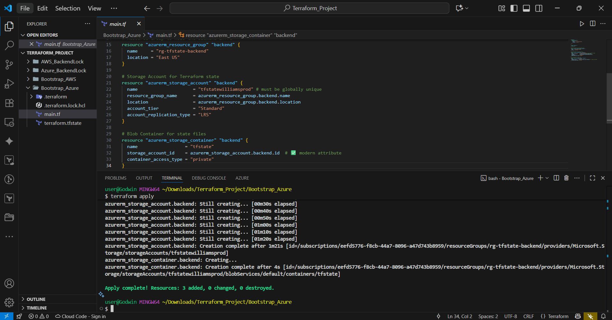

  * Configures remote state in Azure Blob Storage
  * A simple resource to validate backend setup.

-----

## Step 2: Provisioning the Infra main.tf (AWS)

```hcl
terraform {
  required_version = ">= 1.5.0"

  required_providers {
    aws = {
      source  = "hashicorp/aws"
      version = "~> 6.0"
    }
  }

  backend "s3" {
    # Values supplied at init
    # bucket         = "tfstate-williams-prod"
    # key            = "envs/prod/terraform.tfstate"
    # region         = "us-east-1"
    # dynamodb_table = "terraform_state_lock"
  }
}

provider "aws" {
  region = "us-east-1"
}

resource "random_id" "suffix" {
  byte_length = 4
}

resource "aws_s3_bucket" "demo" {
  bucket = "williams-demo-bucket-${random_id.suffix.hex}"
}

output "demo_bucket_name" {
  value = aws_s3_bucket.demo.bucket
}
```

**To initial with the Backend configuration:**

```bash
terraform init \
-backend-config="bucket=tfstate-williams-prod" \
-backend-config="key=envs/prod/terraform.tfstate" \
-backend-config="region=us-east-1" \
-backend-config="dynamodb_table=terraform_state_lock"
```

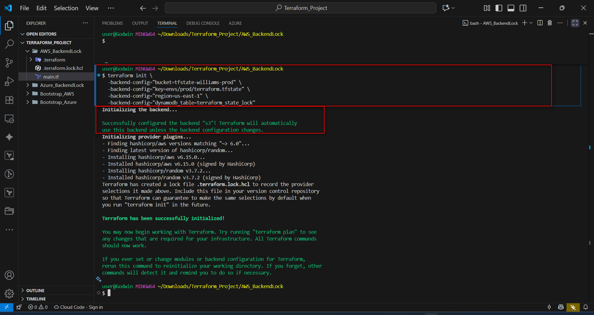


### Step 2.1: Locking test (AWS)

**To verify this:**

1.  Open two terminals in `aws/`.
2.  Start `terraform apply` in **Terminal A** and keep it interactive/running.
3.  Try `terraform apply` or `plan` in **Terminal B** and observe the DynamoDB lock behavior.

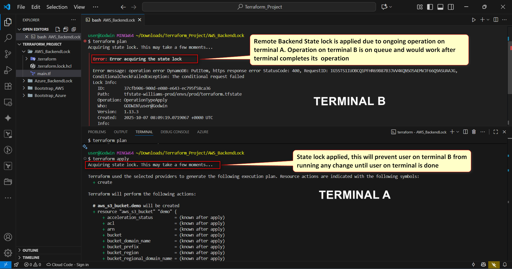

<!-- end list -->

  * No `terraform.tfstate` file, this confirmed Remote Backend was used.

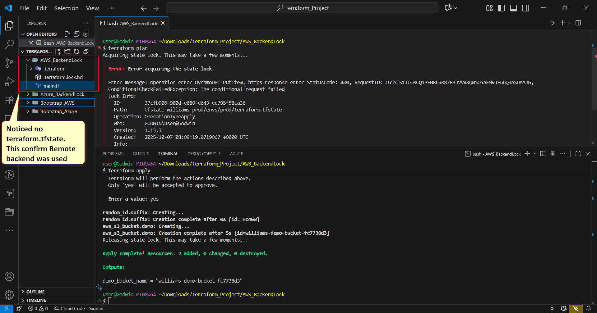


  * Terminal B resumes operation after Terminal A completes its operation.

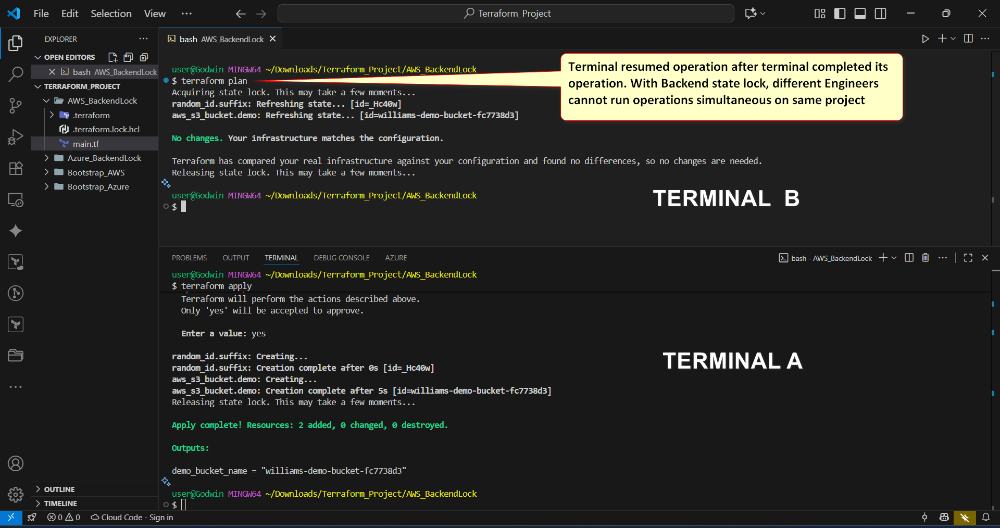

**Console Screenshots**

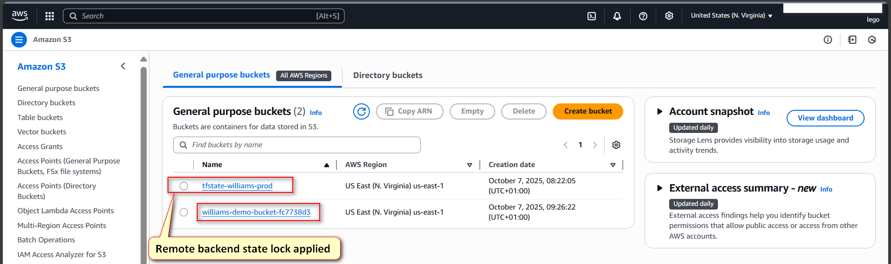

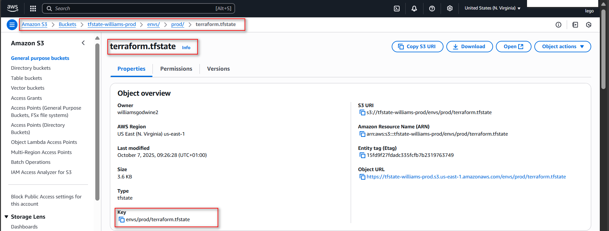

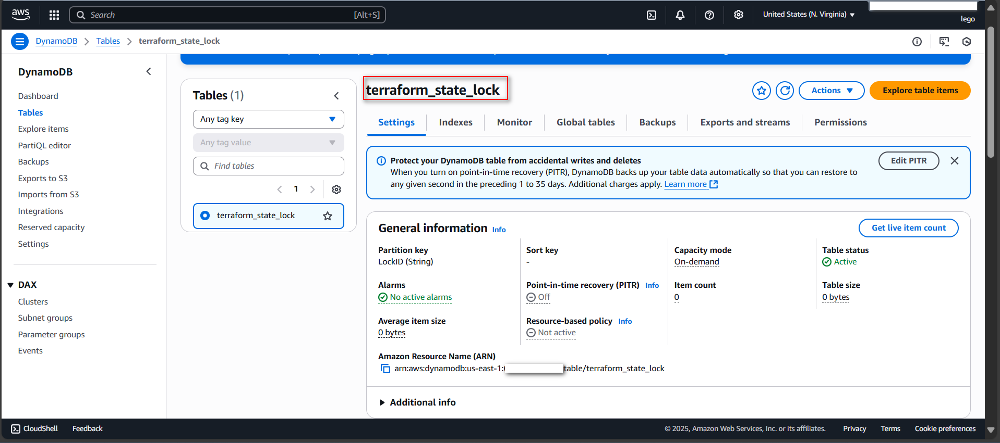

-----

## Step 3: Provisioning the Infra main.tf (Azure)

```hcl
terraform {
  required_version = ">= 1.5.0"

  required_providers {
    azurerm = {
      source  = "hashicorp/azurerm"
      version = "~> 4.0"
    }
  }

  backend "azurerm" {
    # Values supplied at init
    # storage_account_name = "tfstatewilliamsprod"
    # container_name       = "tfstate"
    # key                  = "envs/prod/terraform.tfstate"
    # use_azuread_auth     = true
  }
}

provider "azurerm" {
  features {}
}

resource "azurerm_resource_group" "demo" {
  name     = "rg-remote-state-demo_1"
  location = "East US"
}

output "resource_group_name" {
  value = azurerm_resource_group.demo.name
}
```

**To initial with the Backend configuration:**

```bash
terraform init \
-backend-config="storage_account_name=tfstatewilliamsprod" \
-backend-config="container_name=tfstate" \
-backend-config="key=envs/prod/terraform.tfstate" \
-backend-config="use_azuread_auth=true"
```

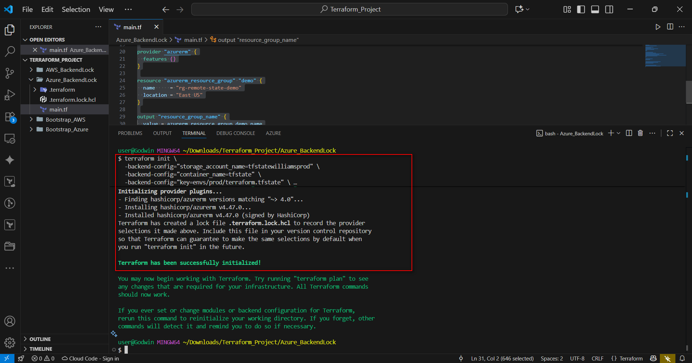


### Step 3.1: Locking test (Azure)

**To verify this:**

1.  Open two terminals in `aws/` (Note: ensure you are in the Azure directory for this step).
2.  Start `terraform apply` in **Terminal A** and keep it interactive/running.
3.  Try `terraform apply` or `plan` in **Terminal B** and observe the lock behavior.

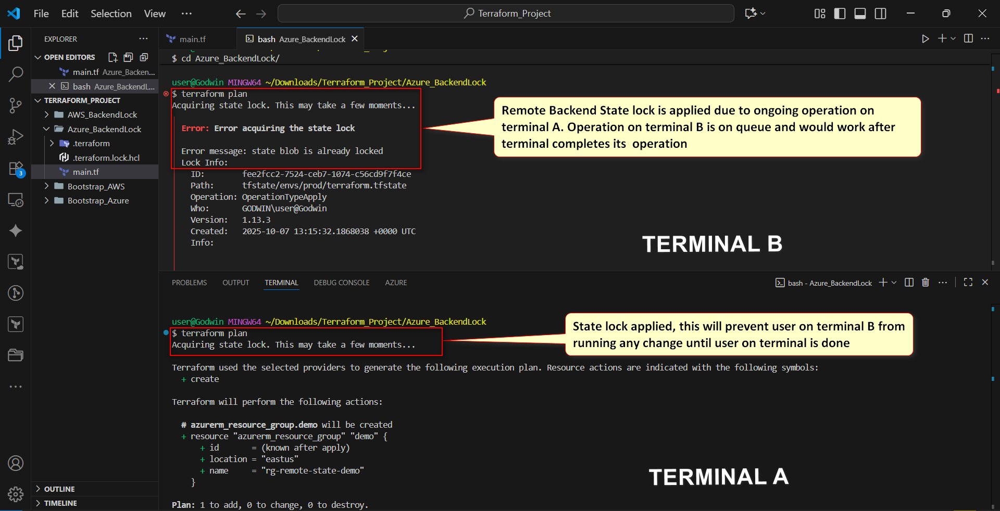

<!-- end list -->

  * No `terraform.tfstate` file, this confirmed Remote Backend was used.

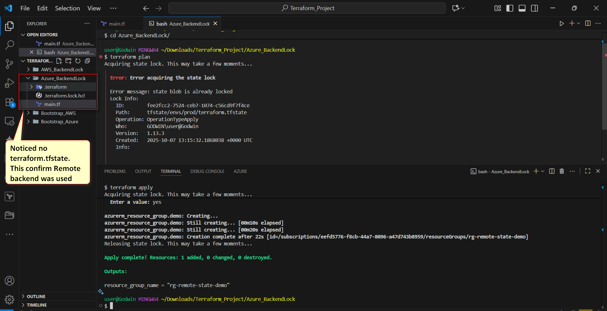

  * Terminal B resumes operation after Terminal A completes its operation.

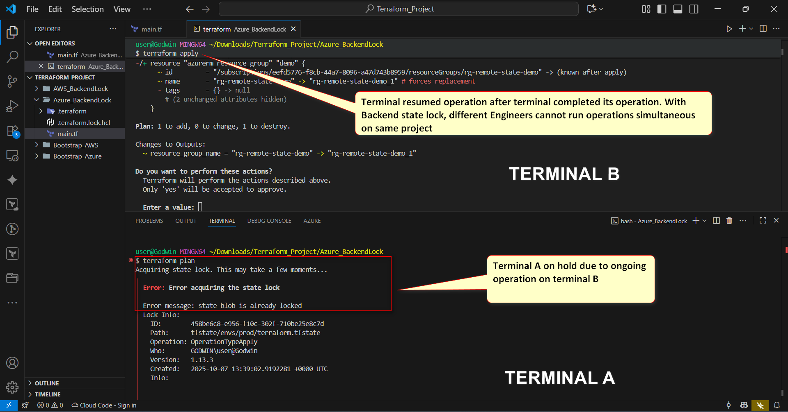  

**Console Screenshots**

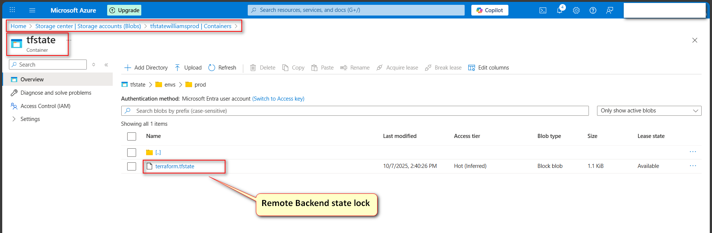

-----

## Step 4: RunBook and Reflection

### 1\. Plan & Apply

  * Run `terraform plan` to preview changes.
  * Run `terraform apply` and confirm with yes.
  * Verify no local `terraform.tfstate` file exists — state is remote.

### 2\. Locking Behavior

  * **Azure:** Backend uses native blob lease locking. If an operation is running, a second terminal shows: “Error acquiring the state lock”.
  * **AWS:** Backend uses DynamoDB lock table. Second apply/plan fails with: “ConditionalCheckFailedException: LockID already locked”.

### 3\. Recovering from Stale Locks

  * **Azure:** Locks auto‑release when the process ends. If a crash occurs, retry after a short wait; leases expire automatically.
  * **AWS:** If a lock is stuck, manually delete the lock item in the DynamoDB table (`terraform_state_lock`) with partition key `LockID`.

### 6\. Cleanup

**Azure:**

```bash
terraform destroy # in azure/ project
az group delete -n rg-tfstate-backend
```

**AWS:**

```bash
terraform destroy # in aws/ project
aws s3 rb s3://tfstate-williams-prod --force
aws dynamodb delete-table --table-name terraform_state_lock
```

### Reflections

I was surprised to learn that Terraform backends and providers do totally different things — providers take care of resources, while backends just manage state storage and locking.
It’s best to keep backend keys organized by environment, like `envs/dev/terraform.tfstate` and so on. One thing to take note of is creating the backend inside the same project that uses it — Terraform won’t initialize without an existing backend. Meaning, always create the backend first.
Also, always enable state locking to avoid conflicts. Fun fact: Azure clears stale locks automatically, but on AWS, you’ll need to remove them manually in DynamoDB.

```
```