# ASSIGNMENT 34 Report

## Ad-Hoc Automation on Azure — 3 VMs, Inventory & Passwordless SSH

Ad-hoc automation on Azure involves managing multiple VMs efficiently without manual repetition. By setting up an inventory file and enabling passwordless SSH, one can connect and run commands across all machines seamlessly. This approach saves time, reduces human error, and ensures consistent configuration — a key step toward smoother, more scalable cloud operations.

### Real-World Scenario
After a team spins up dev sandboxes on Azure. I was asked to bring up three VM, prove access is secure and consistent, and show that I can run fleet-wide actions in seconds—without writing a playbook.

### Assignment Objective:
Provision a small Azure fleet with Terraform (3 Linux VMs),
set up passwordless SSH,
create a custom Ansible inventory,
and run ad-hoc commands (ping, uptime, package install, service restart) targeting hosts and groups with `--become` where needed.

### Prerequisites
* Azure CLI authenticated, Terraform installed
* SSH key ready: `~/.ssh/id_ed25519` (or create one)
* Ubuntu LTS image preferred
* Backend configuration for (resource group, storage account and storage container)

---

## Step 1: Infrastructure Setup

**Tree**
```bash
user@Godwin MINGW64 ~/Downloads/Ansible_wk_8/AD-HOC
$ tree
.
|-- inventory.ini
|-- main.tf
|-- outputs.tf
|-- terraform.tfstate
`-- variables.tf
````

**main.tf**

```hcl
terraform {
  required_providers {
    azurerm = {
      source  = "hashicorp/azurerm"
      version = "~> 3.0"
    }
  }
}

provider "azurerm" {
  features {}
}

# Resource Group
resource "azurerm_resource_group" "main" {
  name     = var.resource_group_name
  location = var.location

  tags = {
    Environment = "Development"
    Project     = "Assignment-34"
  }
}

# Virtual Network
resource "azurerm_virtual_network" "main" {
  name                = "vnet-Assignment34"
  address_space       = ["10.0.0.0/16"]
  location            = azurerm_resource_group.main.location
  resource_group_name = azurerm_resource_group.main.name
}

# Subnet
resource "azurerm_subnet" "main" {
  name                 = "subnet-Assignment34"
  resource_group_name  = azurerm_resource_group.main.name
  virtual_network_name = azurerm_virtual_network.main.name
  address_prefixes     = ["10.0.1.0/24"]
}

# Network Security Group
resource "azurerm_network_security_group" "main" {
  name                = "nsg-Assignment34"
  location            = azurerm_resource_group.main.location
  resource_group_name = azurerm_resource_group.main.name

  security_rule {
    name                       = "SSH"
    priority                   = 1001
    direction                  = "Inbound"
    access                     = "Allow"
    protocol                   = "Tcp"
    source_port_range          = "*"
    destination_port_range     = "22"
    source_address_prefix      = "*"
    destination_address_prefix = "*"
  }

  security_rule {
    name                       = "HTTP"
    priority                   = 1002
    direction                  = "Inbound"
    access                     = "Allow"
    protocol                   = "Tcp"
    source_port_range          = "*"
    destination_port_range     = "80"
    source_address_prefix      = "*"
    destination_address_prefix = "*"
  }
}

# Public IPs
resource "azurerm_public_ip" "main" {
  count               = var.vm_count
  name                = "pip-Assignment34-${count.index + 1}"
  location            = azurerm_resource_group.main.location
  resource_group_name = azurerm_resource_group.main.name
  allocation_method   = "Static"
  sku                 = "Standard"
}

# Network Interfaces
resource "azurerm_network_interface" "main" {
  count               = var.vm_count
  name                = "nic-Assignment34-${count.index + 1}"
  location            = azurerm_resource_group.main.location
  resource_group_name = azurerm_resource_group.main.name

  ip_configuration {
    name                          = "internal"
    subnet_id                     = azurerm_subnet.main.id
    private_ip_address_allocation = "Dynamic"
    public_ip_address_id          = azurerm_public_ip.main[count.index].id
  }
}

# Associate NSG with NICs
resource "azurerm_network_interface_security_group_association" "main" {
  count                     = var.vm_count
  network_interface_id      = azurerm_network_interface.main[count.index].id
  network_security_group_id = azurerm_network_security_group.main.id
}

# Virtual Machines
resource "azurerm_linux_virtual_machine" "main" {
  count               = var.vm_count
  name                = "vm-Assignment34-${count.index + 1}"
  location            = azurerm_resource_group.main.location
  resource_group_name = azurerm_resource_group.main.name
  size                = var.vm_size
  admin_username      = var.admin_username

  network_interface_ids = [
    azurerm_network_interface.main[count.index].id
  ]

  admin_ssh_key {
    username   = var.admin_username
    public_key = file(var.ssh_public_key_path)
  }

  os_disk {
    caching              = "ReadWrite"
    storage_account_type = "Standard_LRS"
  }

  source_image_reference {
    publisher = "Canonical"
    offer     = "0001-com-ubuntu-server-jammy"
    sku       = "22_04-LTS"
    version   = "latest"
  }

  disable_password_authentication = true
}
```

**Output.tf**

```hcl
output "resource_group_name" {
  value = azurerm_resource_group.main.name
}

output "vm_public_ips" {
  value = {
    for idx, ip in azurerm_public_ip.main :
    "vm-${idx + 1}" => ip.ip_address
  }
}

output "vm_names" {
  value = [for vm in azurerm_linux_virtual_machine.main : vm.name]
}
```

**variables.tf**

```hcl
variable "resource_group_name" {
  description = "Name of the resource group"
  type        = string
  default     = "Assignment34-RG"
}

variable "location" {
  description = "Azure region"
  type        = string
  default     = "Australia Central"
}

variable "vm_count" {
  description = "Number of VMs to create"
  type        = number
  default     = 3
}

variable "vm_size" {
  description = "Size of the VMs"
  type        = string
  default     = "Standard_B1s"
}

variable "admin_username" {
  description = "Admin username for VMs"
  type        = string
  default     = "azureuser"
}

variable "ssh_public_key_path" {
  description = "Path to SSH public key"
  type        = string
  default     = "~/.ssh/azure_rsa.pub"
}
```

## Step 2: Configure Passwordless SSH

I initialized, planned and applied using:

```bash
terraform init
terraform plan
terraform apply
```

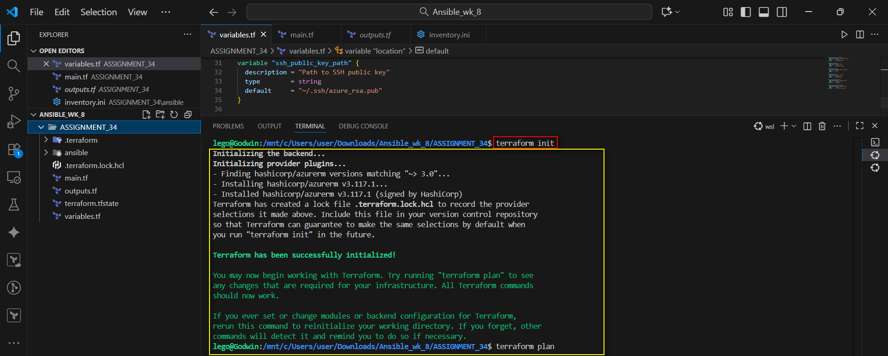

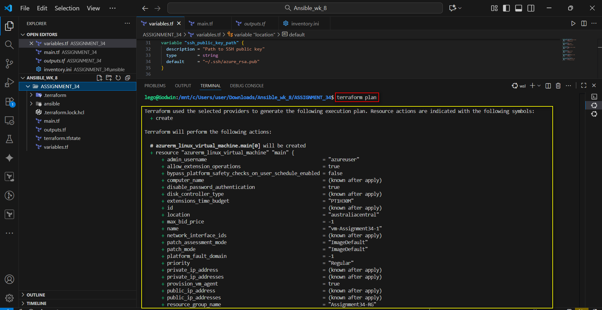

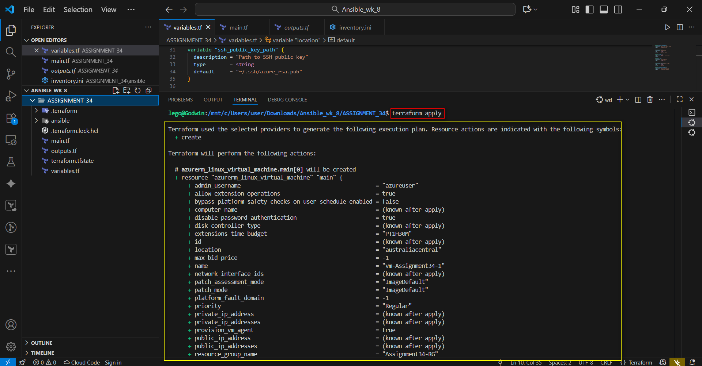

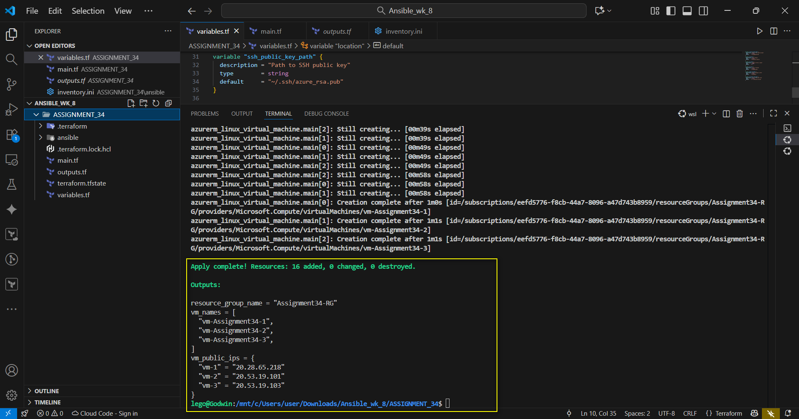


### Step 2.1: Test SSH access

Terraform uses the `admin_ssh_key` block to inject your public key into each VM.
I tested the passwordless SSH for each VM using the outputted public IP for each VM after the `terraform apply` command using:

`ssh -i ~/.ssh/azure_rsa azureuser@VM Public IP`

**1st VM**

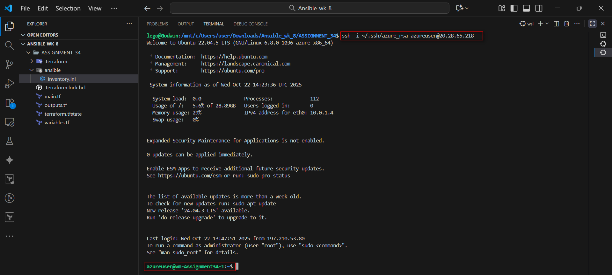

**2nd VM**

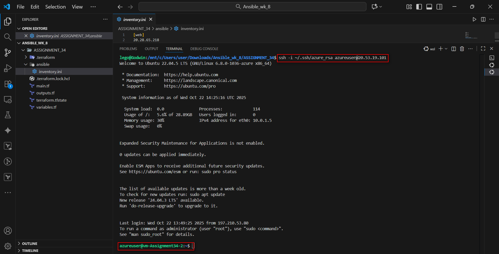

**3rd VM**

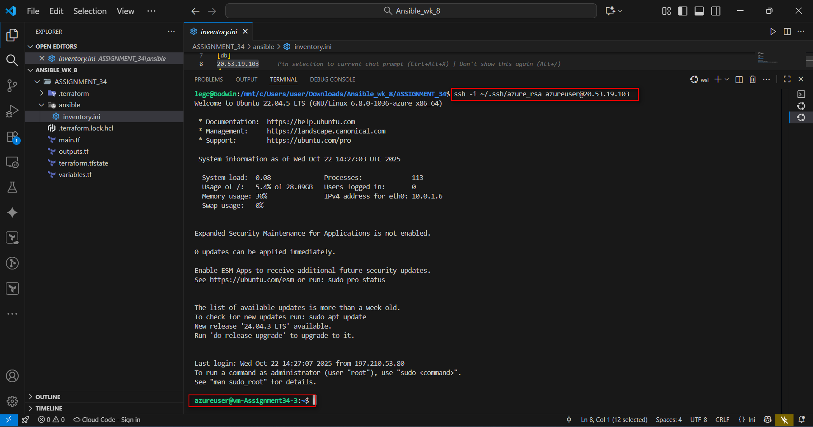

-----

## Step 3: Create inventory.ini

Using these three IPs, I created the `inventory.ini` file for web, app and db.

```ini
[web]
20.28.65.218

[app]
20.53.19.101

[db]
20.53.19.103

[all:vars]
ansible_user=azureuser
ansible_ssh_private_key_file=~/.ssh/azure_rsa
```

-----

## Step 4: Run Ad-Hoc Ansible Commands

**Ping all hosts**
`ansible all -i inventory.ini -m ping`

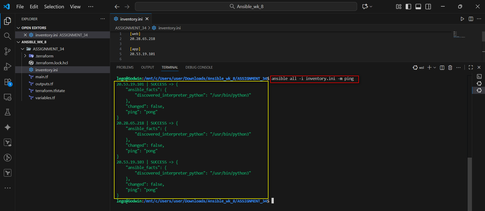

**Who am I**
`ansible all -i inventory.ini -a "whoami"`

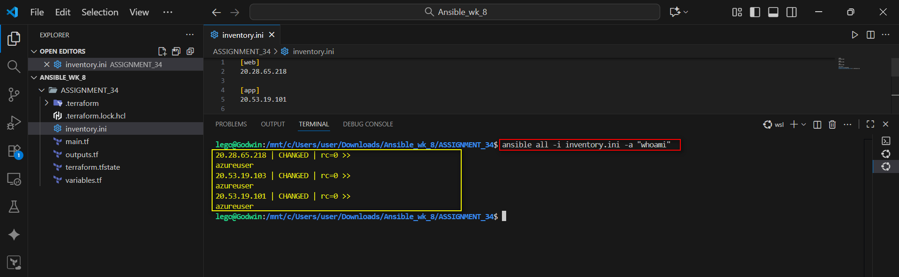

**Check uptime**
`ansible all -i inventory.ini -a "uptime"`

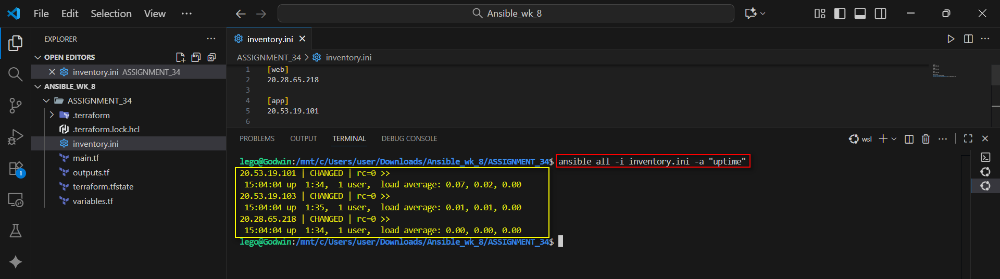

**Install a Package**
`ansible all -i inventory.ini -m apt -a "name=htop state=present update_cahce=yes" -become`

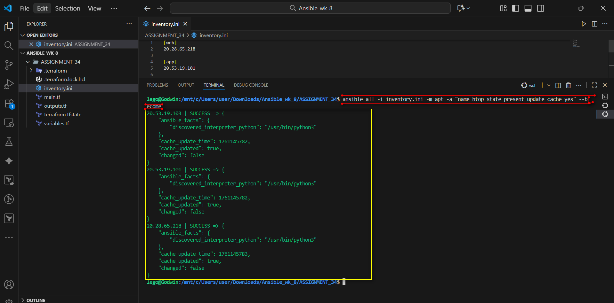

**Install package (e.g., nginx on web group)**
`ansible web -i inventory.ini -b -m apt -a "name=nginx state=present update_cache=yes"`

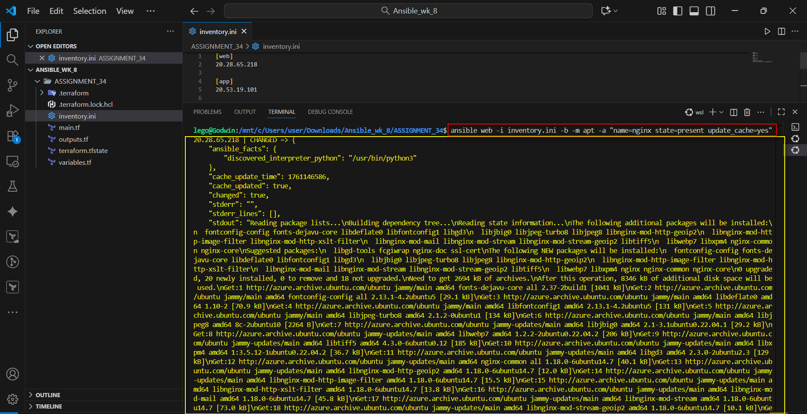
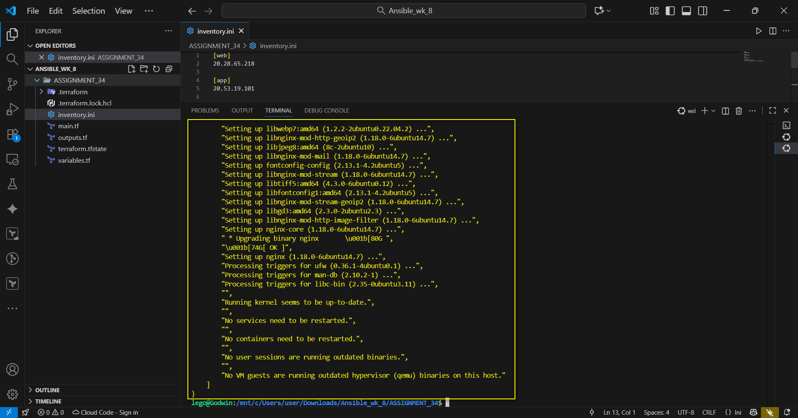

**Start & enable nginx**
`ansible web -i inventory.ini -b -m service -a "name=nginx state=started enabled=yes"`

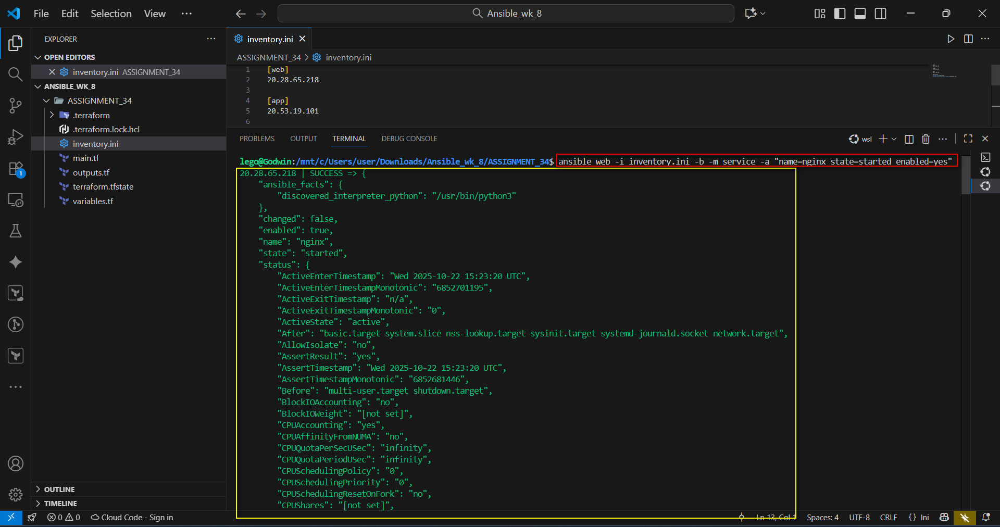

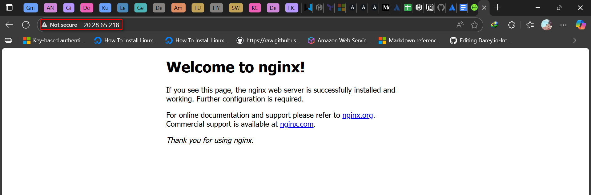


**Check disk and memory**
`ansible web -i inventory.ini -a "df -h"`

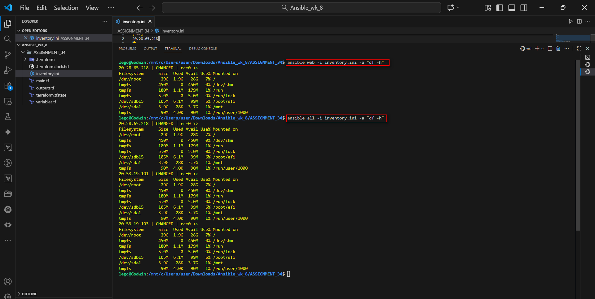

`ansible app -i inventory.ini -a "free -m"`

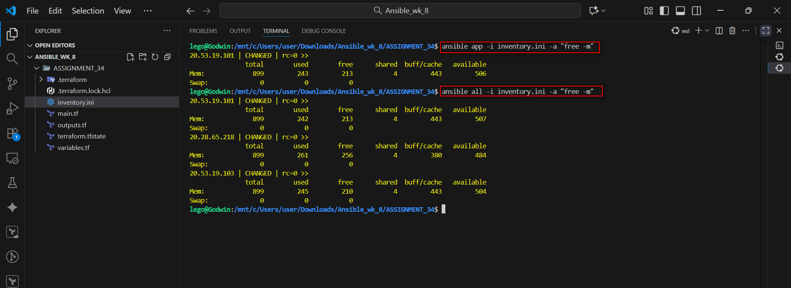

-----

### Step 4.1: Reflection

**Reflection: Ad-Hoc vs Playbook**
Ad-hoc commands are great for quick fixes — like checking uptime, installing a package, or restarting a service on multiple machines. They’re fast, flexible, and don’t need a playbook. But when you’re dealing with more complex or repeatable tasks, playbooks are the way to go. They provide structure, version control, and scalability, making automation easier to manage and share across teams.
