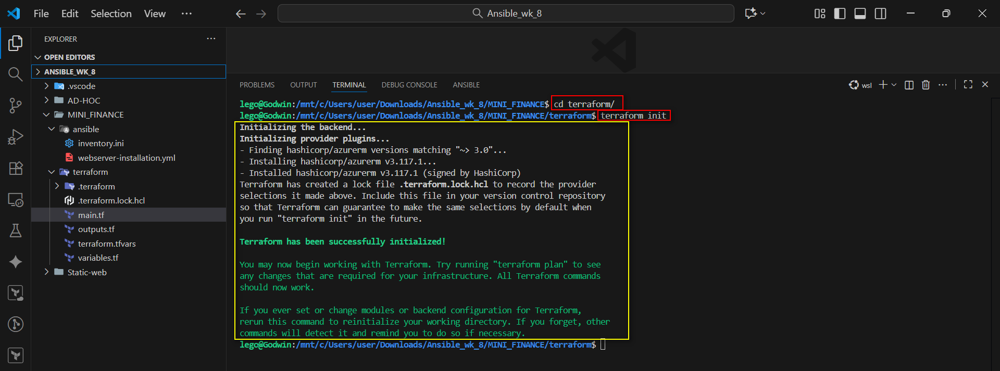
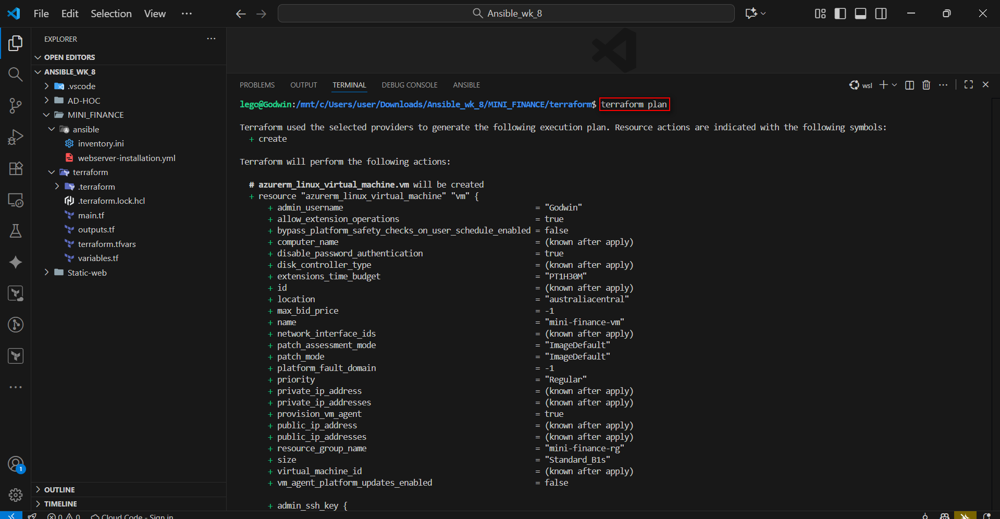
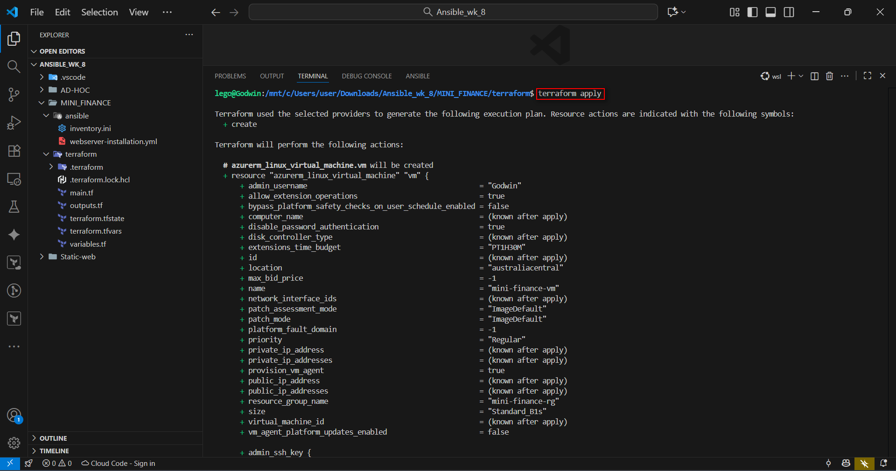
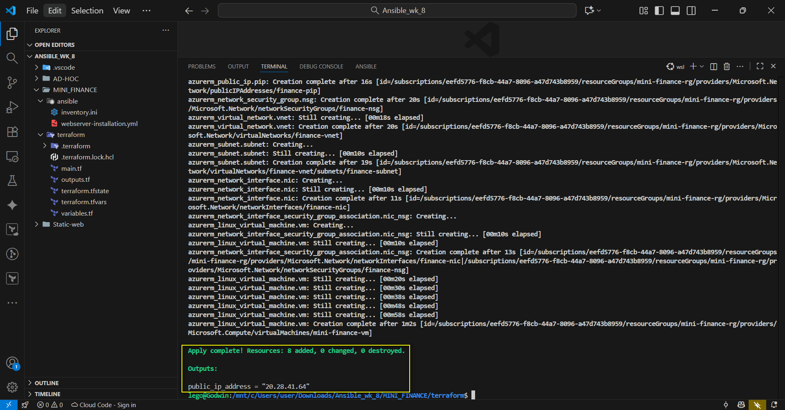
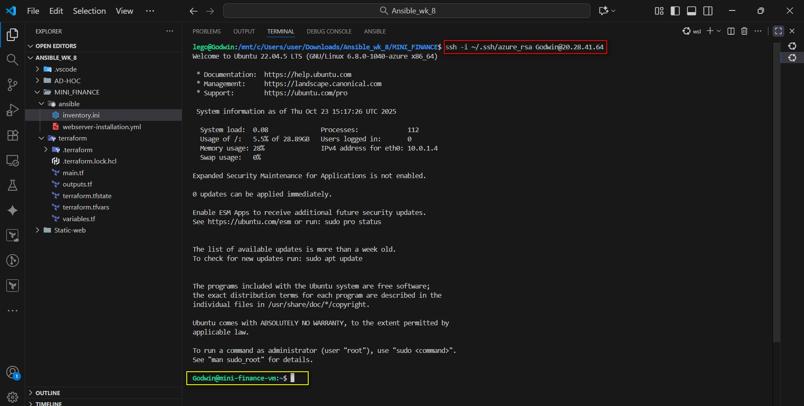
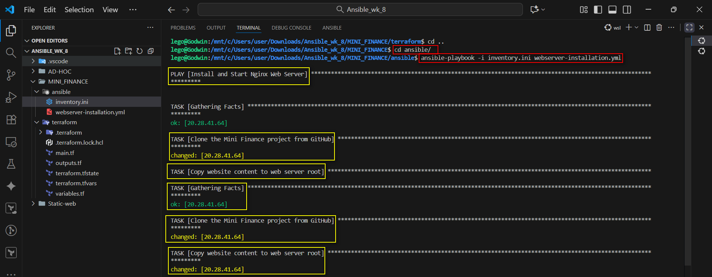
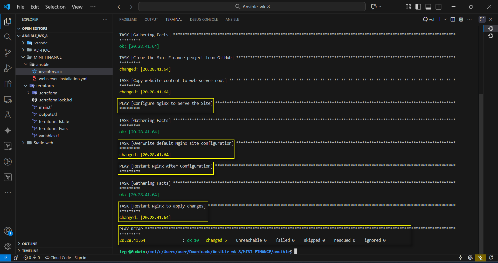
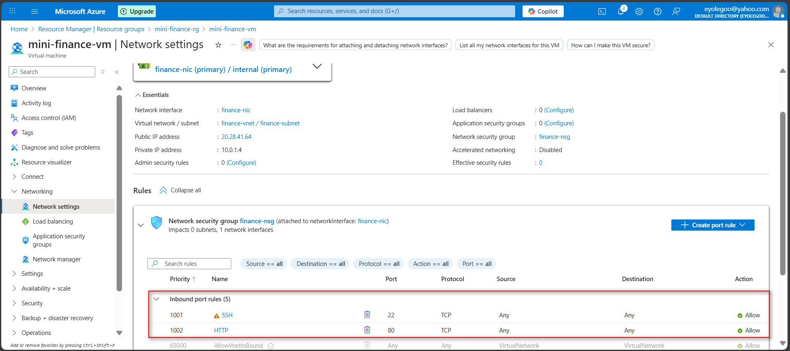

# ASSIGNMENT 36 Report: Deploy Mini Finance Project using Terraform and Ansible

## Introduction
Deploying the Mini Finance Project with Terraform and Ansible brings automation, consistency, and efficiency to any setup process. Terraform handles the infrastructure — creating servers, networks, and resources — while Ansible handles configuration and app deployment. Together, this combination eliminates manual errors, speeds up delivery, and makes the entire system easy to manage, reproduce, and scale. This approach reflects real-world DevOps practices used in modern, production-grade environments.

This assignment is centered on a live scenario where a fast, repeatable path is needed to spin up a public demo of a static site. Infra via Terraform, config & deploy via Ansible—clean separation of concerns.

**Putting the following into consideration:**
* Azure Resource Group, VNet, Subnet, NSG, and Ubuntu VM
* NSG rules for SSH (22) and HTTP (80)
* Passwordless SSH with your public key
* Ansible multi-play flow: install → deploy → verify

I setup a secure Azure VM with Terraform and use an Ansible multi-playbook to:
1.  Install & configure Nginx
2.  Clone a static mini-finance site from GitHub
3.  Deploy it to Nginx’s web root
4.  And reload Nginx after deployment

---

## Step 1: Project Directory Setup

```bash
user@Godwin MINGW64 ~/Downloads/Ansible_wk_8/MINI_FINANCE
$ tree
.
|-- README.md
|-- ansible
|   |-- inventory.ini
|   `-- webserver-installation.yml
`-- terraform
    |-- main.tf
    |-- outputs.tf
    |-- terraform.tfstate
    |-- terraform.tfvars
    `-- variables.tf
````

### `main.tf`

```hcl
terraform {
  required_providers {
    azurerm = {
      source  = "hashicorp/azurerm"
      version = "~> 3.0"
    }
  }
}

provider "azurerm" {
    features {}
}

variable "ssh_public_key" {
  description = "Path to the SSH public key file."
  type        = string
  default     = "~/.ssh/azure_rsa.pub"
}

resource "azurerm_resource_group" "rg" {
  name     = var.resource_group_name
  location = var.location
}

resource "azurerm_virtual_network" "vnet" {
  name                = "finance-vnet"
  address_space       = ["10.0.0.0/16"]
  location            = var.location
  resource_group_name = azurerm_resource_group.rg.name
}

resource "azurerm_subnet" "subnet" {
  name                 = "finance-subnet"
  resource_group_name  = azurerm_resource_group.rg.name
  virtual_network_name = azurerm_virtual_network.vnet.name
  address_prefixes     = ["10.0.1.0/24"]
}
 
resource "azurerm_network_security_group" "nsg" {
  name                = "finance-nsg"
  location            = var.location
  resource_group_name = azurerm_resource_group.rg.name

  security_rule {
    name                       = "SSH"
    priority                   = 1001
    direction                  = "Inbound"
    access                     = "Allow"
    protocol                   = "Tcp"
    source_port_range          = "*"
    destination_port_range     = "22"
    source_address_prefix      = "*"
    destination_address_prefix = "*"
  }

  security_rule {
    name                       = "HTTP"
    priority                   = 1002
    direction                  = "Inbound"
    access                     = "Allow"
    protocol                   = "Tcp"
    source_port_range          = "*"
    destination_port_range     = "80"
    source_address_prefix      = "*"
    destination_address_prefix = "*"
  }
}

resource "azurerm_public_ip" "pip" {
  name                = "finance-pip"
  location            = var.location
  resource_group_name = azurerm_resource_group.rg.name
  allocation_method   = "Static"
  sku                 = "Standard"
}

resource "azurerm_network_interface" "nic" {
  name                = "finance-nic"
  location            = var.location
  resource_group_name = azurerm_resource_group.rg.name

  ip_configuration {
    name                          = "internal"
    subnet_id                     = azurerm_subnet.subnet.id
    private_ip_address_allocation = "Dynamic"
    public_ip_address_id          = azurerm_public_ip.pip.id
  }
}
 
resource "azurerm_network_interface_security_group_association" "nic_nsg" {
  network_interface_id      = azurerm_network_interface.nic.id
  network_security_group_id = azurerm_network_security_group.nsg.id
}

resource "azurerm_linux_virtual_machine" "vm" {
  name                = var.vm_name
  resource_group_name = azurerm_resource_group.rg.name
  location            = var.location
  size                = "Standard_B1s"
  admin_username      = var.admin_username
  network_interface_ids = [
    azurerm_network_interface.nic.id
  ]

  os_disk {
    caching              = "ReadWrite"
    storage_account_type = "Standard_LRS"
    name                 = "${var.vm_name}-disk"
  }

  source_image_reference {
    publisher = "Canonical"
    offer     = "0001-com-ubuntu-server-jammy"
    sku       = "22_04-lts"
    version   = "latest"
  }

  admin_ssh_key {
    username   = var.admin_username
    public_key = file(var.ssh_public_key)
  }

  disable_password_authentication = true
}
```

### `output.tf`

```hcl
output "public_ip_address" {
value = azurerm_linux_virtual_machine.vm.public_ip_address
}
```

### `terraform.tfvars`

```hcl
admin_username = "Godwin"
```

### `variables.tf`

```hcl
variable "admin_username" {
default = "Godwin"
}

variable "location" {
default = "Australia Central"
}

variable "vm_name" {
default = "mini-finance-vm"
}

variable "resource_group_name" {
default = "mini-finance-rg"
}

variable "ssh_public_key_path" {
description = "Path to your SSH Public Key"
default = "~/.ssh/azure_rsa.pub"
}
```

-----

## Step 2: Deploy Infrastructure with Terraform

Now, from inside the terraform directory:

**Initialize Terraform:**

```bash
terraform init
```

This downloads the azurerm provider.




**Plan the deployment:**

```bash
terraform plan
```

This shows you everything Terraform will create. Review it for errors.




**Apply the configuration:**

```bash
terraform apply
```

This will take a few minutes to build all the Azure resources.





-----

## Step 3: Verify SSH and Prepare Ansible

Before configuring Ansible, I ensured my passwordless SSH works.

**Test SSH:**

```bash
ssh -i ~/.ssh/azure_rsa Godwin@20.28.41.66
```



**Enter the Public IP of the VM in the `inventory.ini` file**

```ini
[web]
20.28.41.64

[all:vars]
ansible_user=Godwin
ansible_ssh_private_key_file=~/.ssh/azure_rsa
```

-----

## Step 4: Write the Ansible Multi-Playbook

Now, edit the `site.yml` file. This YAML file defines the plays required by the assignment.

```yaml
---
- name: Install and Start Nginx Web Server
  hosts: web
  become: yes
  tasks:
    - name: Install Nginx
      apt:
        name: nginx
        state: present
        update_cache: yes

    - name: Start and Enable Nginx
      service:
        name: nginx
        state: started
        enabled: yes

- name: Deploy Mini Finance Website
  hosts: web
  become: yes
  tasks:
    - name: Clone the Mini Finance project from GitHub
      git:
        repo: "[https://github.com/eyolegoo/mini_finance.git](https://github.com/eyolegoo/mini_finance.git)"
        dest: "/tmp/mini_finance"

    - name: Copy website content to web server root
      copy:
        src: "/tmp/mini_finance/"
        dest: "/var/www/html/"
        owner: www-data
        group: www-data
        mode: "0755"
        remote_src: yes

- name: Configure Nginx to Serve the Site
  hosts: web
  become: yes
  tasks:
    - name: Overwrite default Nginx site configuration
      copy:
        dest: /etc/nginx/sites-available/default
        content: |
          server {
              listen 80;
              server_name _;
              root /var/www/html;
              index index.html;

              location / {
                  try_files $uri /index.html;
              }

              error_page 404 /index.html;
          }
        owner: root
        group: root
        mode: "0644"

- name: Restart Nginx After Configuration
  hosts: web
  become: yes
  tasks:
    - name: Restart Nginx to apply changes
      service:
        name: nginx
        state: restarted
```

-----

## Step 5: Run the Ansible Playbook

Now, I configured the server and deployed the code. From the ansible directory:

```bash
ansible-playbook -i inventory.ini site.yml
```

You will see Ansible execute each play and task.





**Now entered the public IP of the VM on a web browser**


**NSG inbound prove:**



-----

## Step 5.1: Reflection

**Reflection:**
This taught me how small configuration details can break automation. In a real-world setup, this kind of playbook would be great for spinning up demo or staging environments automatically. When a developer finishes a feature, we could deploy it on a fresh VM and share a live link for review in just a few minutes.
