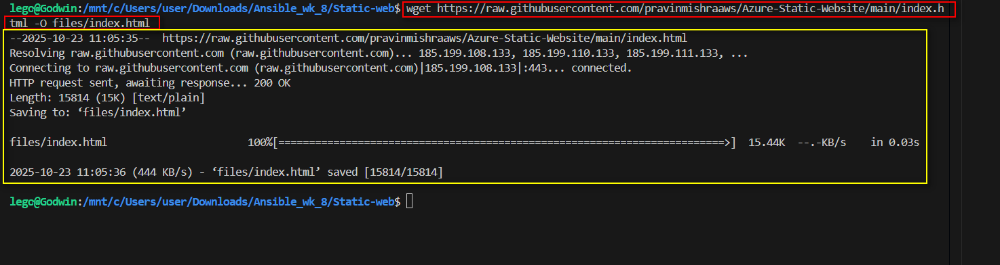
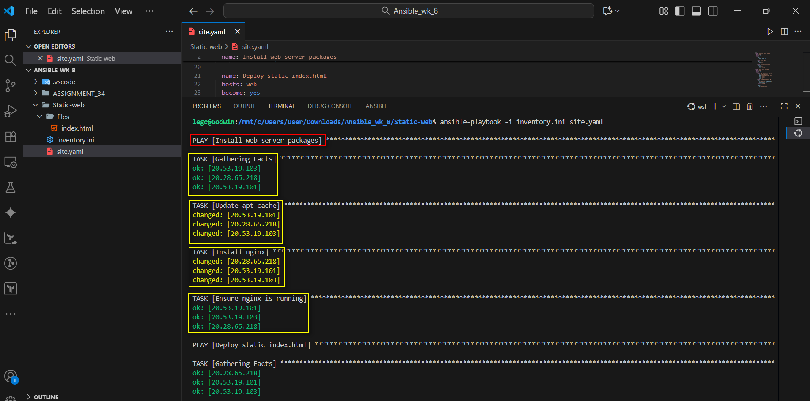
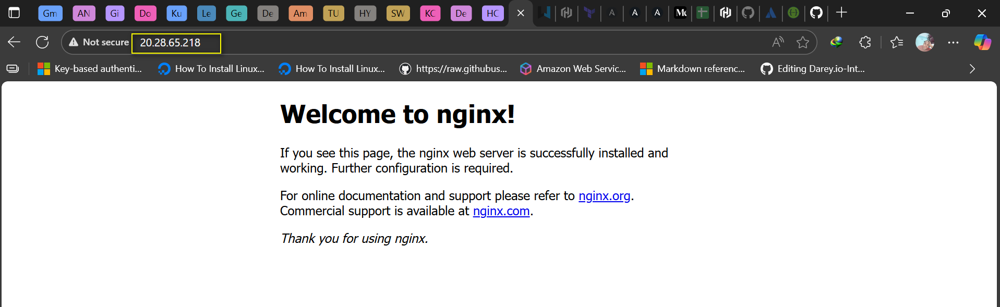
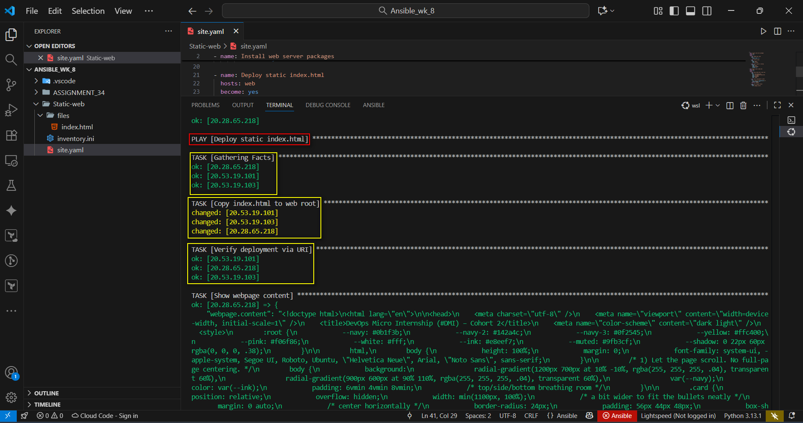
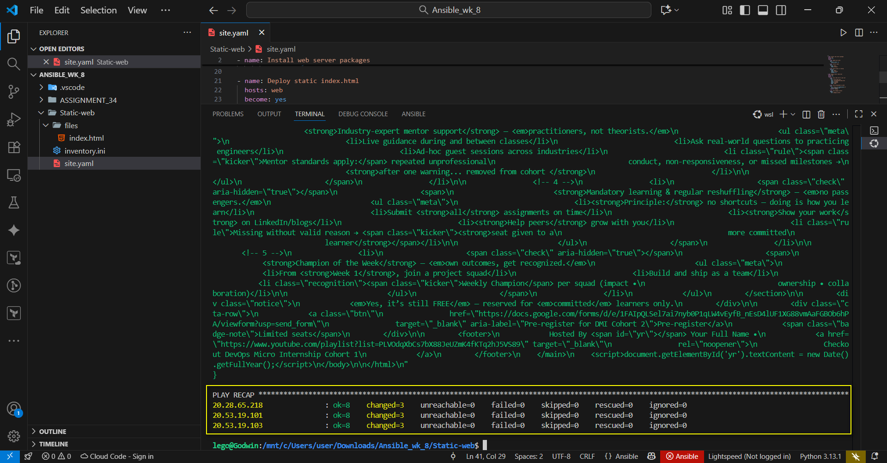
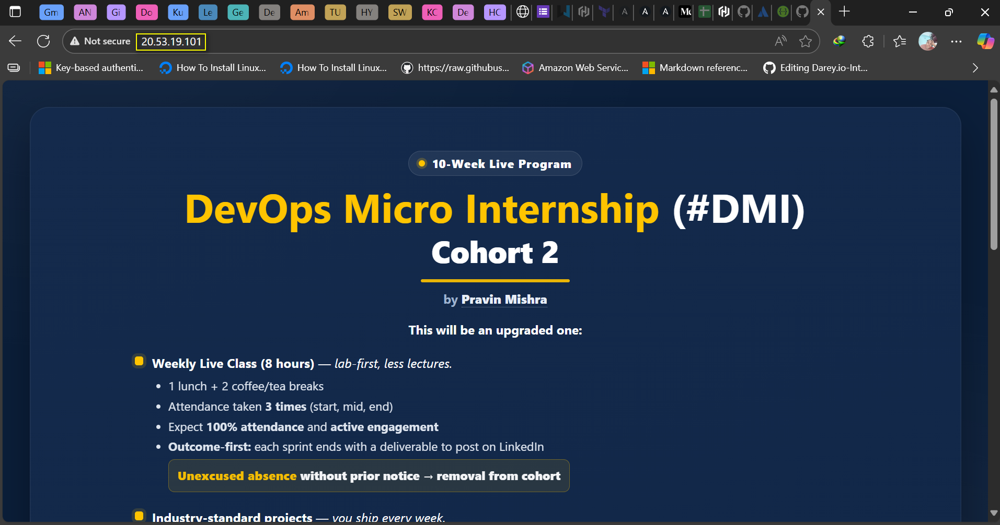

# ASSIGNMENT 35 Report: Multi-Play Static Web Deploy on Azure

## Multi-Play Static Web Deploy on Azure

A multi-play static web deploy on Azure focuses on automating the setup and delivery of a static website using multiple Ansible plays. Each play handles a specific task — from provisioning the server to deploying files and configuring web services. This structured approach improves organization, ensures consistency, and reduces manual effort. It’s especially valuable for teams aiming to maintain reliable, repeatable, and efficient web deployments in the cloud.

### Assignment Objective
Use a single playbook with multiple plays to:
* Prepare web servers (packages/services).
* Deploy `index.html` content from your control machine using copy.
* Verify the result from the controller.

### Pre-reqs / Assumptions
* You have 3 Azure VMs from the previous assignment (or at least one), grouped under `[web]` in `inventory.ini`.
* OS: Ubuntu 22.04 (or similar).
* Public IP access to each VM.
* Your SSH key works (passwordless).

### Repo & demo app
* Live site example to match: [https://ebstaticwebsite.z29.web.core.windows.net](https://ebstaticwebsite.z29.web.core.windows.net)
* Source: [https://github.com/pravinmishraaws/Azure-Static-Website](https://github.com/pravinmishraaws/Azure-Static-Website) (We’ll use its `index.html` as our static payload.)

---

## Step 1: Prepare Your Project Folder

**Tree Structure:**
```bash
user@Godwin MINGW64 ~/Downloads/Ansible_wk_8/Static-web
$ tree
.
|-- files
|   `-- index.html
|-- inventory.ini
`-- site.yaml
````

**Download the Static Page:**

  * Go to this GitHub repo
  * Download the `index.html` file
  * Place it inside the `files/` folder using the command:

<!-- end list -->

```bash
wget [https://raw.githubusercontent.com/pravinmishraaws/Azure-Static-Website/main/index.html](https://raw.githubusercontent.com/pravinmishraaws/Azure-Static-Website/main/index.html) -O files/index.html
```




**Content of `index.html`:**

```html
<!doctype html>
<html lang="en">

<head>
    <meta charset="utf-8" />
    <meta name="viewport" content="width=device-width, initial-scale=1" />
    <title>DevOps Micro Internship (#DMI) - Cohort 2</title>
    <meta name="color-scheme" content="dark light" />
    <style>
        :root {
            --navy: #0b1f3b;
            --navy-2: #142a4c;
            --navy-3: #0f2545;
            --yellow: #ffc400;
            --pink: #f06f86;
            --white: #fff;
            --ink: #e8eef7;
            --muted: #9fb3cf;
            --shadow: 0 22px 60px rgba(0, 0, 0, .38);
        }

        html,
        body {
            height: 100%;
            margin: 0;
            font-family: system-ui, -apple-system, Segoe UI, Roboto, Ubuntu, "Helvetica Neue", Arial, "Noto Sans", sans-serif;
        }

        /* 1) Let the page scroll. No full-page centering. */
        body {
            background:
                radial-gradient(1200px 700px at 10% -10%, rgba(255, 255, 255, .04), transparent 60%),
                radial-gradient(900px 600px at 90% 110%, rgba(255, 255, 255, .04), transparent 60%),
                var(--navy);
            color: var(--ink);
            padding: 6vmin 4vmin 8vmin;
            /* top/side/bottom breathing room */
        }

        .card {
            position: relative;
            overflow: hidden;
            width: min(1100px, 100%);
            /* a bit wider to fit the bullets neatly */
            margin: 0 auto;
            /* center horizontally */
            border-radius: 24px;
            padding: 56px 44px 48px;
            box-shadow: var(--shadow), inset 0 0 0 1px rgba(255, 255, 255, .06);
            background: linear-gradient(160deg, var(--navy-2), var(--navy-3));
            isolation: isolate;
        }

        .card::after {
            content: "";
            position: absolute;
            inset: auto -120px -120px auto;
            width: 420px;
            height: 420px;
            border-radius: 50%;
            background: radial-gradient(40% 40% at 70% 70%, rgba(255, 255, 255, .06), rgba(255, 255, 255, 0));
            z-index: -1;
            pointer-events: none;
        }

        header {
            text-align: center;
            margin-bottom: 18px;
        }

        .eyebrow {
            display: inline-flex;
            align-items: center;
            gap: .6rem;
            font-weight: 800;
            font-size: .9rem;
            letter-spacing: .06em;
            color: var(--white);
            background: rgba(255, 255, 255, .06);
            border: 1px solid rgba(255, 255, 255, .12);
            padding: .38rem .8rem;
            border-radius: 999px;
        }

        .dot {
            width: 8px;
            height: 8px;
            border-radius: 50%;
            background: var(--yellow);
            box-shadow: 0 0 0 3px rgba(255, 196, 0, .22);
        }

        h1 {
            margin: .7rem 0 0;
            line-height: 1.08;
            letter-spacing: .3px;
            color: var(--white);
            font-size: clamp(2rem, 4.2vw, 3.2rem);
        }

        .accent {
            color: var(--yellow);
        }

        .h2 {
            margin: .2rem 0 0;
            font-size: clamp(1.6rem, 3.2vw, 2.4rem);
            color: var(--white);
            font-weight: 800;
        }

        .underline {
            width: 190px;
            height: 4px;
            background: var(--yellow);
            margin: .7rem auto 0;
            border-radius: 8px;
            opacity: .9;
        }

        .sub {
            margin: .6rem auto 0;
            color: var(--muted);
            font-weight: 700;
            width: min(640px, 92%);
            text-align: center;
        }

        .sub a {
            color: var(--ink);
            text-decoration: none;
            border-bottom: 1px dotted rgba(232, 238, 247, .5);
        }

        .sub a:hover {
            color: var(--white);
            border-bottom-color: var(--white);
        }

        .lead {
            text-align: center;
            margin: 16px 0 10px;
            font-size: 1rem;
        }

        .lead strong {
            color: var(--white);
        }

        .grid {
            display: block;
            width: min(920px, 100%);
            margin: 12px auto 0;
        }

        /* 2) Wider content column */

        /* Bullets */
        ul.bullets {
            list-style: none;
            margin: 0;
            padding: 0;
            color: var(--white);
            font-size: 1.02rem;
            line-height: 1.5;
        }

        .bullets>li {
            display: flex;
            align-items: flex-start;
            gap: .7rem;
            padding: .5rem 0;
        }

        .check {
            flex: 0 0 11px;
            margin-top: .28rem;
            height: 11px;
            width: 11px;
            border-radius: 3px;
            background: var(--yellow);
            box-shadow: 0 0 0 4px rgba(255, 196, 0, .14);
        }

        /* sublist under each bullet */
        .meta {
            margin: .35rem 0 0 .1rem;
            padding-left: 1.2rem;
            list-style: disc;
            font-size: .96rem;
            color: var(--ink);
            opacity: .95;
        }

        .meta li {
            margin: .18rem 0;
        }

        .notice {
            margin: 18px auto 0;
            width: min(920px, 100%);
            background: rgba(255, 196, 0, .10);
            border: 1px solid rgba(255, 196, 0, .28);
            color: var(--white);
            padding: .85rem 1rem;
            border-radius: 12px;
            font-weight: 800;
            text-align: center;
            box-shadow: inset 0 0 0 1px rgba(255, 255, 255, .04);
        }

        .notice em {
            color: var(--yellow);
            font-style: normal;
        }

        .cta-row {
            display: flex;
            justify-content: center;
            align-items: center;
            gap: 16px;
            margin-top: 26px;
            flex-wrap: wrap;
        }

        .btn {
            appearance: none;
            border: 0;
            cursor: pointer;
            padding: 1.05rem 1.5rem;
            border-radius: 999px;
            font-weight: 900;
            letter-spacing: .04em;
            font-size: 1.12rem;
            box-shadow: 0 14px 26px rgba(240, 111, 134, .42);
            color: var(--white);
            background: var(--pink);
            transition: transform .18s ease, filter .18s ease;
            text-decoration: none;
            display: inline-flex;
            align-items: center;
            gap: .6rem;
        }

        .btn:hover {
            transform: translateY(-2px);
            filter: brightness(1.06);
        }

        .badge-note {
            display: inline-flex;
            align-items: center;
            gap: .45rem;
            padding: .6rem .9rem;
            border-radius: 999px;
            background: rgba(255, 196, 0, .12);
            border: 1px solid rgba(255, 196, 0, .45);
            color: var(--yellow);
            font-weight: 900;
            font-size: 1rem;
        }

        .badge-note::before {
            content: "•";
            font-size: 1.2rem;
            line-height: 1;
        }

        footer {
            text-align: center;
            margin-top: 18px;
            color: var(--muted);
            font-size: .86rem;
        }

        footer a {
            color: var(--yellow);
            text-decoration: none;
        }

        footer a:hover {
            text-decoration: underline;
        }

        /* Mobile polish */
        @media (max-width:560px) {
            .card {
                padding: 42px 22px 40px;
                border-radius: 18px;
            }

            .grid,
            .notice {
                width: 100%;
            }

            .btn {
                width: 100%;
                justify-content: center;
            }

            ul.bullets {
                font-size: 1rem;
            }

            .meta {
                font-size: .95rem;
            }
        }

        @media (prefers-reduced-motion:reduce) {
            .btn {
                transition: none
            }
        }

        /* Highlighted meta items */
        .meta li.rule {
            list-style: none;
            /* remove the disc */
            background: rgba(255, 196, 0, .10);
            /* yellow tint */
            border: 1px solid rgba(255, 196, 0, .35);
            border-radius: 8px;
            padding: .55rem .7rem;
            margin: .28rem 0;
            color: var(--white);
            font-weight: 800;
        }

        .meta li.rule .kicker {
            font-weight: 900;
            letter-spacing: .02em;
            color: var(--yellow);
        }

        /* Positive recognition */
        .meta li.recognition {
            list-style: none;
            background: rgba(240, 111, 134, .12);
            /* brand pink tint */
            border: 1px solid rgba(240, 111, 134, .45);
            border-radius: 8px;
            padding: .55rem .7rem;
            margin: .28rem 0;
            color: var(--white);
            font-weight: 800;
        }

        .meta li.recognition .kicker {
            color: var(--pink);
            font-weight: 900;
        }
    </style>
</head>

<body>
    <main class="card" role="main" aria-labelledby="title">
        <header>
            <div class="eyebrow" aria-label="Program format">
                <span class="dot" aria-hidden="true"></span> 10-Week Live Program
            </div>

            <h1 id="title"><span class="accent">DevOps Micro Internship</span> <span
                    style="font-weight:700;">(#DMI)</span></h1>
            <div class="h2">Cohort 2</div>
            <div class="underline" aria-hidden="true"></div>
            <p class="sub">by <strong><a href="[https://www.linkedin.com/in/pravin-mishra-aws-trainer/](https://www.linkedin.com/in/pravin-mishra-aws-trainer/)" target="_blank"
                        rel="noopener">Pravin Mishra</a></strong></p>
        </header>

        <p class="lead"><strong>This will be an upgraded one:</strong></p>

        <section class="grid" aria-label="Highlights">
            <ul class="bullets">
                <li>
                    <span class="check" aria-hidden="true"></span>
                    <span>
                        <strong>Weekly Live Class (8 hours)</strong> -- <em>lab-first, less lectures.</em>
                        <ul class="meta">
                            <li>1 lunch + 2 coffee/tea breaks</li>
                            <li>Attendance taken <strong>3 times</strong> (start, mid, end)</li>
                            <li>Expect <strong>100% attendance</strong> and <strong>active engagement</strong></li>
                            <li><strong>Outcome-first:</strong> each sprint ends with a deliverable to post on LinkedIn
                            </li>
                            <li class="rule"><span class="kicker">Unexcused absence</span> without prior notice →
                                <strong>removal from cohort</strong>
                            </li>

                        </ul>
                    </span>
                </li>

                <li>
                    <span class="check" aria-hidden="true"></span>
                    <span>
                        <strong>Industry-standard projects</strong> -- <em>you ship every week.</em>
                        <ul class="meta">
                            <li><strong>4-6 assignments</strong> per week</li>
                            <li>On-time → <strong>manually reviewed & scored</strong></li>
                            <li><strong>Community + co-mentor support:</strong> you're not alone</li>
                            <li>Maintain <strong>≥ 90% average</strong> (one grace re-submission)</li>
                            <li class="rule">Consistently below threshold → <span class="kicker"><strong>removed from
                                            cohort</strong></span></li>

                        </ul>
                    </span>
                </li>

                <li>
                    <span class="check" aria-hidden="true"></span>
                    <span>
                        <strong>Industry-expert mentor support</strong> -- <em>practitioners, not theorists.</em>
                        <ul class="meta">
                            <li>Live guidance during and between classes</li>
                            <li>Ask real-world questions to practicing engineers</li>
                            <li>Ad-hoc guest sessions across industries</li>
                            <li class="rule"><span class="kicker">Mentor standards apply:</span> repeated unprofessional
                                conduct, non-responsiveness, or missed milestones →
                                <strong>after one warning... removed from cohort </strong>
                            </li>

                        </ul>
                    </span>
                </li>

                <li>
                    <span class="check" aria-hidden="true"></span>
                    <span>
                        <strong>Mandatory learning & regular reshuffling</strong> -- <em>no passengers.</em>
                        <ul class="meta">
                            <li><strong>Principle:</strong> no shortcuts -- doing is how you learn</li>
                            <li>Submit <strong>all</strong> assignments on time</li>
                            <li><strong>Show your work</strong> on LinkedIn/blogs</li>
                            <li><strong>Help peers</strong> grow with you</li>
                            <li class="rule">Missing without valid reason → <span class="kicker"><strong>seat given to a
                                            more committed
                                            learner</strong></span></li>

                        </ul>
                    </span>
                </li>

                <li>
                    <span class="check" aria-hidden="true"></span>
                    <span>
                        <strong>Champion of the Week</strong> -- <em>own outcomes, get recognized.</em>
                        <ul class="meta">
                            <li>From <strong>Week 1</strong>, join a project squad</li>
                            <li>Build and ship as a team</li>
                            <li class="recognition"><span class="kicker">Weekly Champion</span> per squad (impact •
                                ownership • collaboration)</li>

                        </ul>
                    </span>
                </li>
            </ul>
        </section>

        <div class="notice">
            <em>Yes, it's still FREE</em> -- reserved for <em>committed</em> learners only.
        </div>

        <div class="cta-row">
            <a class="btn"
                href="[https://docs.google.com/forms/d/e/1FAIpQLSel7ai7nyb0P1qLW4vEyfB_nEsD4lUF1XG88vmAaFGBOb6hPA/viewform?usp=send_form](https://docs.google.com/forms/d/e/1FAIpQLSel7ai7nyb0P1qLW4vEyfB_nEsD4lUF1XG88vmAaFGBOb6hPA/viewform?usp=send_form)"
                target="_blank" aria-label="Pre-register for DMI Cohort 2">Pre-register</a>
            <span class="badge-note">Limited seats</span>
        </div>

        <footer>
            Hosted By <span id="yr"></span> Your Full Name •
            <a href="[https://www.youtube.com/playlist?list=PLVOdqXbCs7bX88JeUZmK4fKTq2hJ5VS89](https://www.youtube.com/playlist?list=PLVOdqXbCs7bX88JeUZmK4fKTq2hJ5VS89)" target="_blank"
                rel="noopener">
                Checkout DevOps Micro Internship Cohort 1
            </a>
        </footer>
    </main>
    <script>document.getElementById('yr').textContent = new Date().getFullYear();</script>
</body>

</html>
```

-----

## Step 2: Create Your Inventory File

I defined the Azure VMs inside the `inventory.ini` file:

```ini
[web]
20.28.65.218
20.53.19.101
20.53.19.103

[all:vars]
ansible_user=azureuser
ansible_ssh_private_key_file=~/.ssh/azure_rsa
```

*Note: These are the IPs as obtained from the previous assignment*

-----

## Step 3: Write Your Multi-Play Playbook

I created `site.yml` with two plays:

**Play 1: Install nginx**

```yaml
- name: Install web server packages
  hosts: web
  become: yes
  tasks:
    - name: Update apt cache
      apt:
        update_cache: yes

    - name: Install nginx
      apt:
        name: nginx
        state: present

    - name: Ensure nginx is running
      service:
        name: nginx
        state: started
        enabled: yes
```

**Play 2: Deploy index.html and Verify**

```yaml
- name: Deploy static index.html
  hosts: web
  become: yes
  tasks:
    - name: Copy index.html to web root
      copy:
        src: files/index.html
        dest: /var/www/html/index.html
        owner: www-data
        group: www-data
        mode: '0644'

    - name: Verify deployment via URI
      uri:
        url: "http://{{ ansible_host }}"
        return_content: yes
      register: webpage

    - name: Show webpage content
      debug:
        var: webpage.content
```

-----

## Step 4: Run the Playbook

In my terminal, I navigated to the static-web folder and run:

```bash
ansible-playbook -i inventory.ini site.yml
```




At this point Nginx was installed.








-----

## Step 5: Verify in Browser

I verified using any of the VM IP and open:
`http://<x.x.x.x.x>`


-----

## Step 5.1: Reflection

**Reflection:**
Splitting the install and deploy parts into separate plays makes things clearer and more organized. The install play takes care of setting up everything needed, like Nginx, while the deploy play focuses on putting the website content in place. This makes it easier to troubleshoot since you can tell whether an issue is with the setup or the deployment. It also reflects how real-world CI/CD pipelines work, where setting up the environment and deploying the app happen in different stages.
