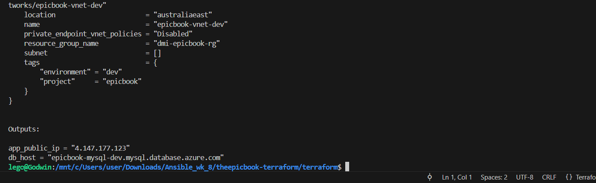

# ASSIGNMENT 37 Report
## Production-Grade EpicBook — Terraform + Ansible Roles (Azure)

In this project, I deployed the EpicBook web application on Azure using Terraform and Ansible. Terraform handled the infrastructure provisioning — setting up the VM, network, and database — while Ansible automated the configuration and deployment of the app itself. Combining both tools ensured a reliable, consistent, and repeatable setup, reducing manual effort and minimizing human error. This approach reflects real-world production-grade DevOps practices, where infrastructure and automation work hand in hand for efficiency and scalability.

## Objective
Stand up the EpicBook app on a cloud VM you provision with Terraform (Azure), and configure it with Ansible roles:

* **common:** baseline updates, packages, SSH hardening basics
* **nginx:** install, enable, serve from `/var/www/epicbook`
* **epicbook:** clone theepicbook repo and deploy content (build if needed), then reload Nginx
* **Repo:** [https://github.com/eyolegoo/theepicbook](https://github.com/eyolegoo/theepicbook)

---

## Step 1: Create Azure Infrastructure using Terraform

I created the foundation network and resources:

* **Resource Group:** EpicBook-RG
* **Virtual Network:** EpicBook-VNet (`10.0.0.0/16`)
    * PublicSubnet-VM (`10.0.1.0/24`)
    * PrivateSubnet-MySQL (`10.0.2.0/24`)
* **MySQL Flexible Server** in the PrivateSubnet-MySQL
    * Example: `epicbook-mysql-dev.mysql.database.azure.com`
    * Created an admin user: `devepicuser`
    * Allowed access only from your VM subnet.

Then I created:

* **Virtual Machine (Ubuntu)** named `epicbook-vm-dev`
* Attached a **Public IP** so you can access it via SSH.
* Made sure the **Network Security Group (NSG)** allows inbound ports:
    * 22 (SSH)
    * 80 (HTTP)

### Project Structure and Code

**File Tree**
```text
lego@Godwin:/mnt/c/Users/user/Downloads/Ansible_wk_8/theepicbook-terraform$ tree
.
├── ansible
│   ├── ansible.cfg
│   ├── group_vars
│   │   └── web.yml
│   ├── inventory.ini
│   ├── roles
│   │   ├── common
│   │   │   └── tasks
│   │   │       └── main.yml
│   │   ├── epicbook
│   │   │   ├── handlers
│   │   │   │   └── main.yml
│   │   │   ├── tasks
│   │   │   │   └── main.yml
│   │   │   └── templates
│   │   │       └── config.json.j2
│   │   ├── mysql
│   │   │   ├── files
│   │   │   │   └── db
│   │   │   │       ├── BuyTheBook_Schema.sql
│   │   │   │       ├── author_seed.sql
│   │   │   │       └── books_seed.sql
│   │   │   └── tasks
│   │   │       └── main.yml
│   │   └── nginx
│   │       ├── handlers
│   │       │   └── main.yml
│   │       ├── tasks
│   │       │   └── main.yml
│   │       └── templates
│   │           └── epicbook.conf.j2
│   └── site.yml
└── terraform
    ├── README.md
    ├── envs
    │   ├── dev.tfvars
    │   └── prod.tfvars
    │   ├── main.tf
    ├── modules
    │   ├── compute
    │   │   ├── cloud-init.tpl
    │   │   ├── main.tf
    │   │   ├── outputs.tf
    │   │   └── variables.tf
    │   ├── database
    │   │   ├── main.tf
    │   │   ├── outputs.tf
    │   │   └── variables.tf
    │   └── network
    │       ├── main.tf
    │       ├── outputs.tf
    │       └── variables.tf
    ├── outputs.tf
    ├── providers.tf
    └── variables.tf
````

*Note I maintained same terraform setup used in assignment 32.*

**ansible.cfg**

```ini
[defaults]
inventory = ./inventory.ini
host_key_checking = False
retry_files_enabled = False
forks = 10
deprecation_warnings = False
remote_tmp = /tmp/.ansible-${USER}/tmp
```

**group\_vars/web.yml**

```yaml
---
epicbook_repo: "[https://github.com/eyolegoo/theepicbook.git](https://github.com/eyolegoo/theepicbook.git)"
app_dir: /var/www/epicbook
app_port: 8080

db_host: "epicbook-mysql-dev.mysql.database.azure.com"
db_username: "devepicuser"
db_password: "Youandme@12345"
db_name: "bookstore"
db_port: 3306

nodejs_setup_script: "[https://deb.nodesource.com/setup_lts.x](https://deb.nodesource.com/setup_lts.x)"
```

**inventory.ini**

```ini
[web]
4.147.177.123

[all:vars]
ansible_user=azureuser
ansible_ssh_private_key_file=~/.ssh/azure_rsa
```

**roles/common/tasks/main.yml**

```yaml
---
- name: Update apt cache
  apt:
    update_cache: yes
    cache_valid_time: 3600

- name: Upgrade all packages (safe)
  apt:
    upgrade: dist
  register: upgrade_result
  changed_when: upgrade_result.changed

- name: Ensure essential packages are present
  apt:
    name:
      - git
      - curl
      - build-essential
      - apt-transport-https
      - ca-certificates
      - software-properties-common
      - gnupg
      - mysql-client
    state: present
    update_cache: yes

- name: Ensure UFW installed
  apt:
    name: ufw
    state: present

- name: Allow SSH (22) and HTTP (80) through UFW, then enable (non-interactive)
  ansible.builtin.ufw:
    rule: allow
    port: "{{ item.port }}"
    proto: "{{ item.proto }}"
  loop:
    - { port: 22, proto: tcp }
    - { port: 80, proto: tcp }

- name: Enable UFW firewall (force yes)
  ansible.builtin.ufw:
    state: enabled
    direction: incoming
    policy: allow
```

**roles/epicbook/handler/main.yml**

```yaml
---
- name: Restart epicbook
  systemd:
    name: epicbook.service
    state: restarted
    daemon_reload: yes

- name: Reload systemd
  command: systemctl daemon-reload
  become: true
```

**roles/epicbook/tasks/main.yml**

```yaml
---
- name: Ensure nodejs LTS repository script is present
  shell: curl -fsSL {{ nodejs_setup_script }} | bash -
  args:
    creates: /etc/apt/sources.list.d/nodesource.list

- name: Install nodejs (LTS)
  apt:
    name: nodejs
    state: present
    update_cache: yes

- name: Ensure application directory exists
  file:
    path: "{{ app_dir }}"
    state: directory
    owner: www-data
    group: www-data
    mode: '0755'

- name: Mark /var/www/epicbook as safe for Git
  ansible.builtin.command: git config --global --add safe.directory /var/www/epicbook
  become: true
 
- name: Clone EpicBook repository
  git:
    repo: "{{ epicbook_repo }}"
    dest: "{{ app_dir }}"
    version: HEAD
    force: yes
    update: yes
  notify: Restart epicbook

- name: Install npm dependencies
  npm:
    path: "{{ app_dir }}"
    production: no
    ignore_scripts: no
  register: npm_install
  notify: Restart epicbook

- name: Provide config.json from template
  template:
    src: config.json.j2
    dest: "{{ app_dir }}/config/config.json"
    owner: www-data
    group: www-data
    mode: '0640'
  notify: Restart epicbook

- name: Ensure build step (if any) - run npm run build if package.json has build script
  shell: |
    if grep -q "\"build\":" {{ app_dir }}/package.json; then
      cd {{ app_dir }} && npm run build
    fi
  args:
    chdir: "{{ app_dir }}"
  register: build_result
  changed_when: "'npm run build' in build_result.stdout or build_result.rc == 0"

- name: Create systemd service for epicbook
  copy:
    dest: /etc/systemd/system/epicbook.service
    content: |
      [Unit]
      Description=EpicBook Node App
      After=network.target

      [Service]
      Environment=NODE_ENV=production
      WorkingDirectory={{ app_dir }}
      ExecStart=/usr/bin/node {{ app_dir }}/server.js
      Restart=always
      User=www-data
      Group=www-data
      RestartSec=5

      [Install]
      WantedBy=multi-user.target
  notify: Reload systemd

- name: Ensure epicbook service is enabled and started
  systemd:
    name: epicbook.service
    state: started
    enabled: yes
```

**roles/epicbook/templates/config.json.j2**

```json
{
  "development": {
    "username": "{{ db_username }}",
    "password": "{{ db_password }}",
    "database": "{{ db_name }}",
    "host": "{{ db_host }}",
    "port": "{{ db_port | default('3306') }}",
    "dialect": "mysql",
    "dialectOptions": {
      "ssl": {
        "require": true,
        "rejectUnauthorized": false
      }
    }
  },
  "test": {
    "username": "root",
    "password": null,
    "database": "database_test",
    "host": "127.0.0.1",
    "dialect": "mysql"
  },
  "production": {
    "use_env_variable": "JAWSDB_URL",
    "dialect": "mysql"
  }
}
```

**roles/mysql/tasks/main.yml**

```yaml
---
- name: Ensure mysql-client is present
  apt:
    name: mysql-client
    state: present
    update_cache: yes

- name: Create app DB marker dir
  file:
    path: /opt/epicbook-db
    state: directory
    mode: '0755'

- name: Copy schema and seed SQL to remote (if not present)
  copy:
    src: "{{ item }}"
    dest: "/opt/epicbook-db/{{ item | basename }}"
    mode: '0644'
  loop:
    - db/BuyTheBook_Schema.sql
    - db/author_seed.sql
    - db/books_seed.sql
  # This expects your playbook runner to be in repo root where db/ exists. Alternatively, use get_url or template.

- name: Import schema if not already imported
  shell: >
    mysql -h {{ db_host }} -u {{ db_username }} -p'{{ db_password }}' -e "use {{ db_name }};"
  register: check_db
  failed_when: false
  changed_when: false

- name: Create database if missing
  shell: >
    mysql -h {{ db_host }} -u {{ db_username }} -p'{{ db_password }}' -e "CREATE DATABASE IF NOT EXISTS {{ db_name }};"
  when: check_db.rc != 0
  register: create_db
  changed_when: create_db.rc == 0

- name: Import schema file
  shell: >
    mysql -h {{ db_host }} -u {{ db_username }} -p'{{ db_password }}' {{ db_name }} < /opt/epicbook-db/BuyTheBook_Schema.sql
  args:
    creates: /opt/epicbook-db/.schema_imported
  register: import_schema
  failed_when: import_schema.rc != 0

- name: Touch schema import marker
  file:
    path: /opt/epicbook-db/.schema_imported
    state: touch
  when: import_schema is changed

- name: Import author seed
  shell: >
    mysql -h {{ db_host }} -u {{ db_username }} -p'{{ db_password }}' {{ db_name }} < /opt/epicbook-db/author_seed.sql
  args:
    creates: /opt/epicbook-db/.author_seed
  register: import_auth
  failed_when: import_auth.rc != 0

- name: Touch author seed marker
  file:
    path: /opt/epicbook-db/.author_seed
    state: touch
  when: import_auth is changed

- name: Import books seed
  shell: >
    mysql -h {{ db_host }} -u {{ db_username }} -p'{{ db_password }}' {{ db_name }} < /opt/epicbook-db/books_seed.sql
  args:
    creates: /opt/epicbook-db/.books_seed
  register: import_books
  failed_when: import_books.rc != 0

- name: Touch books seed marker
  file:
    path: /opt/epicbook-db/.books_seed
    state: touch
  when: import_books is changed
```

**roles/nginx/handler/main.yml**

```yaml
---
- name: Reload nginx
  systemd:
    name: nginx
    state: reloaded
```

**roles/nginx/tasks/main.yml**

```yaml
---
- name: Install nginx
  apt:
    name: nginx
    state: present
    update_cache: yes

- name: Ensure /var/www exists
  file:
    path: /var/www
    state: directory

- name: Place epicbook nginx config
  template:
    src: epicbook.conf.j2
    dest: /etc/nginx/sites-available/epicbook
  notify: Reload nginx

- name: Enable site by symlinking
  file:
    src: /etc/nginx/sites-available/epicbook
    dest: /etc/nginx/sites-enabled/epicbook
    state: link
  notify: Reload nginx

- name: Remove default site if present
  file:
    path: /etc/nginx/sites-enabled/default
    state: absent
  notify: Reload nginx

- name: Test nginx config
  command: nginx -t
  register: nginx_test
  failed_when: nginx_test.rc != 0

- name: Ensure nginx is started and enabled
  systemd:
    name: nginx
    state: started
    enabled: yes
```

**roles/nginx/templates/epicbook.conf.j2**

```nginx
server {
    listen 80;
    server_name _;

    location / {
        proxy_pass [http://127.0.0.1:8080](http://127.0.0.1:8080);
        proxy_http_version 1.1;
        proxy_set_header Upgrade $http_upgrade;
        proxy_set_header Connection 'upgrade';
        proxy_set_header Host $host;
        proxy_cache_bypass $http_upgrade;
    }
}
```

**site.yml**

```yaml
---
- name: Prepare system (common)
  hosts: web
  become: true
  roles:
    - common

- name: Install and configure MySQL client & import schema
  hosts: web
  become: true
  roles:
    - mysql

- name: Deploy EpicBook app
  hosts: web
  become: true
  roles:
    - epicbook

- name: Install and configure Nginx
  hosts: web
  become: true
  roles:
    - nginx
```

-----

## Step 1.1: Provision Infrastructure using Terraform

On the terraform folder of the infrastructure, I initialized, planned and applied using:

```bash
terraform init
terraform plan -var-file="envs/dev.tfvars"
terraform apply -var-file="envs/dev.tfvars" -auto-approve
```

*Note, the plan and apply commands were done on dev environment workspace.*

After a successful provisioning of the infrastructure, the VM IP and other information was outputted.




-----

## Step 2: Passwordless SSH Check

I accessed the VM via ssh without password by running:

```bash
ssh -i ~/.ssh/azure_rsa azureuser@4.147.177.123
```


-----

## Step 3: Configuration and Deployment with Ansible

Before using ansible to configure and deploy the applications, I first updated the `inventory.ini` file with the outputted VM IP (`4.147.177.123`), because this configuration and deployment would be done on the VM.

With that update, I ran the ansible command using:

```bash
ANSIBLE_CONFIG=./ansible.cfg ansible-playbook site.yml -i inventory.ini
```

Yes, I used that command because Ansible completely ignored the `ansible.cfg`, because it’s inside a world-writable Windows mount (`/mnt/c/...`). That means your `remote_tmp` line never got applied — it still tries to create, but keeps failing. So the command forces Ansible to read the config file even from a Windows-mounted folder.


After successfully automating app configuration and deployment, I tested the VM IP on a web browser `http://4.147.177.123`


-----

## Step 4: Confirmations and Conclusion

**Nginx site file**


**Browser showing**


-----

## REFLECTION

This project was a valuable learning experience that helped me understand how Terraform and Ansible complement each other. I initially struggled with service configuration and JSON syntax errors, but troubleshooting them deepened my understanding of deployment automation. Seeing the EpicBook app run smoothly on Azure made the effort worthwhile. I also realized the importance of securing credentials and using environment variables or Azure Key Vault in production to prevent sensitive data exposure and maintain a more secure, professional setup.

### Regarding security

I noticed a few concerns:

  * The database credentials were stored in plain text within `config.json`.
  * The Nginx reverse proxy wasn’t using HTTPS — only HTTP on port 80.

**In production, I would fix these by:**

  * Storing secrets securely in Azure Key Vault and referencing them through environment variables instead of hardcoding credentials.
  * Enforcing HTTPS by setting up an SSL certificate (via Let’s Encrypt or Azure-managed certificates) and redirecting all HTTP traffic to HTTPS.
  * Restricting database access to only the app’s private subnet to minimize exposure.

Overall, this experience helped me better understand how backend configuration, security, and deployment all tie together in a production-grade setup.
