# ASSIGNMENT 41 Report

## Automate the Book Review Application with Terraform, Ansible, and Azure DevOps

This assignment focuses on automating the deployment of the Book Review Application using Terraform, Ansible, and Azure DevOps. It combines infrastructure provisioning and application configuration into a seamless CI/CD workflow. This approach is highly useful because it ensures consistent, repeatable deployments, reduces manual errors, and speeds up delivery. By integrating Terraform and Ansible within Azure DevOps pipelines, teams can achieve full end-to-end automation — from setting up servers to deploying and updating the application with minimal effort.

### Objective
Reproduce the end-to-end automation, using two repositories and two Azure DevOps pipelines to deploy the Book Review App:

* **Infra repository (Terraform):** provisions the infrastructure (resource group/VNet/2 VMs/MySQL).
* **App repository (Book Review App + Ansible):** configures frontend and backend VMs and deploys the application.

**Application repo to deploy:** [https://github.com/pravinmishraaws/book-review-app](https://github.com/pravinmishraaws/book-review-app)

> **Note:** Everything was done in my agent machine.

---

### Step 1: The Build

#### Repositories

**1. Book-review-infra** [https://github.com/pravinmishraaws/book-review-infra](https://github.com/pravinmishraaws/book-review-infra)
Terraform code to provision:
* 1 frontend VM (Ubuntu)
* 1 backend VM (Ubuntu)
* VNet / subnet
* MySQL (Azure MySQL or VM-based; follow the video)
* Terraform outputs: `frontend_public_ip`, `backend_public_ip`, `mysql_fqdn` (or endpoint)

**2. Book-review-app** [https://github.com/pravinmishraaws/book-review-app](https://github.com/pravinmishraaws/book-review-app)
App source code (frontend + backend). Ansible playbooks to:
* configure common packages
* configure backend (API, DB connection)
* configure frontend (points to backend)
* restart services / Nginx

#### Pipelines

**1. Infra pipeline (Azure Pipelines):**
* Source: book-review-infra (in GitHub or Azure Repos)
* Install Terraform
* Authenticate using Azure Resource Manager service connection (SPN)
* terraform init/plan/apply
* Print/log Terraform outputs (frontend IP, backend IP, DB FQDN)
* *This is the “platform / infra” pipeline*

**2. App pipeline (Azure Pipelines):**
* Source: book-review-app repo
* Install Ansible
* Download SSH private key from Secure Files
* Update Ansible inventory and vars manually with values from the infra pipeline
* Run Ansible playbook to configure both VMs and deploy the app
* *This is the “application / Dev” pipeline*

---

### Step 2: Background Setup

**1. Install terraform**
```bash
sudo apt update && sudo apt install -y wget curl unzip

sudo apt-get update && sudo apt-get install -y gnupg software-properties-common

wget -O- [https://apt.releases.hashicorp.com/gpg](https://apt.releases.hashicorp.com/gpg) | gpg --dearmor | sudo tee /usr/share/keyrings/hashicorp-archive-keyring.gpg

echo "deb [signed-by=/usr/share/keyrings/hashicorp-archive-keyring.gpg] [https://apt.releases.hashicorp.com](https://apt.releases.hashicorp.com) $(lsb_release -cs) main" | sudo tee /etc/apt/sources.list.d/hashicorp.list

sudo apt update

sudo apt install terraform

terraform -version
````

**2. Download AZ in linux**

```bash
curl -sL [https://aka.ms/InstallAzureCLIDeb](https://aka.ms/InstallAzureCLIDeb) | sudo bash
```

**3. az login**

**4. Create Service Principle**


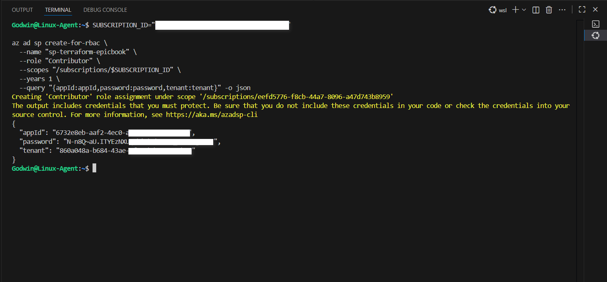


**5. Azure Resource Manager**
Create an Azure Resource Manager service connection using the SPN/App Registration.
In azure DevOps, go to book review project settings, create service connections. Don't use  SSH. Use Azure Resource.


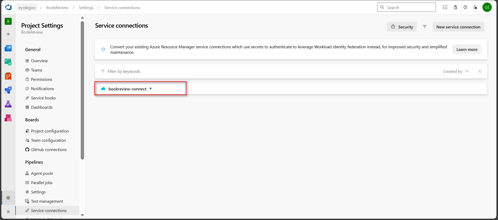


**6. Keygen**
Upload your keygen (both private and public) to Azure DevOps-Pipeline-Library.

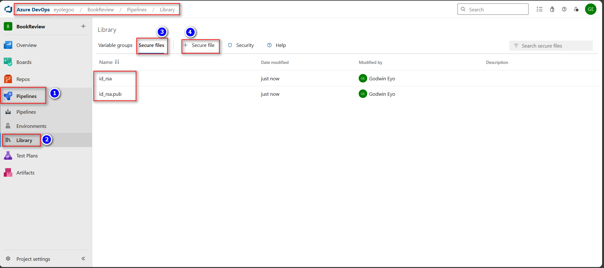
-----

### Step 3: App Repository, Infra Repository and Pipeline

1.  Clone/import the book-review-app

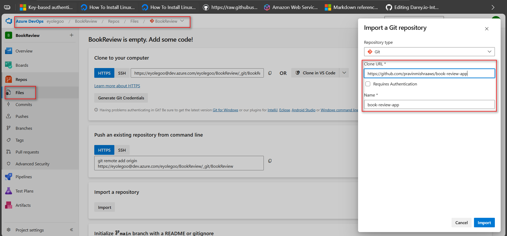
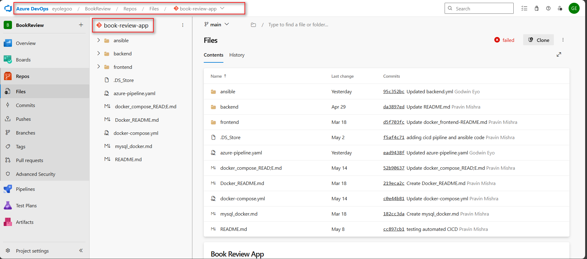

2.  Clone/import book-review-infra and place the Terraform code (modules for network, compute, database; separate env folders).
3.  Create an Azure Pipeline (YAML) in Azure DevOps for this repo:
      * Use self-hosted agent (preferred)
      * Install Terraform
      * Download SSH public key from Secure Files and place it where Terraform expects it
      * Run terraform init, terraform plan, and terraform apply


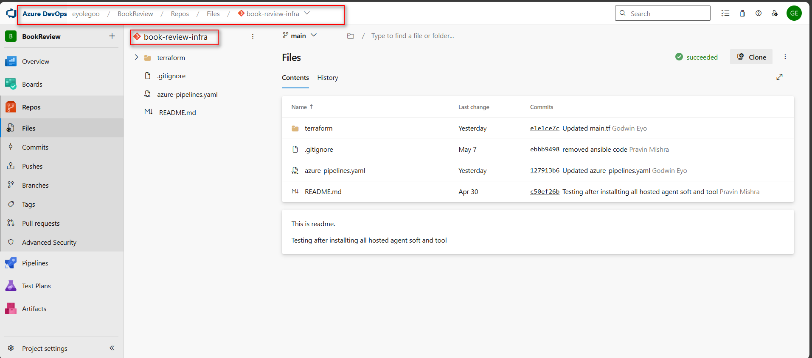

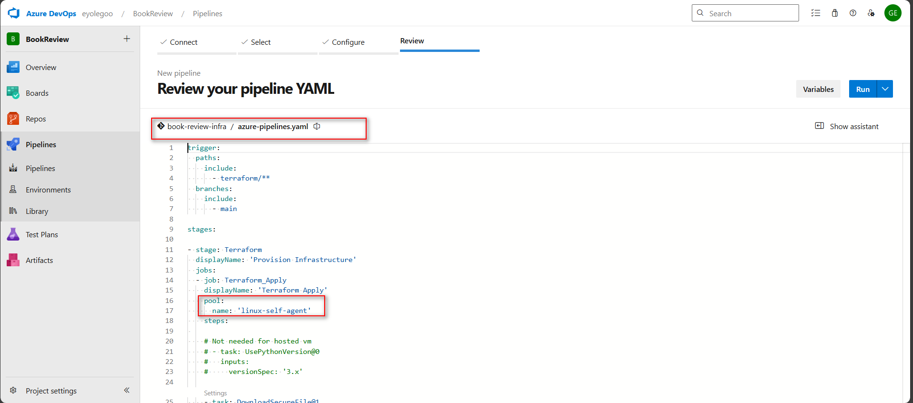


**Infra Pipeline YAML:**

```yaml
trigger:
  paths:
    include:
      - terraform/**
  branches:
    include:
      - main

stages:

- stage: Terraform
  displayName: 'Provision Infrastructure'
  jobs:
  - job: Terraform_Apply
    displayName: 'Terraform Apply'
    pool:
      name: 'linux-self-agent'
    steps:
 
    # Not needed for hosted vm
    # - task: UsePythonVersion@0
    #   inputs:
    #     versionSpec: '3.x'

    - task: DownloadSecureFile@1
      name: download_ssh_key
      inputs:
        secureFile: 'id_rsa.pub'

    - script: |
        echo "Copying SSH public key into Terraform module"

        mkdir -p ~/.ssh
        cp $(download_ssh_key.secureFilePath) ~/.ssh/id_rsa.pub

        # Now copy into Terraform module path
        cp $(download_ssh_key.secureFilePath) terraform/modules/compute/id_rsa.pub

        echo "Listing contents of terraform/modules/compute/"
        ls -al terraform/modules/compute/
      displayName: 'Extract SSH Public Key for Terraform'

    - task: AzureCLI@2
      inputs:
        azureSubscription: 'bookreview-connect'
        scriptType: bash
        scriptLocation: inlineScript
        workingDirectory: $(System.DefaultWorkingDirectory)/terraform
        inlineScript: |
          echo "##[group]Terraform Init/Plan/Apply"
          cd terraform
          terraform init -input=false 
          terraform plan -input=false -var-file="envs/dev.tfvars"
          terraform apply -input=false -auto-approve -var-file="envs/dev.tfvars"
          echo "##[endgroup]"
```

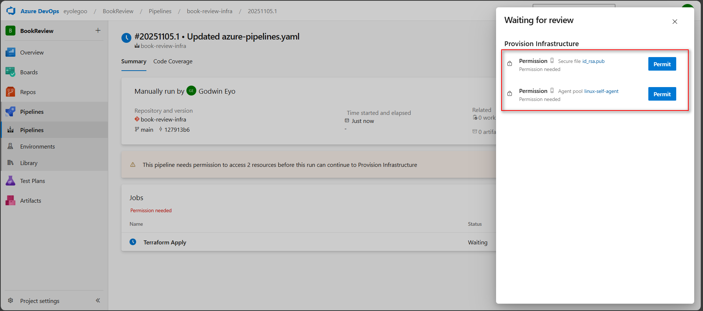


**Terraform Outputs:**

```text
backend_public_ip = "20.248.126.94"
frontend_public_ip = "20.28.47.108"
mysql_fqdn = "bookreview-db1008.mysql.database.azure.com"
```

## 

### Step 4: Manual handoff

1.  From the pipeline logs of the Infra pipeline, copy:
      * Frontend public IP
      * Backend public IP
      * MySQL FQDN / endpoint
2.  Open the book-review-app repo
3.  Update the following files (names may differ depending on your structure):
      * `ansible/inventory.ini` → set frontend and backend hosts to the new IPs
      * `ansible/group_vars/backend.yml` (or similar) → set DB host / FQDN
      * `ansible/group_vars/frontend.yml` (or similar) → set backend API URL

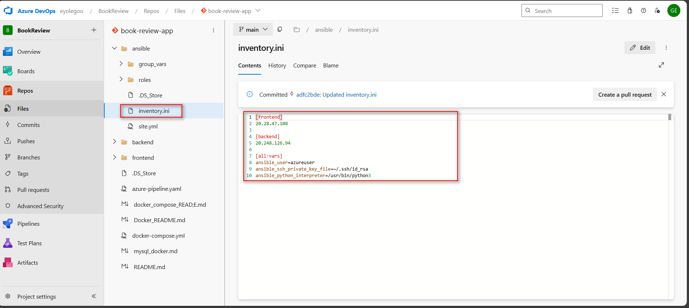
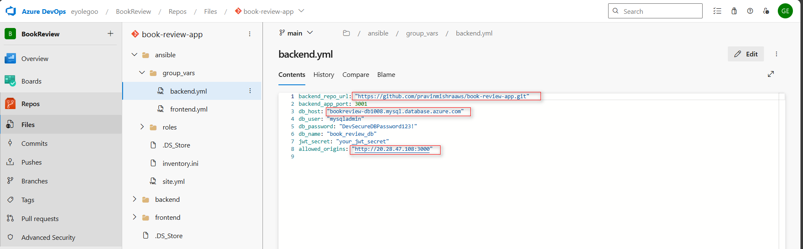
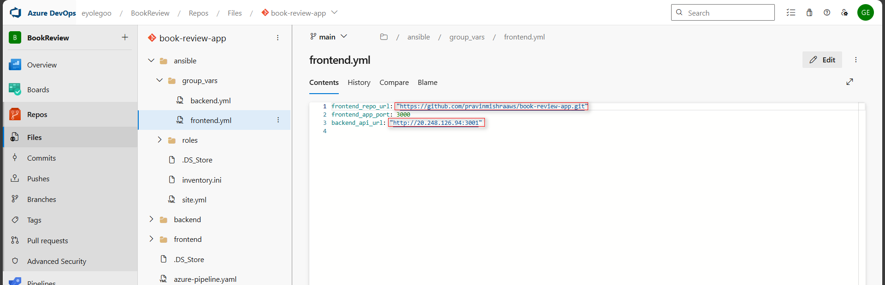

-----

### Step 5: App Repository Pipeline

1.  In Azure DevOps, create a second pipeline, this time pointing to the book-review-app repo.
2.  In the pipeline:
      * Install Ansible
      * Download SSH private key from Secure Files
      * Set correct permissions on the key
      * Run the main Ansible playbook that:
          * runs common role on both VMs
          * configures backend VM (app + DB connection)
          * configures frontend VM (Nginx + UI)
3.  Run the pipeline and ensure all Ansible tasks succeed.


**App Pipeline YAML (`azure-pipelines-app.yaml`):**

```yaml
trigger:
  branches:
    include:
      - main

stages:
  - stage: DeployApp
    displayName: "Deploy Application Code via Ansible"
    jobs:
      - job: App_Deployment
        displayName: "Run Ansible Playbook to Deploy App"
        pool:
          name: "linux-self-agent"

        steps:
          - script: |
              sudo apt update
              sudo apt install -y ansible sshpass
            displayName: "Install Ansible & SSH dependencies"

          - task: DownloadSecureFile@1
            name: download_ssh_key
            inputs:
              secureFile: "id_rsa"

          - script: |
              mkdir -p ~/.ssh
              cp $(download_ssh_key.secureFilePath) ~/.ssh/id_rsa
              chmod 600 ~/.ssh/id_rsa
              echo "StrictHostKeyChecking no" > ~/.ssh/config
            displayName: "Setup SSH Private Key"

          - script: |
              cd ansible
              ansible-playbook -i inventory.ini site.yml --ssh-extra-args "-o StrictHostKeyChecking=no -o UserKnownHostsFile=/dev/null"
            displayName: "Run Ansible Playbook"
            env:
              ANSIBLE_HOST_KEY_CHECKING: "False"
```


**Now I tested the VM IP on the web browser**


**Created resources on azure portal**


## 


### Step 5.1: Reflection

The infrastructure pipeline took the most time since setting up Terraform modules, configuring the service connection, and verifying Azure resources required careful testing. Once the infrastructure was ready, the application pipeline was smoother, though fine-tuning Ansible roles took some effort. In the next version, I’d automate the handoff by feeding Terraform outputs directly into the Ansible pipeline using artifacts or variable groups, removing manual edits entirely.
