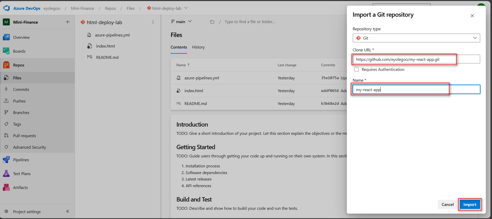
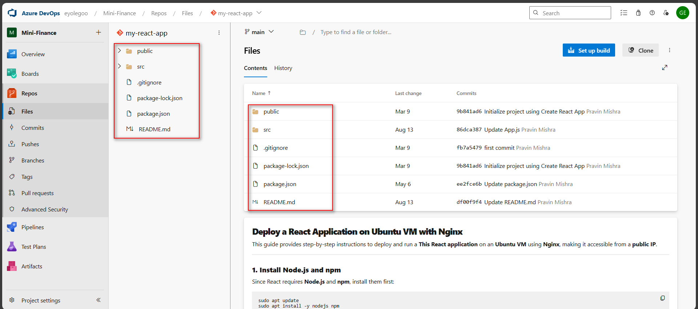
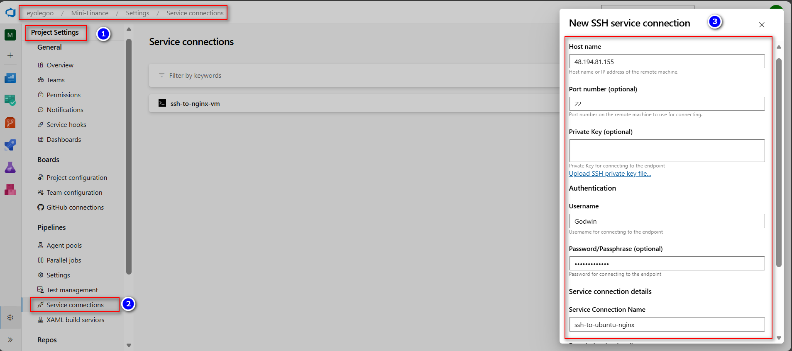
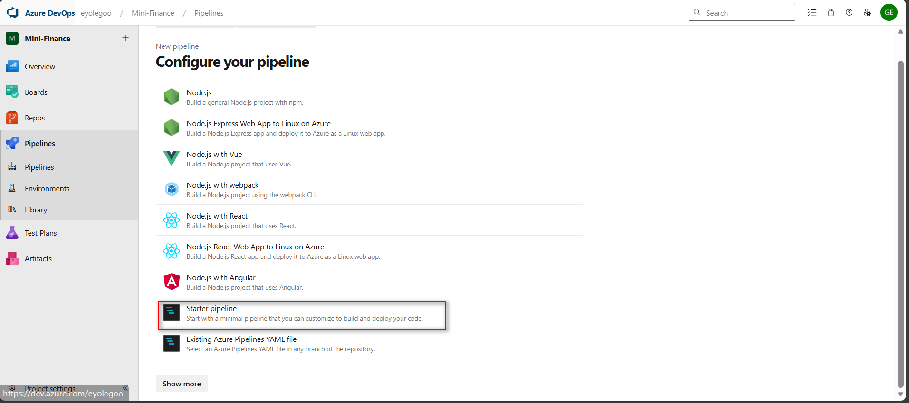
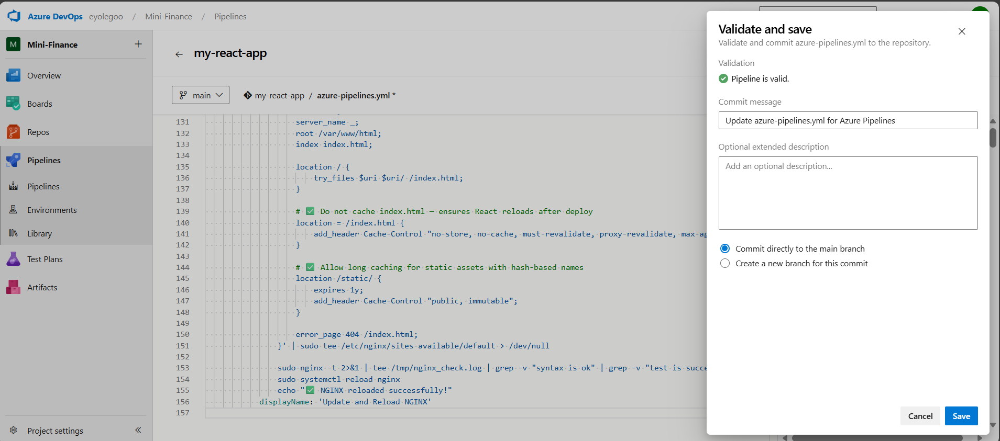

# ASSIGNMENT 40 Report

## CI/CD Pipeline for React Application using Azure DevOps and Nginx (Multi-Stage YAML)

This assignment centers on creating and deploying a React application through a multi-stage CI/CD pipeline in Azure DevOps, seamlessly integrated with an Nginx server. It streamlines the process from code changes to live deployment, ensuring efficiency, accuracy, and stability. The approach is valuable because it minimizes manual effort, supports continuous delivery, and strengthens collaboration between developers and operations teams, leading to quicker and more dependable software releases.

### Objective
Build and deploy a real React application using a multi-stage Azure DevOps pipeline that covers the complete CI/CD lifecycle — from build and test to deployment on a Linux web server. Import the React app, configure the pipeline, and deploy the compiled build to my Ubuntu VM running Nginx via an SSH Service Connection.

**Reference repository:** [https://github.com/eyolegoo/my-react-app](https://github.com/eyolegoo/my-react-app)

### What to Build
* Azure DevOps pipeline with Build → Test → Publish → Deploy stages
* Automated deployment of React app to an Ubuntu VM on Azure
* Nginx serving the React build from `/var/www/html`
* End-to-end CI/CD triggered automatically on commits to main

### Prerequisites
* Azure DevOps Organization and Project
* New Ubuntu VM provisioned using Terraform Azure
* Nginx installed and serving `/var/www/html` (using Ansible)
* SSH Service Connection configured with username and password

---

### Step 1: Import the React App

I imported the React repository into my Azure Repos: [https://github.com/eyolegoo/my-react-app](https://github.com/eyolegoo/my-react-app)

I ensured the `package.json` and `src/` files are visible in your project.




*After import*


---

### Step 2: Create or Update the SSH Service Connection

You need an SSH service connection in your Azure DevOps project that points to the VM.

**Steps (Azure DevOps UI):**
1.  Project settings → Service connections → New service connection → SSH.
2.  Fill:
    * **Host:** `<vm_public_ip_or_dns>`
    * **Port:** 22 (or custom)
    * **Username:** e.g. ubuntu
    * **Authentication:** Password or Private key (recommended: private key)
    * **Name the connection** (e.g. `ubuntu-nginx-ssh`).
3.  Save and click Verify. If verify fails, check:
    * Public IP is reachable
    * SSH allowed from Azure DevOps agent IP (if self-hosted, ensure agent can reach VM)
    * Username & key/password/mode are correct

*Manual verification (from your local machine or from your self-hosted agent host)*


---

### Step 3: Author a Multi-Stage Pipeline (YAML)

Create a new Azure Pipeline using YAML. Define the following stages:

* **Stage 1 — Build**
    * Install Node.js
    * Install dependencies (`npm install`)
    * Build the React app (`npm run build`)
* **Stage 2 — Test**
    * Run unit tests (`npm test -- --watchAll=false`)
    * Fail the stage if tests fail
* **Stage 3 — Publish**
    * Publish the `build/` directory as an artifact for later deployment
* **Stage 4 — Deploy**
    * Use an SSH task to copy the artifact (`/build` folder) to `/var/www/html` on the VM
    * Optionally clear old content before copying
    * Restart Nginx after deployment

#### Step 3.1: How each stage works — step-by-step guide

**Build**
* **Purpose:** produce an optimized production build (`/build`) using `react-scripts build`.
* **Steps:** install Node → `npm ci` (clean install) → `npm run build`.
* **Output:** publish `/build` as an artifact for downstream stages.

**Test**
* **Purpose:** run automated unit tests (Jest).
* **Steps:** `npm test -- --watchAll=false` ensures tests run once in CI.
* If tests fail the pipeline stops (by default failing the stage).

**Publish**
* **Purpose:** make the `/build` artifact available to deployment jobs via Azure artifact storage.
* We used `PublishPipelineArtifact@1` for deterministic artifact availability.

**Deploy**
* **Purpose:** copy production build to target VM `/var/www/html` and restart Nginx.
* **Mechanism:** `CopyFilesOverSSH@0` to push files, then `SSH@0` to run commands (move files, chown, restart nginx).
* **Why copy to temp location first?** avoids serving half-written files and reduces downtime.

---

### Step 4: Run and Verify

1.  Commit changes to main.
2.  Observe that the pipeline triggers automatically.
3.  Validate that all stages complete successfully.
4.  Access your React app at `http://<public_ip>` in a browser.
5.  Confirm that the Nginx server serves the React application.





#### Azure pipeline.yml

```yaml
trigger:
  - main

pool:
  name: 'linux-self-agent'

variables:
  sshService: 'ssh-to-ubuntu-nginx'
  artifactName: 'react-build'
  webRoot: '/var/www/html'

stages:
  # Stage 1 -- Build
  - stage: Build
    displayName: 'Build React App'
    jobs:
      - job: Build
        steps:
          - checkout: self

          - task: NodeTool@0
            inputs:
              versionSpec: '20.x'
            displayName: 'Install Node.js'

          - script: npm ci
            displayName: 'Install Dependencies'

          - script: npm run build
            displayName: 'Build React App'

          - task: PublishBuildArtifacts@1
            inputs:
              pathToPublish: 'build'
              artifactName: '$(artifactName)'
            displayName: 'Publish Build Output'

  # Stage 2 -- Test
  - stage: Test
    displayName: 'Run Unit Tests'
    dependsOn: Build
    condition: succeeded()
    jobs:
      - job: Test
        steps:
          - checkout: self

          - task: NodeTool@0
            inputs:
              versionSpec: '20.x'
            displayName: 'Install Node.js'

          - script: npm ci
            displayName: 'Install Dependencies'

          - script: npm test -- --watchAll=false
            displayName: 'Run Jest Tests'

  # Stage 3 -- Publish
  - stage: Publish
    displayName: 'Publish Artifact for Deployment'
    dependsOn: Test
    condition: succeeded()
    jobs:
      - job: Publish
        steps:
          - task: DownloadBuildArtifacts@0
            inputs:
              buildType: 'current'
              artifactName: '$(artifactName)'
              downloadPath: '$(Pipeline.Workspace)/publish'
            displayName: 'Download Build Artifact'

          - task: PublishBuildArtifacts@1
            inputs:
              pathToPublish: '$(Pipeline.Workspace)/publish'
              artifactName: '$(artifactName)-deploy'
            displayName: 'Publish Final Artifact'

  # Stage 4 -- Deploy
  - stage: Deploy
    displayName: 'Deploy to NGINX Server'
    dependsOn: Publish
    condition: succeeded()
    jobs:
      - job: Deploy
        steps:
          # 1️⃣ Download artifact
          - task: DownloadBuildArtifacts@0
            inputs:
              buildType: 'current'
              artifactName: '$(artifactName)-deploy'
              downloadPath: '$(Pipeline.Workspace)'
            displayName: 'Download Deployment Artifact'

          # 2️⃣ Clean and prepare remote directory
          - task: SSH@0
            inputs:
              sshEndpoint: '$(sshService)'
              runOptions: 'inline'
              inline: |
                echo "🧹 Cleaning and preparing /var/www/html ..."
                sudo rm -rf /var/www/html/*
                sudo mkdir -p /var/www/html
                sudo chown -R $USER:$USER /var/www/html
                sudo chmod -R 755 /var/www/html
            displayName: 'Prepare Remote Directory'

          # 3️⃣ Copy contents of build folder directly into /var/www/html
          - task: CopyFilesOverSSH@0
            inputs:
              sshEndpoint: '$(sshService)'
              sourceFolder: '$(Pipeline.Workspace)/$(artifactName)-deploy/react-build'
              contents: '**'
              targetFolder: '$(webRoot)'
            displayName: 'Copy Build Contents to Web Root'

          # 4️⃣ Configure and reload NGINX cleanly
          - task: SSH@0
            inputs:
              sshEndpoint: '$(sshService)'
              runOptions: 'inline'
              inline: |
                echo "⚙️ Updating NGINX configuration..."
                echo 'server {
                    listen 80;
                    server_name _;
                    root /var/www/html;
                    index index.html;

                    location / {
                        try_files $uri /index.html;
                    }

                    error_page 404 /index.html;
                }' | sudo tee /etc/nginx/sites-available/default > /dev/null

                echo "🧪 Testing NGINX configuration..."
                if sudo nginx -t 2>&1 | grep -q 'syntax is ok'; then
                  echo "✅ Configuration valid"
                fi

                sudo systemctl reload nginx
                echo "🚀 NGINX reloaded successfully!"
            displayName: 'Update and Reload NGINX'
````





*Pipeline ran successfully*


Testing the VM public IP on a web browser shows it works


Confirmation check post deployment nginx folder content


-----

### Step 4.1: Reflection

One key insight I gained is that deploying artifacts (the compiled `/build` folder) is more efficient and dependable than sending raw source code since the artifact is already optimized for production. Setting up environments and approvals in the pipeline ensures safer and more controlled deployments. For multiple environments, I would include separate stages with specific variables and approval steps for production. Automating tests early also helped prevent faulty builds from being deployed.
