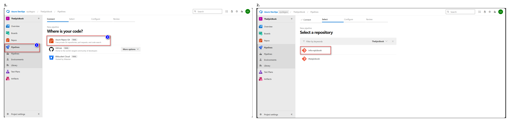
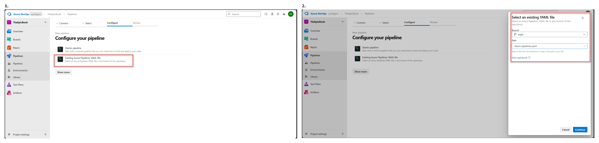
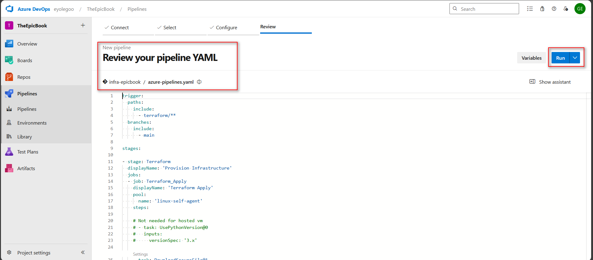
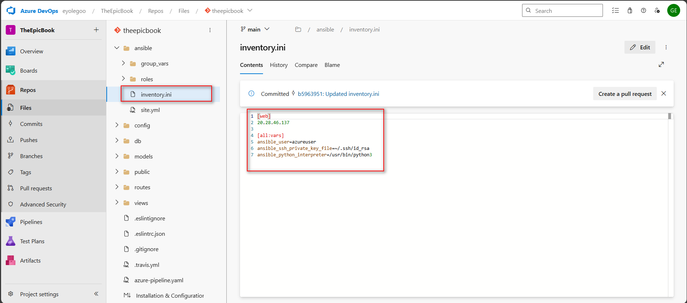
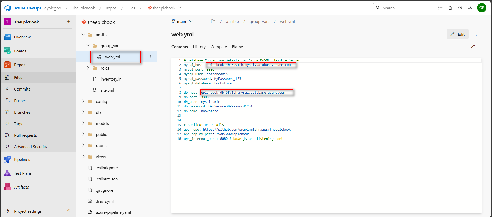
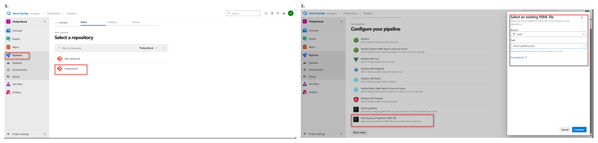
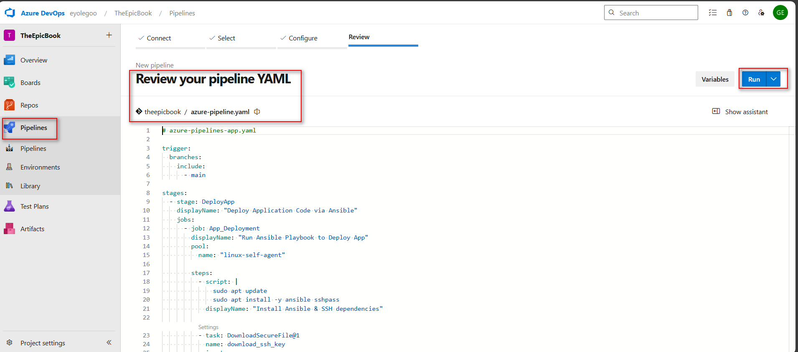
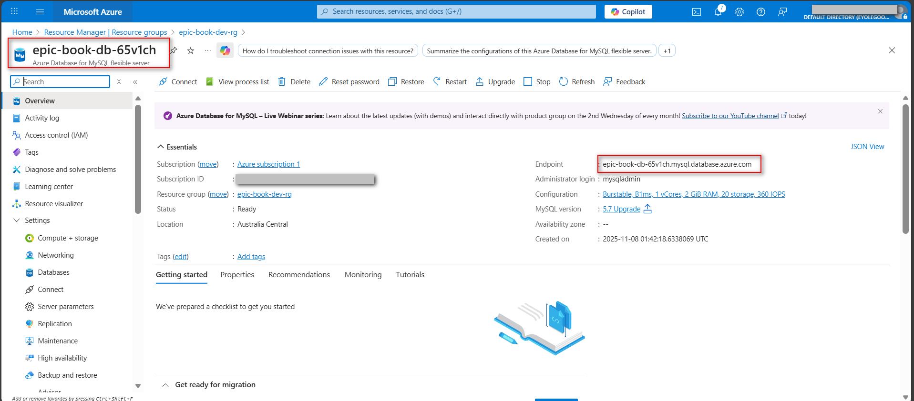
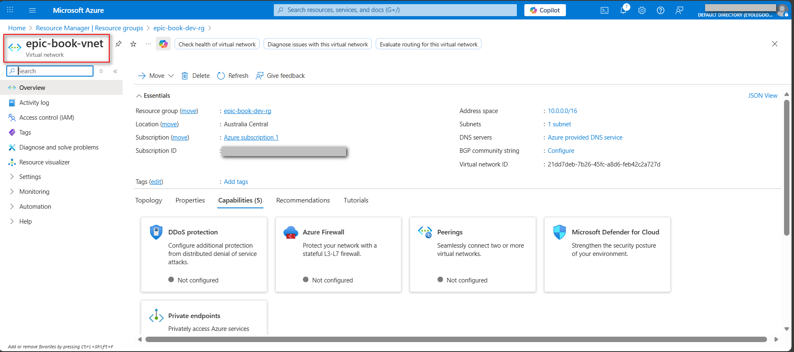
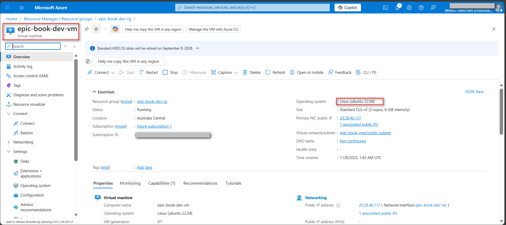

# ASSIGNMENT 42 Report

## Capstone Project – Automate the EpicBook Application with Dual Pipelines (Terraform + Ansible)

This capstone project focuses on fully automating the EpicBook application using two Azure DevOps pipelines — one for infrastructure (Terraform) and another for deployment (Ansible). This approach mirrors real-world DevOps practices where teams separate infrastructure and application responsibilities for better scalability, collaboration, and control. It ensures faster provisioning, consistent deployments, and easier troubleshooting while promoting modular automation that can be reused and extended across different environments or applications.

## Objective

In this capstone project, I’m required to design and implement a complete DevOps automation workflow for the EpicBook application using Azure DevOps Pipelines, Terraform, and Ansible.
Also, I’m expected to separate responsibilities across two repositories and two pipelines — one for infrastructure provisioning and the other for application deployment — similar to how large teams work in production environments.

### Prerequisites:
* Azure subscription and active Azure DevOps organization/project
* App Registration in Azure AD (Client ID, Client Secret, Tenant ID, Subscription ID)
* Create Azure service connection
* Two repositories in Azure Repos or GitHub:
    * **infra-epicbook** – Terraform code (https://github.com/eyolegoo/Epicbook-Infra)
    * **theepicbook** – application + Ansible code (https://github.com/eyolegoo/theepicbook-app)
* SSH key pair for VM access (stored as Secure Files in Azure DevOps)

---

## Step 1: What to Build

### Repositories

**1. Infra Repository (Terraform)**
* Provisions Azure resources:
    * Resource Group
    * Virtual Network and Subnets
    * Ubuntu VMs for Frontend and Backend
    * MySQL Database (PaaS or VM-based)

**2. App Repository (Ansible + Application Code)**
* Configures the provisioned VMs
* Installs Nginx and deploys the EpicBook application
* Configures the backend connection to MySQL

### Pipelines

**1. Infra Pipeline (Azure Pipelines – Terraform)**
* Install Terraform
* Authenticate using Azure Resource Manager Service Connection (SPN)
* Execute: `terraform init`, `plan`, `apply`
* Produce outputs:
    * `app_public_ip`
    * `Mysql_fqdn`

**2. App Pipeline (Azure Pipelines – Ansible)**
* Install Ansible
* Download SSH keys from Secure Files
* Update inventory and variable files using Terraform outputs
* Configure backend and frontend servers
* Deploy the EpicBook application and verify through Nginx

---

## Step 2: Infra Repo and Pipeline Creation

1.  **Infra repo:** Initialize Terraform configuration for network, compute, and database. Include outputs for VM IPs and database FQDN.
2.  In Azure DevOps, create a YAML pipeline in the Infra repository with stages for:
    * Installing Terraform
    * Initializing backend and providers
    * Running `terraform plan` and `terraform apply`
    * Publishing key outputs (Application IP, MySQL FQDN)







### Infra Pipeline YAML Configuration

```yaml
trigger:
  paths:
    include:
      - terraform/**
  branches:
    include:
      - main

stages:

- stage: Terraform
  displayName: 'Provision Infrastructure'
  jobs:
  - job: Terraform_Apply
    displayName: 'Terraform Apply'
    pool:
      name: 'linux-self-agent'
    steps:
 
    # Not needed for hosted vm
    # - task: UsePythonVersion@0
    #   inputs:
    #     versionSpec: '3.x'

    - task: DownloadSecureFile@1
      name: download_ssh_key
      inputs:
        secureFile: 'id_rsa.pub'

    - script: |
        echo "Copying SSH public key into Terraform module"

        mkdir -p ~/.ssh
        cp $(download_ssh_key.secureFilePath) ~/.ssh/id_rsa.pub

        # Now copy into Terraform module path
        cp $(download_ssh_key.secureFilePath) terraform/modules/compute/id_rsa.pub

        echo "Listing contents of terraform/modules/compute/"
        ls -al terraform/modules/compute/
      displayName: 'Extract SSH Public Key for Terraform'

    - task: AzureCLI@2
      inputs:
        azureSubscription: 'epicbook_connect'
        addSpnToEnvironment: true
        scriptType: bash
        scriptLocation: inlineScript
        workingDirectory: $(System.DefaultWorkingDirectory)/terraform
        inlineScript: |
          echo "##[group]Terraform Init/Plan/Apply"
          #cd terraform
          terraform init -input=false 
          terraform plan -input=false -var-file="envs/dev.tfvars"
          terraform apply -input=false -auto-approve -var-file="envs/dev.tfvars"
          
          # Save Terraform outputs
          terraform output -json > tf_output.json
          
          echo "##[endgroup]"
    
    # Publish the output file so the next pipeline can use it
    - task: PublishPipelineArtifact@1
      inputs:
        targetPath: "$(System.DefaultWorkingDirectory)/terraform/tf_output.json"
        artifactName: "tf-output"

```


### Infrastructure Outputted data after a successful terraform apply:

```
epic_book_public_ip = "20.28.46.137"
mysql_fqdn = "epic-book-db-65v1ch.mysql.database.azure.com"

```

---

## Step 3: Create App Pipeline

1. **App repo:** Add Ansible playbooks and roles for common setup, Nginx, and EpicBook deployment. Create an inventory template that will later be updated with IPs from Terraform outputs.
2. In the App repository, define another Azure DevOps pipeline that:
* Installs Ansible
* Downloads SSH private key from Secure Files
* Updates Ansible inventory and variable files with Terraform outputs (manual copy for now)
* Configures backend (MySQL connection, application setup) and frontend (Nginx, app deployment)
* Verifies Nginx is serving the EpicBook site


### Inventory Configuration: I injected this value into the `inventory.ini` file and `group_vars/web.yml`:

```
epic_book_public_ip = "20.28.46.137"
mysql_fqdn = "epic-book-db-65v1ch.mysql.database.azure.com"

```







### App Pipeline YAML Configuration (azure-pipelines-app.yaml)

```yaml
# azure-pipelines-app.yaml

trigger:
  branches:
    include:
      - main

stages:
  - stage: DeployApp
    displayName: "Deploy Application Code via Ansible"
    jobs:
      - job: App_Deployment
        displayName: "Run Ansible Playbook to Deploy App"
        pool:
          name: "linux-self-agent"

        steps:
          - script: |
              sudo apt update
              sudo apt install -y ansible sshpass
            displayName: "Install Ansible & SSH dependencies"

          - task: DownloadSecureFile@1
            name: download_ssh_key
            inputs:
              secureFile: "id_rsa"

          - script: |
              mkdir -p ~/.ssh
              cp $(download_ssh_key.secureFilePath) ~/.ssh/id_rsa
              chmod 600 ~/.ssh/id_rsa
              echo "StrictHostKeyChecking no" > ~/.ssh/config
            displayName: "Setup SSH Private Key"

          - script: |
              cd ansible
              ansible-playbook -i inventory.ini site.yml --ssh-extra-args "-o StrictHostKeyChecking=no -o UserKnownHostsFile=/dev/null"
            displayName: "Run Ansible Playbook"
            env:
              ANSIBLE_HOST_KEY_CHECKING: "False"

```


### Validation I tested the VM IP on a web browser and it gave the required output:


**Other validation checks:**

**MySQL Database:**


**Vnet:**


**VM:**


---

## Step 3.1: Reflection

This assignment helped me understand how separating infrastructure and application pipelines enhances efficiency and teamwork. Using Terraform for provisioning and Ansible for deployment made automation more structured and reusable. I learned how to securely manage credentials, connect pipelines, and verify end-to-end delivery. Overall, it reflected real-world DevOps workflows where collaboration, automation, and scalability work together to ensure reliable and consistent application delivery.
