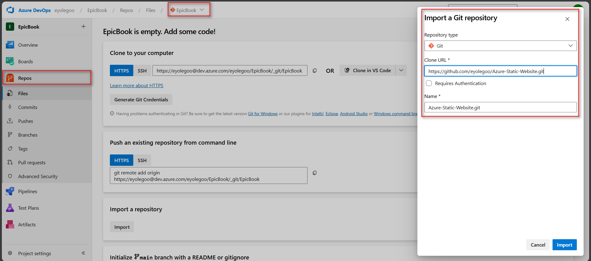
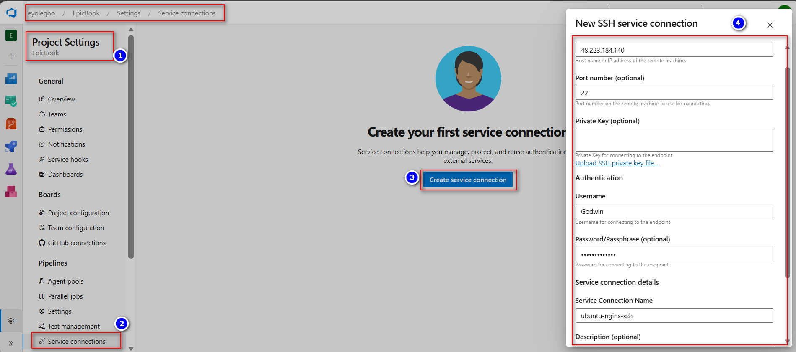
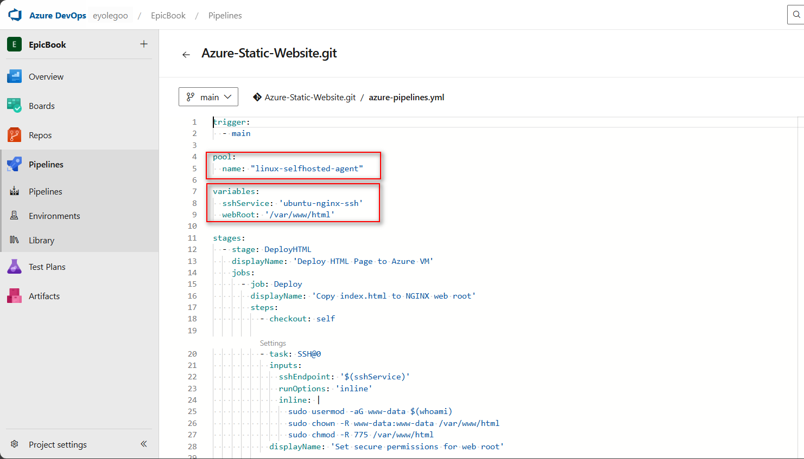
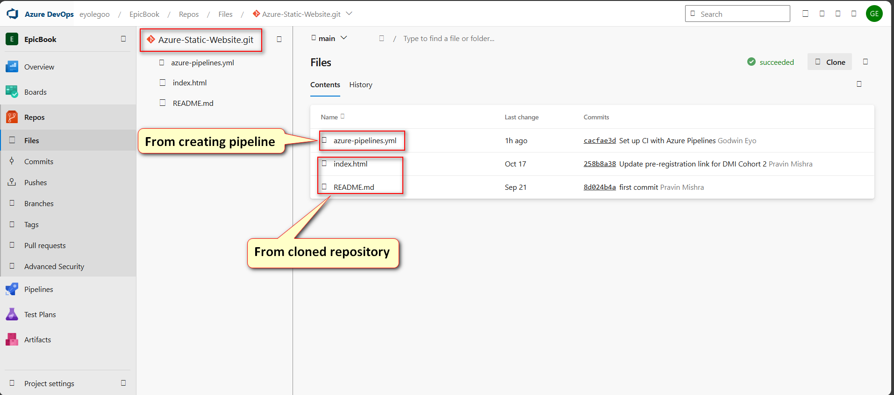
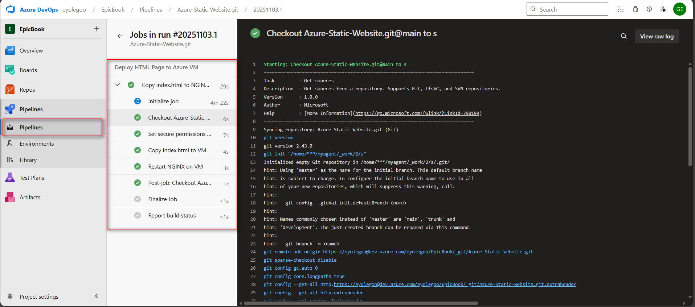
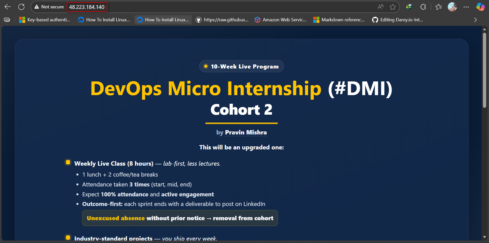
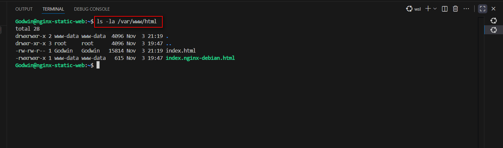
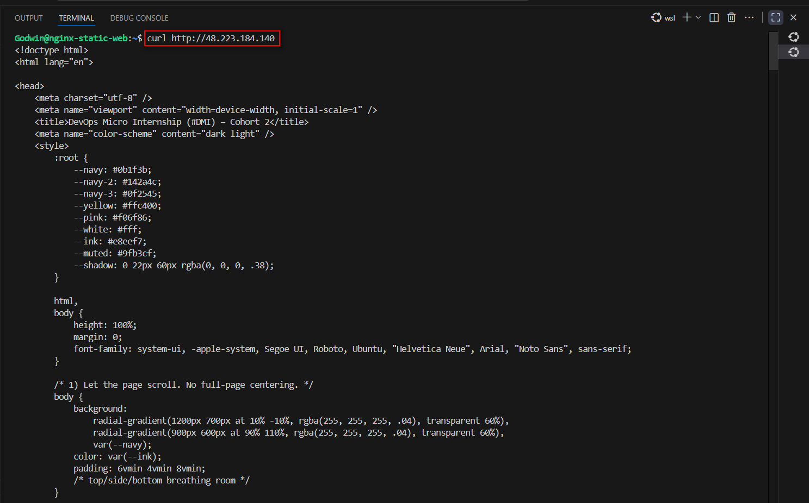

# ASSIGNMENT 39 Report

## Deploy a Website to an Nginx Server Using Azure DevOps Pipelines

This assignment focuses on automating the deployment of a static website to an Nginx server using Azure DevOps pipelines. It demonstrates how continuous integration and continuous deployment (CI/CD) streamline delivery from source control to production. The approach is important because it ensures consistency, reduces manual effort, and enables faster, error-free updates—showing how DevOps practices bridge development and operations for smoother, more reliable software delivery.

### Objective
Implement a complete CI/CD pipeline in Azure DevOps that deploys a website from Azure Repos to an Ubuntu VM running Nginx. This exercise demonstrates end-to-end automation—from source control to live deployment—using Azure DevOps YAML pipelines.

### Goal
* Create a Azure Repos by importing the git repo (https://github.com/eyolegoo/Azure-Static-Website) containing the codebase
* Used Azure DevOps pipeline to trigger commits to main
* Secure SSH Service Connection (password-based) to your Ubuntu VM
* Deployed and accessible site served over HTTP (port 80)
* Pipeline logs verifying successful connection, file transfer, and deployment

### Prerequisites
I used terraform to create a Linux VM running on Azure. And ansible to ensure Nginx is installed and serving content from `/var/www/html`. Keep port 80 open and verify SSH connection into the instance using username and password.

---

### Step 1: Import the Repository

Import the following repository into your Azure Repos: https://github.com/eyolegoo/Azure-Static-Website/tree/main
Confirm that the code and index.html are visible under your project.




---

### Step 2: Create an SSH Service Connection

In Azure DevOps:
Go to **Project Settings → Service Connections → New Service Connection → SSH**

Fill:
* **Connection name:** ubuntu-nginx-ssh
* **Host name:** Public IP of your VM
* **Port:** 22
* **Username:** VM username
* **Password:** VM password

Click **Verify and Save**



---

### Step 3: Create the YAML Pipeline

**Goal:** Automate deployment when code changes.

1. Go to: **Pipelines → Create Pipeline → Azure Repos Git → Select Repo**
2. Choose “Starter Pipeline” → Replace with this YAML:

```yaml
trigger:
  - main

pool:
  name: "linux-selfhosted-agent"

variables:
  sshService: 'ubuntu-nginx-ssh'
  webRoot: '/var/www/html'

stages:
  - stage: DeployHTML
    displayName: 'Deploy HTML Page to Azure VM'
    jobs:
      - job: Deploy
        displayName: 'Copy index.html to NGINX web root'
        steps:
          - checkout: self

          - task: SSH@0
            inputs:
              sshEndpoint: '$(sshService)'
              runOptions: 'inline'
              inline: |
                sudo usermod -aG www-data $(whoami)
                sudo chown -R www-data:www-data /var/www/html
                sudo chmod -R 775 /var/www/html
            displayName: 'Set secure permissions for web root'

          - task: CopyFilesOverSSH@0
            inputs:
              sshEndpoint: '$(sshService)'
              sourceFolder: '$(Build.SourcesDirectory)'
              contents: 'index.html'
              targetFolder: '$(webRoot)'
            displayName: 'Copy index.html to VM'

          - task: SSH@0
            inputs:
              sshEndpoint: '$(sshService)'
              runOptions: 'inline'
              inline: |
                echo "Restarting NGINX..."
                sudo systemctl restart nginx
            displayName: 'Restart NGINX on VM'
````




3.  Save as `azure-pipelines.yml` in the repo root
4.  Run the pipeline manually or push a commit to main.

It should:

  * Connect via SSH
  * Copy website files
  * Show logs listing `/var/www/html` contents

**Repo view**




**After a successful pipeline run**



-----

### Step 4: Verify Deployment

I accessed `http://<public_ip>` in my browser and confirmed the static website is served successfully.





I also validated that the files are present on the server in `/var/www/html`.





Using the curl command



-----

### Step 4.1: Reflection

One issue I faced was the SSH task failing due to permission errors on `/var/www/html`. I fixed it by adjusting directory ownership for my deployment user. Compared to GitHub Actions, Azure DevOps gives more control over service connections and agent pools. The pipeline’s visualization made debugging easy, and using YAML made the process reusable. I liked how seamless the integration from repo to deployment felt once configured correctly.
