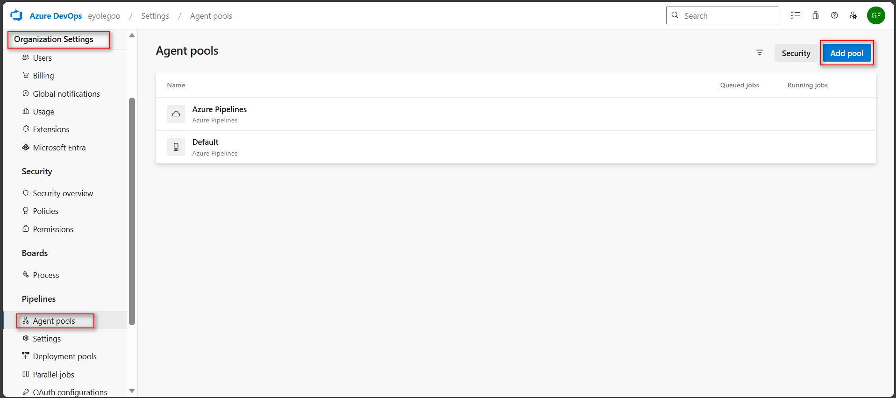
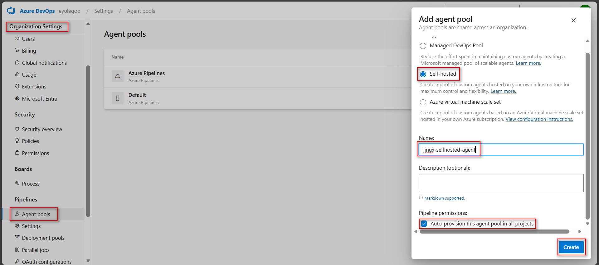
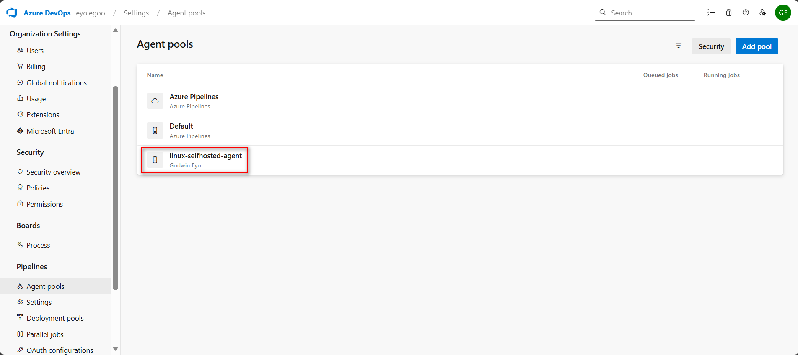
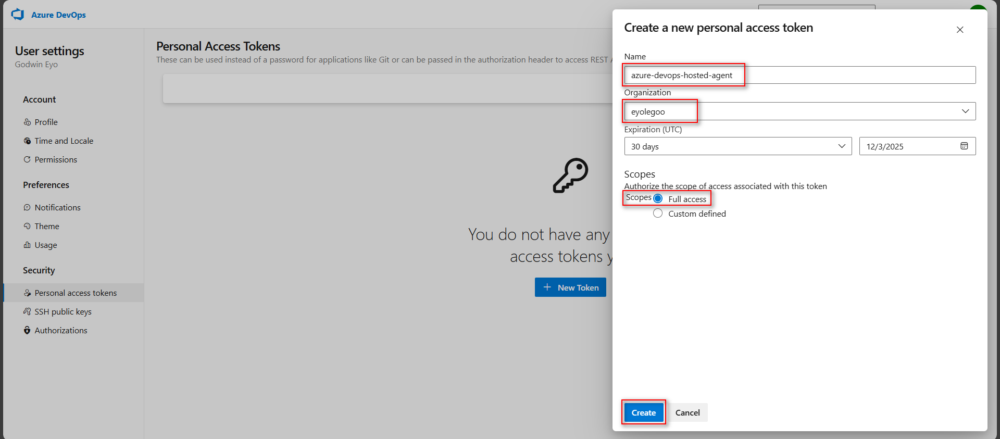
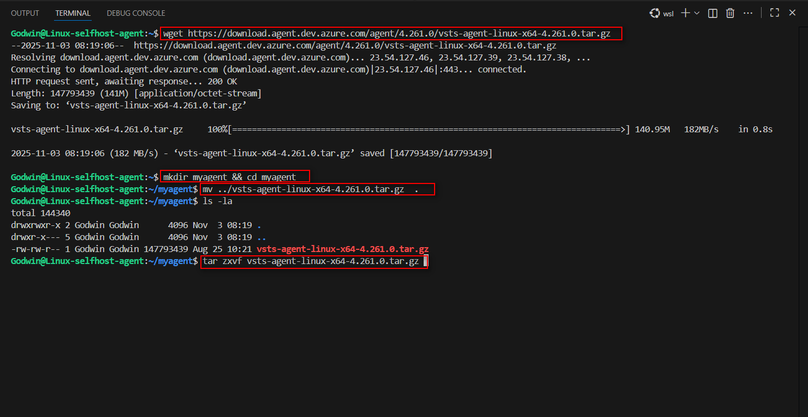
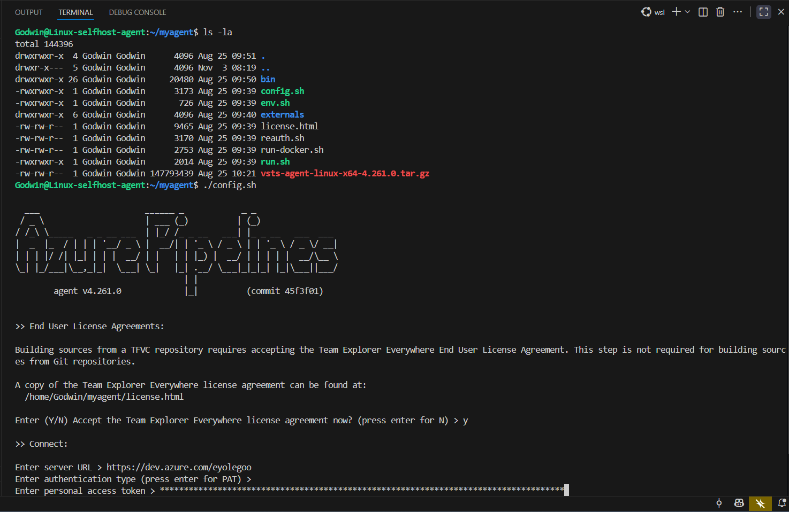
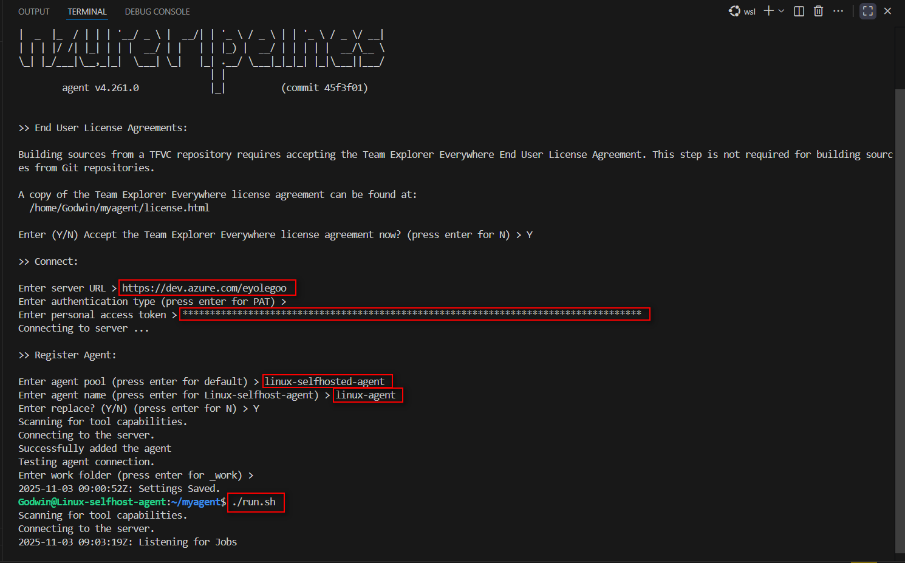
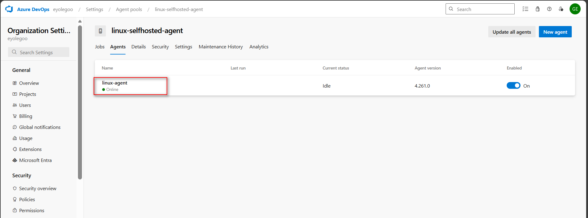
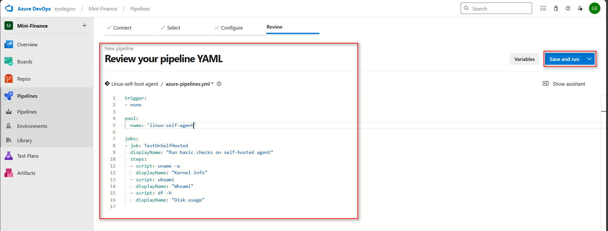
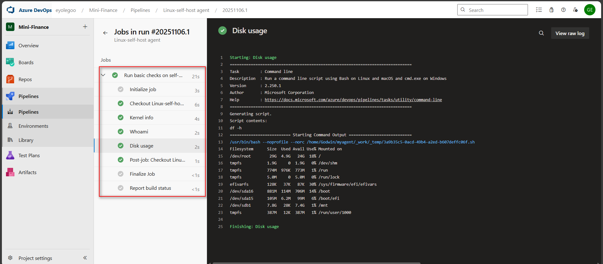

# ASSIGNMENT 38 Report: Set Up a Self-Hosted Linux Agent for Azure DevOps (Ubuntu + PAT)

A self-hosted Linux agent is a virtual machine or server set up to run Azure DevOps pipelines instead of relying on Microsoft’s shared hosted agents. It gives you full control over the build environment—software versions, dependencies, security settings, and network access. This setup addresses limitations of cloud-hosted agents by enabling faster builds, custom configurations, private network access, and cost efficiency for continuous integration and deployment within controlled infrastructure.

## Objective
Set up a self-hosted Azure DevOps build agent on an Ubuntu virtual machine running in any cloud environment (AWS or Azure). This agent will be used in upcoming assignments to execute CI/CD pipelines for real-time deployment.

## What I seek to achieve
* One Ubuntu 22.04 VM (in AWS or Azure)
* A self-hosted agent pool in Azure DevOps (e.g., SelfHostedPool)
* An agent registered using a Personal Access Token (PAT)
* A test pipeline that confirms successful agent registration

## Prerequisites
* Azure DevOps with:
    * Organization
    * Project
* An Ubuntu VM with nginx running (with port 22s and 443 enabled). This was provisioned using terraform while ansible was used to install and configure nginx.

---

### Step 1: Create an Agent Pool

In Azure DevOps → Organization Settings → Agent Pools, create a new pool (for example SelfHostedPool). This pool will host the agent you are about to register.






### Step 2: Create a Personal Access Token (PAT)

Generate a new PAT in Azure DevOps with scopes for Agent Pools (Read & Manage) and Build (Read & Execute). This was securely stored because it will be required during agent registration.




### Step 3: Install and Configure the Agent

Firstly, I gained access to the VM via ssh. On the VM, install the required dependencies and download the latest Azure Pipelines agent package for Linux. Configure the agent using your organization URL and the PAT created earlier. Register it under the agent pool you created. Install and start the agent as a system service.






Agent is now up.




### Step 4: Run a Test Pipeline

Create a simple Azure Pipeline that uses your self-hosted pool. Run basic shell commands (e.g., `uname -a`, `whoami`, `df -h`) to verify that the job executes on your VM.

**azure-pipelines.yml**
```yaml
trigger:
- none

pool:
  name: 'linux-self-agent'

jobs:
- job: TestOnSelfHosted
  displayName: "Run basic checks on self-hosted agent"
  steps:
  - script: uname -a
    displayName: "Kernel info"
  - script: whoami
    displayName: "Whoami"
  - script: df -h
    displayName: "Disk usage"
````





### Step 4.1: Reflection

One challenge I faced was the agent failing to come online due to blocked outbound HTTPS traffic. I resolved it by adjusting the VM’s firewall to allow port 443 access to Azure DevOps.

To scale this setup in production, I’d use multiple agent pools, automate deployment with scripts, and isolate each application’s agents for better security and control.

```

### Next Step
If you need help creating the specific Terraform or Ansible scripts mentioned in the prerequisites section for your repository, just let me know!
```